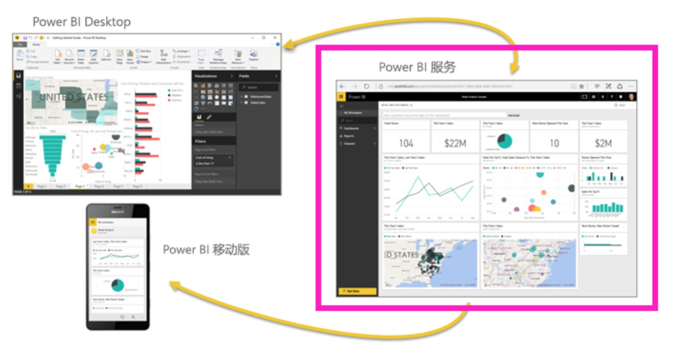
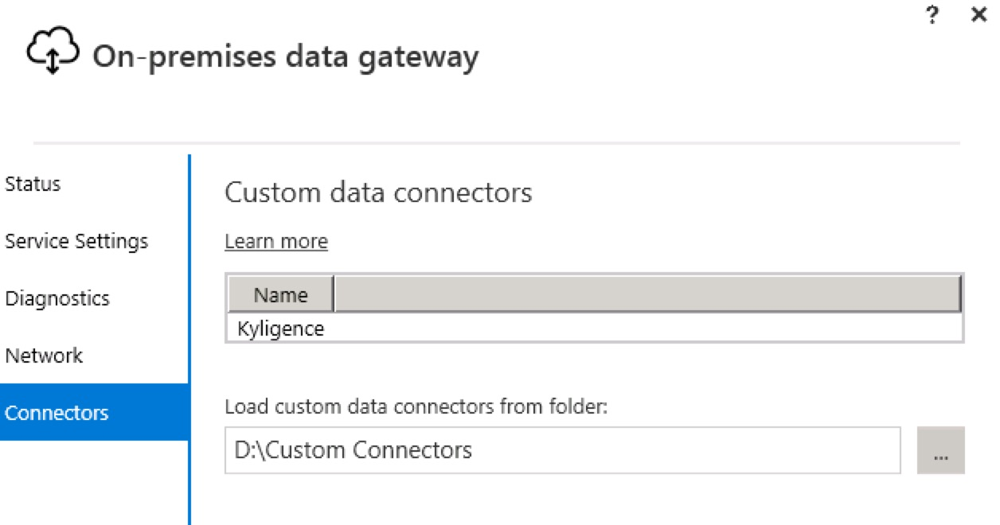
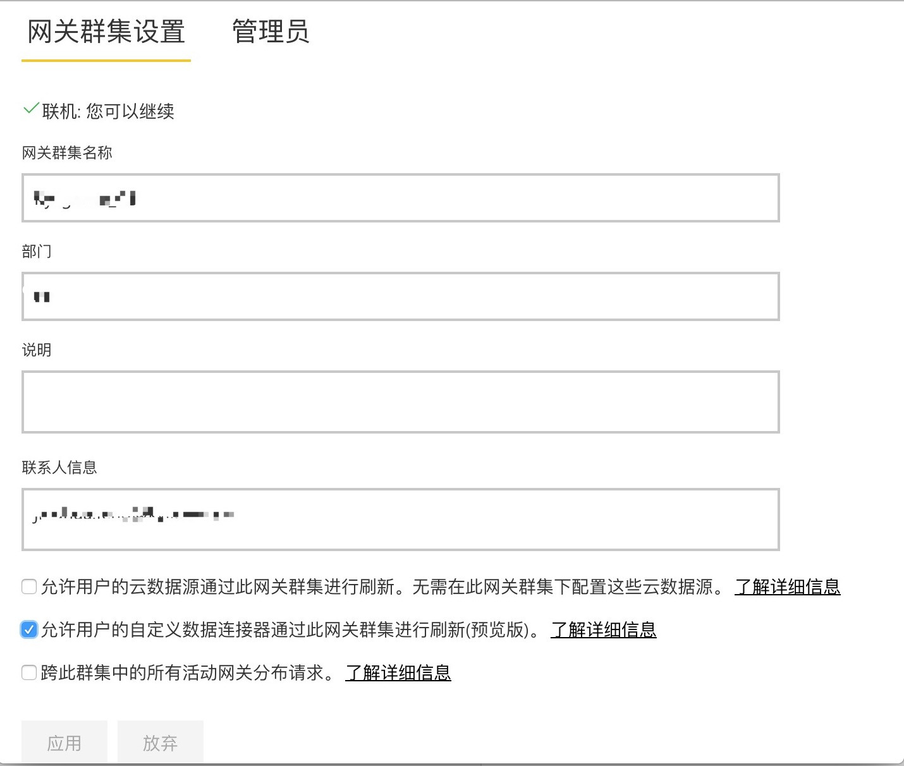
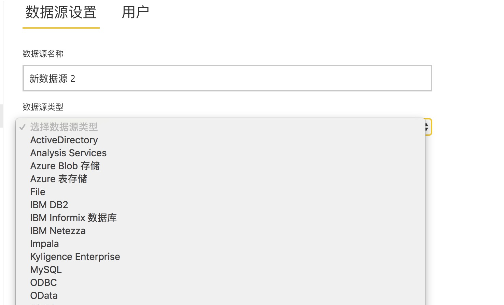
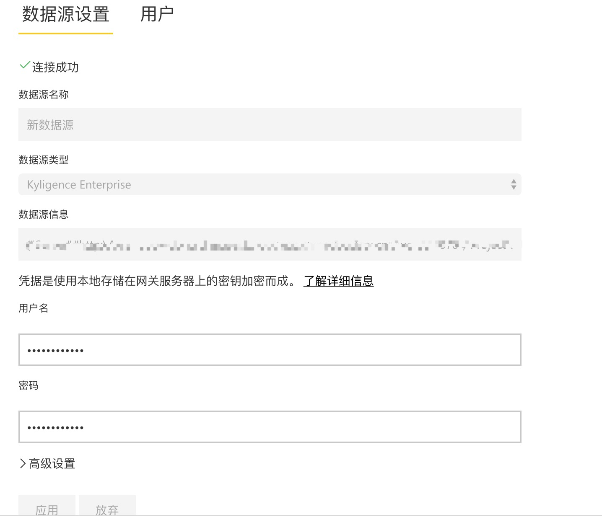
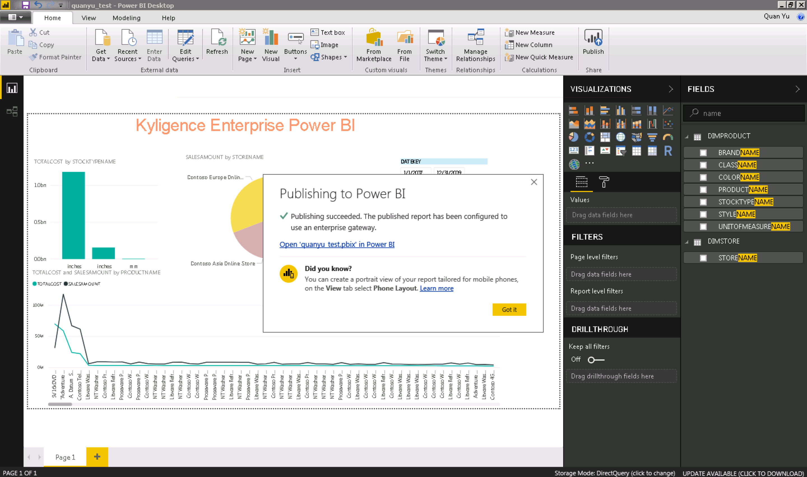
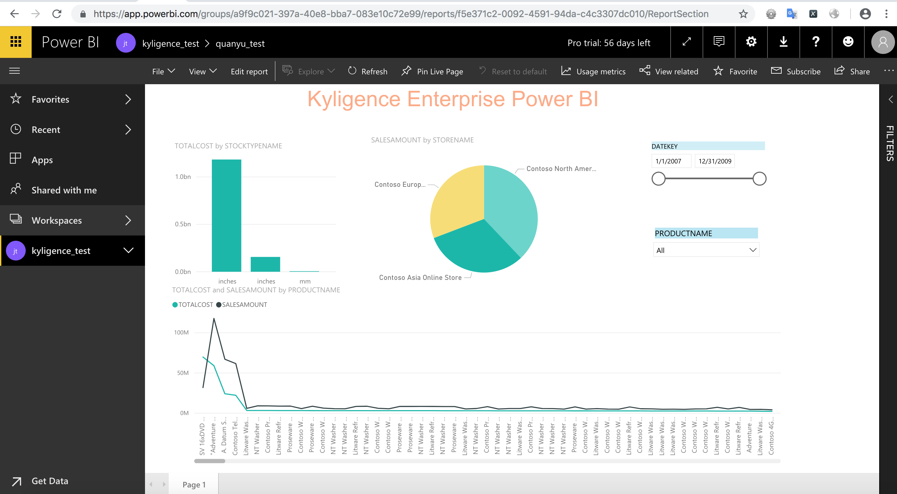

## 与 Power BI Service 集成

Microsoft Power BI Service 也被称为 Power BI online，是一个具有强大的分析能力及协作管理能力的在线 SaaS 服务。可以轻松与 Power BI Desktop 或 Power BI Mobile 进行协作，搭建企业级 BI 平台。



本文将分步介绍如何使用 Power BI Service 连接 Kyligence Enterprise。

### Power BI Desktop 集成

Power BI service 通过 Power BI Desktop 发布报表，需要已经安装 Power BI Desktop 并集成 Kylingence。关于如何使用 Power BI Desktop 连接 Kyligence Enterprise 的信息请参考页面 [Power BI Desktop 集成](powerbi_desktop.cn.md)。
注意：Power BI service 和 Power BI Desktop 通过 Power BI 账号进行关联，所以在将报表发布到 Power BI service 时，Power BI Desktop 需处于正确的登录状态。

### 安装 Gateway

Power BI service 通过 Gateway 和本地服务器进行通信，您可以通过 Microsoft 的 [Gateway 安装页面](https://docs.microsoft.com/zh-cn/power-bi/service-gateway-install)完成 Gateway 安装。注意：Gateway 不需要和 Power BI Desktop 安装在同一机器上，但需要运行 Gateway 的机器网络通畅且能访问 Kyligence Enterprise Data Connector for PowerBI 配置的数据源，需要安装了64位的 Kyligence ODBC 驱动程序，有关如何下载和配置 Kyligence ODBC 驱动程序的详细信息，请参阅 Kyligence Enterprise 用户手册中 [Kyligence ODBC 驱动程序教程](../driver/kyligence_odbc.cn.md)。

### 配置 Gateway

1.完成 Gateway 安装后，在运行网关的计算机上，启动管理员命令提示符，运行 ```net start PBIEgwService``` 命令启动 Gateway 服务。启动 Gateway 服务后，您可以通过双击 **On-premises data gateway** 程序图标进行 Gateway 的配置。您也可以通过在运行网关的计算机上，启动管理员命令提示符，运行 ```net stop PBIEgwService``` 命令停止 Gateway 服务。

2.为 Gateway 配置 Kyligence Enterprise Data Connector：

a)创建放置 Connector 的目录，且该目录需能被 Gateway 服务访问(不可创建在没有权限访问的 Windows 用户目录或系统目录下的目录)。

b)在 [Kyligence 下载页面](http://download.kyligence.io/#/products)下载 Kyligence Enterprise Data Connector for Power BI 插件并将插件放入到已创建的目录下。



您也可以参考配置文档：[自定义连接器](https://docs.microsoft.com/zh-cn/power-bi/service-gateway-custom-connectors)。

### Power BI Service 管理数据源

1.登录 Power BI service 后，在网关页面上勾选**允许用户的自定义连接器通过此网关集群进行刷新**选择框，点击**应用**按钮，这样你就可以加载 Kyligence Enterprise Data Connector 了。



2.在 Power BI service 页面点击齿轮设置图标，然后点击 Manage gateways->ADD DATA SOURCE，选择 Kyligence Enterprise 数据源。



3.配置 **DATA SOURCE**：DATA SOURCE 的配置信息需与在 Power BI Desktop 上的 Kyligence Enterprise 的连接信息保持一致。



4.您可以在 **Data Source Settings** 的右侧，点击 **Users** 选项，为 DATA SOURCE 增加用户，被增加的用户将拥有发布报表的权限。

### 通过 Power BI Desktop 发布报表到 Power BI Service

Gateway 配置全部完成后，在已登录的 Power BI Desktop 上编辑并保存报表后，点击 Publish 按钮、选择对应的工作区域，即可发布报表到 Power BI service。
这样，就可以在Power BI service对应的工作区域查看及修改上传的报表。





