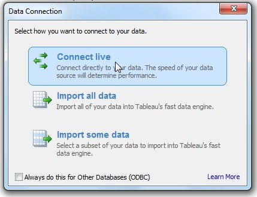
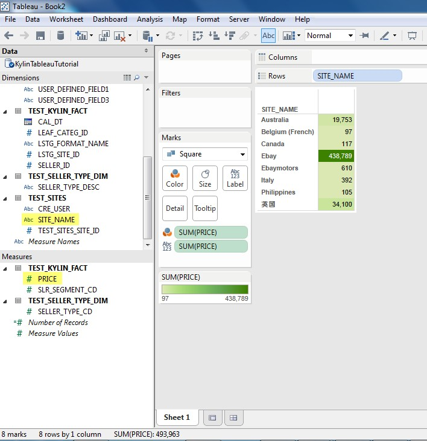
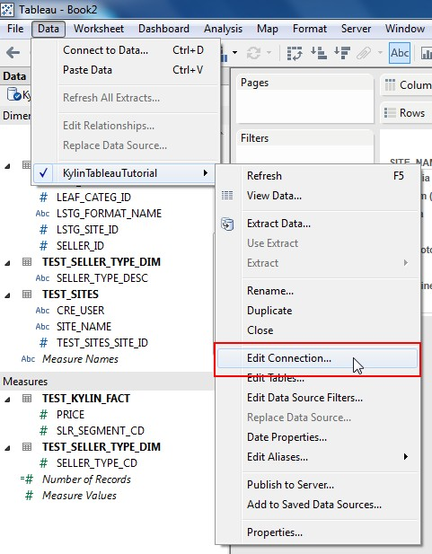
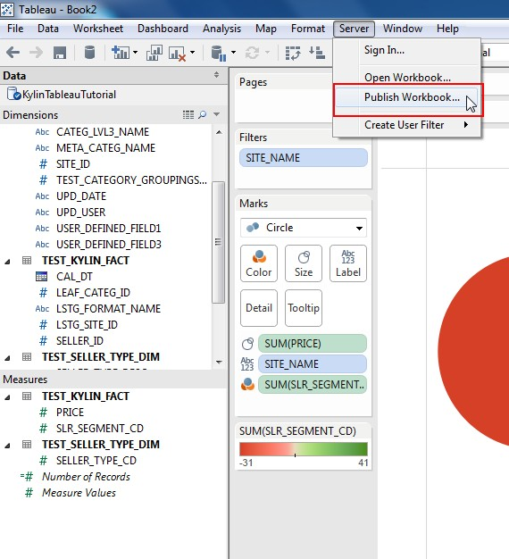
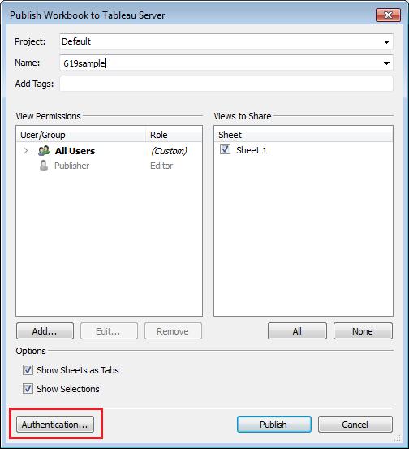
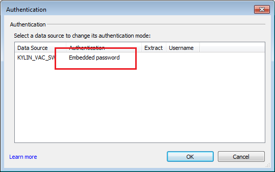

## Tableau 8.x 集成

> KAP ODBC驱动程序与Tableau存在一些限制，请在尝试前仔细阅读本说明书。
> * 仅支持“managed”分析路径，KAP引擎将对意外的维度或度量报错
> * 请始终优先选择事实表，然后使用正确的连接条件添加查找表（cube中已定义的连接类型）
> * 请勿尝试在多个事实表或多个查找表之间进行连接；
> * 你可以尝试使用类似Tableau过滤器中seller id这样的高基数维度，但引擎现在将只返回有限个Tableau过滤器中的seller id。
> 
> 如需更多详细信息或有任何问题，请联系KAP团队：`support@kyligence.io`

### 步骤1. KAP ODBC驱动程序
参考页面[KAP ODBC 驱动程序教程](../driver/odbc.cn.html)。

### 步骤2. 连接到KAP服务器
> 我们建议使用Connect Using Driver而不是Using DSN。

Connect Using Driver: 选择左侧面板中的“Other Database(ODBC)”和弹出窗口的“KylinODBCDriver”。

输入你的服务器位置和证书：服务器主机，端口，用户名和密码。

点击“Connect”获取你有权限访问的项目列表。有关权限的详细信息请参考[Kylin Cube Permission Grant Tutorial](https://github.com/KylinOLAP/Kylin/wiki/Kylin-Cube-Permission-Grant-Tutorial)。然后在下拉列表中选择你想要连接的项目。

点击“Done”完成连接。

### 步骤3. 使用单表或多表
> 限制
>    * 必须首先选择事实表
>    * 请勿仅支持从查找表选择
>    * 连接条件必须与cube定义匹配

**选择事实表**

选择`Multiple Tables`。

然后点击`Add Table...`添加一张事实表。

**选择查找表**

点击`Add Table...`添加一张查找表。

仔细建立连接条款。

继续通过点击`Add Table...`添加表直到所有的查找表都被正确添加。命名此连接以在Tableau中使用。

**使用Connect Live**

`Data Connection`共有三种类型。选择`Connect Live`选项。

然后你就能够尽情使用Tableau进行分析。

**添加额外查找表**

点击顶部菜单栏的`Data`，选择`Edit Tables...`更新查找表信息。

### 步骤4. 使用自定义SQL
使用自定义SQL类似于使用单表/多表，但你需要在`Custom SQL`标签复制你的SQL后采取同上指令。

### 步骤5. 发布到Tableau服务器
如果你已经完成使用Tableau制作一个仪表板，你可以将它发布到Tableau服务器上。
点击顶部菜单栏的`Server`，选择`Publish Workbook...`。

然后登陆你的Tableau服务器并准备发布。

如果你正在使用Connect Using Driver而不是DSN连接，你还将需要嵌入你的密码。点击左下方的`Authentication`按钮并选择`Embedded Password`。点击`Publish`然后你将看到结果。

### 小贴士
* 在Tableau中隐藏表名

* Tableau将会根据源表名分组显示列，但用户可能希望根据其他不同的安排组织列。使用Tableau中的"Group by Folder"并创建文件夹来对不同的列分组。

