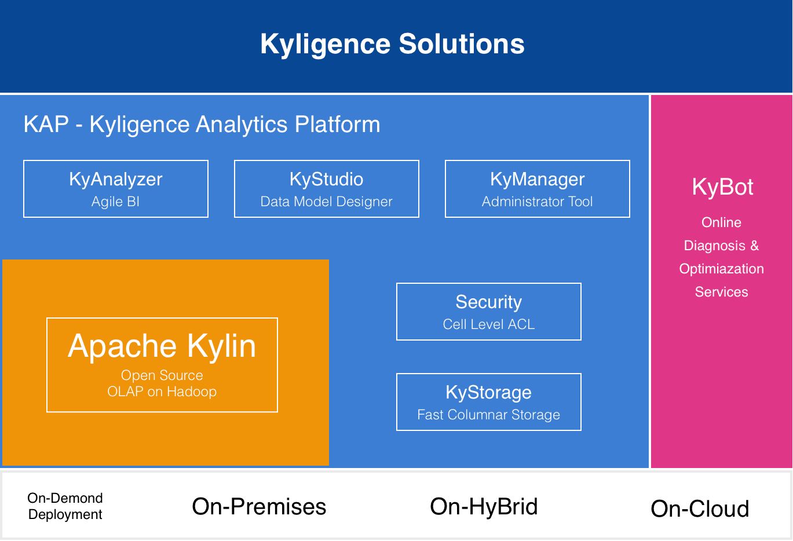
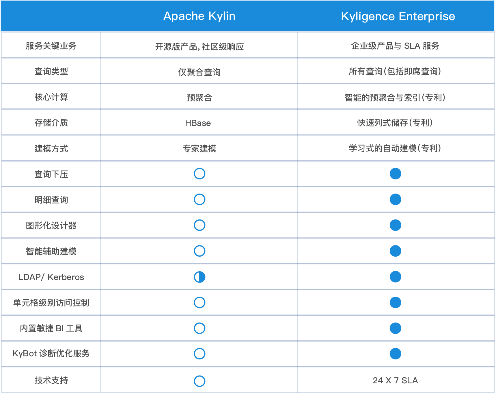
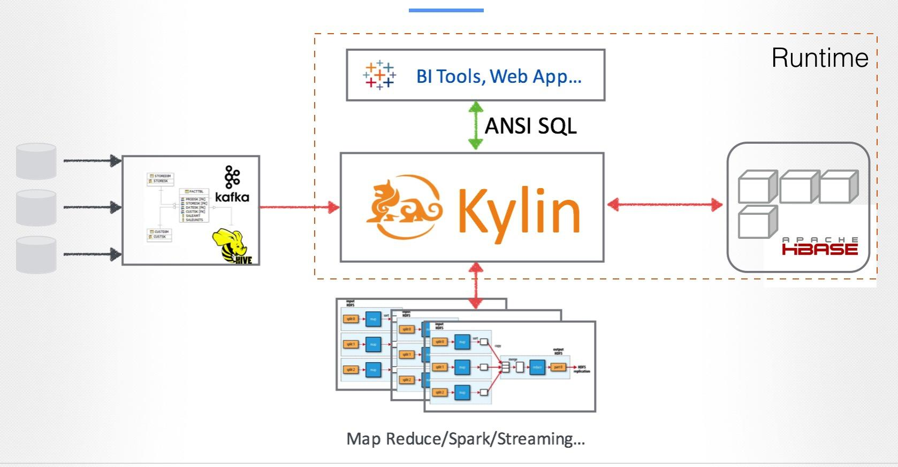

## Kyligence Enterprise 简介

==> Brian

Kyligence大数据分析平台 (Kyligence Analytics Platform, Kyligence Enterprise) 是基于 [Apache Kylin](http://kylin.apache.org) 的，在超大规模数据集上提供亚秒级分析能力的企业级产品，为业务用户、分析师及工程师提供简单、快捷的大数据分析服务。

相较于其它技术，Kyligence Enterprise 具有以下特点：

* **亚秒级查询** 

在百亿及以上规模数据集上为业务用户及分析师提供亚秒级的查询速度，并同时支持高并发，使得在大数据平台上对超大规模数据进行交互式分析成为可能；支持_ANSI SQL_查询标准，使得业务用户及分析师无需重新学习新的技术即可掌握在海量超大规模数据集上快速分析的能力。

* **无缝集成** 

支持与企业级商业智能(BI)及可视化工具无缝集成，提供标准的ODBC、JDBC驱动及REST API接口等以连接流行的数据分析、展示工具，如 _Tableau_、_Microsoft PowerBI_、_Microsoft Excel_、_Apache Zeppelin_、_Saiku_ 等

* **自助服务** 

Kyligence Enterprise使得分析师及用户能以简洁而快速的方式分析海量数据。易于使用的Web界面允许用户自己构建数据集市而无需知晓底层技术 。

* **可扩展架构** 

全新设计的可扩展架构从根本上解耦了对特定技术的依赖，将计算框架，数据源以及底层存储等扩展到更多的技术领域，为不同的技术栈提供可配置的优化解决方案。

* **非侵入式** 

Kyligence Enterprise的部署不需要在现有Hadoop集群上安装任何新的组件，更不需要在数据节点或其他节点上安装Agent等，所有与集群的操作都通过标准API完成，从而使得对现有集群的影响最小化，也为快速部署带来了可能。

更多信息，请访问Kyligence网站: [http://kyligence.io/](http://kyligence.io/)

## Kyligence Enterprise 概览

Kyligence Enterprise是Kyligence提供的基于Apache Kylin的企业级大数据智能分析平台，在PB级数据集上提供亚秒级标准SQL查询响应，支持互联网级的高并发访问，赋能分析师以行业标准的数据仓库和商业智能方法论架构DW on Hadoop解决方案。Kyligence Enterprise为商业用户、分析师和工程师提供了统一的分析平台，支持自助式建模，无需编程，并与主流BI工具实现无缝集成，在开源Apache Kylin核心功能之外，在企业用户所关注的实施效率、安全控制、性能优化、自助式敏捷BI、系统监控和管理等方面进行了全面创新和增强。作为Hadoop上的原生OLAP解决方案，Kyligence Enterprise基于Hadoop标准接口与集群交互，兼容主流Hadoop发行版，支持私有数据中心及云端部署安装。

**KyStorage：高效的列式存储引擎，支持明细数据查询**

*KyStorage*是Kyligence研发的基于HDFS的列式存储引擎，支持多路复合索引，针对超高基数维度、复杂过滤条件等的场景进行了专门优化，相对*Apache Kylin*，查询性能有几倍到几十倍的提升，在存储空间上也有超过50％的节省。

基于*KyStorage*列式存储引擎，及倒排索引等多种索引技术，突破了传统OLAP引擎仅能查询聚合数据的局限，全面地支持了明细数据的查询，优化了对宽表的支持，降低了数据建模的难度，更好地服务数据探索式分析场景。

**KyStudio：交互式建模平台**

*KyStudio*以model为中心，支持直观的拖拽式建模流程，支持增强的语义层建模，简化与BI工具的模型对接。支持多种辅助建模和优化算法，不断提升建模效率和效果。

**KyAnalyzer：敏捷BI自助多维分析工具**

内置敏捷BI平台*KyAnalyzer*，用户仅需浏览器，以熟悉的可拖拽方式交互地探复杂数据源，支持钻取，上卷，切片，切块，旋转等多维分析方法，支持数十种可视化报表技术，简易地多格式数据分享，极大地提高了业务人员分析大数据的效率。

**更多企业级功能**

支持开箱即用的用户管理及单元格级别的访问控制方式，可与用户已有访问认证体系深度集成，保证数据访问的可管理性、可追溯性。

**兼容主流Hadoop发行版**

Kyligence Enterprise兼容开源Hadoop及主流商业Hadoop发行版，可运行在*Apache Hadoop*，*Hortonworks HDP*，*Microsoft HDInsight*，*AWS EMR*，*华为FusionInsight*等发行版和平台，并与*Cloudera CDH* 实现了产品相互认证。

### Kyligence Enterprise与Apache Kylin比较

## Apache Kylin

Apache Kylin是一个开源的分布式分析引擎，提供Hadoop之上超大规模数据的SQL查询接口及多维分析（OLAP）能力。Apache Kylin于2015年11月正式毕业成为Apache基金会(ASF) 顶级项目，是第一个由中国团队完整贡献到Apache的顶级项目。

Apache Kylin构建在Hadoop等分布式计算平台之上，充分利用了MapReduce的并行处理能力和可扩展基础设施，高效地处理超大规模数据，可根据数据的规模实现架构的可伸缩。Apache Kylin作为OLAP引擎包含了从数据源（Hive／Kafka等）获取源数据，基于MapReduce构建多维立方体(Cube)，并充分利用HBase的列式特性来分布式的存储立方体数据，提供标准SQL解析与查询优化，以及ODBC／JDBC驱动及REST API等多个模块。可插拔的灵活架构，允许支持更多的数据源接入Kylin，也支持采用其它技术作为存储引擎。Apache Kylin包含以下核心组件：

1. **元数据管理**：包含模型设计，Cube设计，表结构同步，数据采样分析等。支持层级维度、联合维度、可推导维度等维度降维优化技术，避免Cube数据膨胀。支持多种字典编码算法，实现数据高效压缩存储。

2. **任务引擎**：用于向Hadoop平台提交Cube构建任务，支持全表构建、增量构建、流式构建等多种构建机制，支持Cube自动合并等IO优化手段，内置多种Cube预计算算法以及数十个Job性能调优参数，充分发挥MapReduce的计算能力。

3. **存储节点**：将关系型表的源数据，经过预计算，保存在支持高通量大并发快速读写的键值数据库HBase中，充分利用HBase高效的Fuzzy Key过滤技术和Coprocessor并行处理技术，以并行计算方式检索数据，支持查询逻辑下压存储节点，实现了数据检索问题由O(N)的计算复杂度降低为O(1)。

4. **查询节点**：构建在Apache Calcite语法解析器之上，支持JDBC／ODBC／REST等多种协议和接口，支持ANSI SQL，包含绝大多数SQL函数，提供自定义计算函数机制，与Tableau等主流BI工具完美对接。

5. **Web管理端**：内置用户友好的交互界面，支持向导式的模型构建，直观的任务监控与告警，以及用户权限管理。

   

   # KyBot简介及快速入门

## 概述

随着Apache Kylin的深入应用，Kylin集群规模不断扩大，数据存储不断增加，用户访问更加频繁，如何对整个Kylin集群、底层存储、构建任务、Hadoop资源利用等有更多的了解和分析，最大限度的利用相关资源，优化查询性能，提高运行效率，保证应用稳定等逐渐成了Kylin用户群的普遍且急迫的需求。

作为Apache Kylin背后的创业公司，上海跬智信息技术有限公司（Kyligence）推出了KyBot云端服务，为Apache Kylin及其商业版Kyligence Enterprise提供 **在线诊断、优化及服务平台** 。KyBot通过分析Kylin的日志等信息，为用户提供可视化仪表盘、系统优化、故障排查、技术支持等服务：

1. **仪表盘：** 以可视化的形式展现Kylin系统的相关内容，包括Cube、用户访问情况、查询延迟、任务构建统计、存储等各方面的信息， 从不同维度提供整个Kylin集群及应用的洞察能力
2. **系统优化：** Kylin提供万亿规模数据集上的亚秒级交互式分析能力，因此，查询的优化是Kylin应用的核心。KyBot可以分析相应的日志为用户提供直观的性能分析试图，通过可视化来展示每一个阶段的性能消耗，以此来帮助用户快速定位瓶颈等。同时，KyBot通过对Cube日志的分析，来帮助用户不断优化数据模型及Cube的设计和存储，以在存储、构建及查询性能间找到最佳的平衡点
3. **故障排查：** 分布式系统在运行过程中不可避免的出现一些异常甚至故障，如何快速的定位和排查这些问题是系统运维的重中之中，KyBot通过解析异常来快速的监控相关故障信息，为用户提供快速诊断能力
4. **技术支持：** 企业级客户可以通过工单快速提交相关的支持请求，结合已经提交的相关日志及分析结果，Kyligence支持工程师可以快速定位并及时给出解决方案，大大降低了沟通成本，提升了服务响应能力

## KyBot是如何工作的？

## 如何使用KyBot？

## 1. 登录注册

KyBot默认访问地址： [https://kybot.io](https://kybot.io)，根据提示完成注册。

## 2. 如何混淆敏感信息

- OBF=混淆 RAW=不混淆
- Cardinality和邮箱账号默认混淆（Cardinality 混淆范围：tiny: &lt;20 small: &lt;100 medium: &lt;1000 high: &lt;10,000 very high: &lt;100,000 ultra high: &gt;=100,000）
- 如hostname设置为OBF，需要定义hostname的模式，如kybot.obf.hostname.pattern=\*.kybot.io

## 3. 生成诊断包

- Kyligence Enterprise用户

登录每一个Kyligence Enterprise节点的WEB UI,点击系统页面的"诊断"按钮,生成诊断包

- Kylin 用户

① 下载KyBot Client (支持Apache Kylin1.5.0以上及Kyligence Enterprise全部版本)下载路径：登录KyBot 官网https://kybot.io，在首页点击上传，然后点击"打包工具: KyBot Client 1.0.1"即可下载。

② 解压到每个Kylin节点的$KYLIN\_HOME/kybot目录

③ 在每个Kylin节点运行$KYLIN\_HOME/kybot/kybot.sh来生成诊断包

## 4.诊断包上传

登录KyBot网站，单击页面顶部的"上传"按钮，即打开上传页面，单击"上传诊断包"按钮，选择一个生成好的KyBot诊断包，并等待其上传成功，上传成功后即加入分析队列，用户可以在上传页面查看分析进度，分析好之后就可使用全部功能。

## 页面功能介绍：

## 1. 仪表盘

洞悉Kyligence Enterprise（Apache Kylin）集群的健康情况

- Cube使用情况统计

- Query执行情况统计

## 2. 调优

优化Cube和查询, 找到系统瓶颈，给予优化建议

- Cube 详情及使用分析

- SQL查询解析及统计分析

## 3. 故障排查

基于知识库和日志分析，提供有效的故障解决方案

- 异常统计

- 故障追踪

## 技术支持

Kyligence提供的Apache Kylin原厂支持，用户可以通过KyBot提交工单获取Kyligence的技术支持。 

## 获取技术支持

### Kyligence 技术支持

Kyligence 可以帮助客户安装、配置、优化和运行 Kyligence Enterprise，帮助客户解决大规模数据处理和分析问题。Kyligence 既支持客户将 Kyligence Enterprise 安装在客户的数据中心，也支持安装在公有云，如 Amazon Web Services 和 Microsoft Azure 等。

如果您是 Kyligence 的注册用户，在使用 Kyligence Enterprise 过程中遇到问题，可以：

* 在 [KyBot 支持网站](https://kybot.io/home)，依次点击**进入我的 KyBot -> 帮助中心 -> 我的工单**，创建并提交工单获取技术支持。详情参见 [KyBot](kybot/kybot.cn.md)章节。
