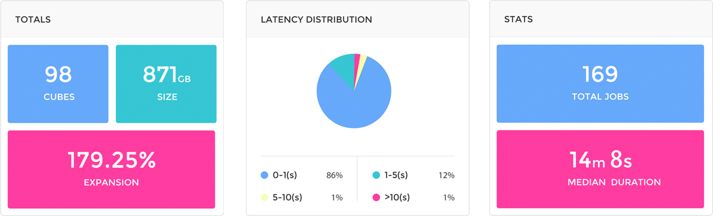
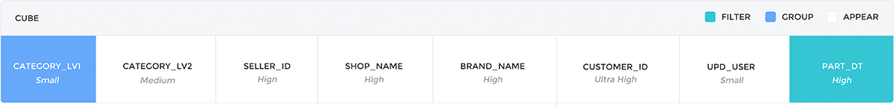
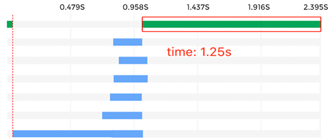

## KyBot 案例分析
某电商公司运行 Kyligence Enterprise 超过21个节点，希望通过 KyBot 诊断集群的健康状态并获取 Cube 优化建议。KyBot 分析了时间跨度为5天的诊断包，涵盖了98个 Cube 和7000多个查询 ，通过分析发现了查询的瓶颈并提供了优化方案。

### 总体情况

Cube **98** 个，总大小 **871GB**，Cube 膨胀率较低；

**86%** 以上的查询都在 **1秒** 以内，**98%** 的查询在 **5** 秒之内， 平均查询性能较好；构建耗时中位数在 **15min** 以内，属于正常范围；




### SQL 执行分析
SQL 语句如下：

```
SELECT CATEGORY_LV1
	,sum(order_amt) AS order_amt
	,sum(payment_amt) AS payment_amt
	,sum(discount_amt) AS discount_amt
	,sum(shipping_fee) AS shipping_fee
	,sum(tax_amt) astax_amt
	,sum(coupon_amt) AS coupon_amt
	,count(DISTINCT CUSTOMER_ID) AS uv
	,count(DISTINCT SHIPPING_AGT_ID) AS shipping_agt
	,count(DISTINCT province_id) AS province
FROM t_sales_order
WHERE PART_DT > ’20160901’
	AND PART_DT < ’20161001’
GROUP BY CATEGORY_LV1
ORDER BY CATEGORY_LV1
```

#### Cube 索引匹配度分析
在 SQL 执行过程解析的页面，展示了 8 个维度，表示 Cube 中 8 个维度索引参与了SQL执行，但仅 `PART_DT` 是有效的过滤维度， `CATEGORY_LV1` 是有效的聚合分组维度，总体匹配度较低（25%）。中间六个维度之所以参与执行，是因为它们被设置成了必需维度，可以考虑取消必需维度组的设置或者增加其他维度组的设置。

过滤维度 `PART_DT` 位于索引组合的末端，且前置维度基数较大，过滤代价较大，影响查询效率，建议更新索引维度的排序。



#### SQL 执行生命周期分析

在 SQL 执行生命周期图中，蓝色部分是 SQL 在多个存储节点中的并行查询部分，绿色部分是 SQL 在查询节点的执行部分。

绿色部分时间较长，说明瓶颈在于查询节点，可以考虑减少数据后聚合压力或增强查询节点性能。



### 优化操作
1.取消之前的 `必需维度聚合组`设置。

2.添加一个 `层级聚合组`，包含 `CATEGORY_LV1` 和 `CATEGORY_LV2`。

3.添加一个 `联合聚合组`，包含 `SELLER_ID` 和 `SHOP_NAME`。


### 优化结果

查询击中了匹配度更高的 Cuboid ，查询效率显著提升，查询节点运行时间缩短为 0.4 秒。

### 客户反馈

根据 KyBot 的分析，我们有针对性地对 Cube 的设计进行了优化，增大了查询节点的内存，对比测试表明查询效率得到了显著的提升，接下来我们会根据进一步的分析，继续优化。