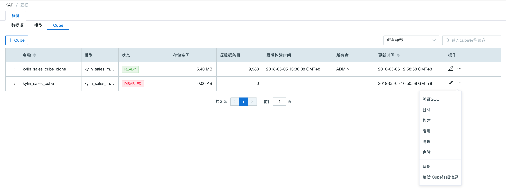
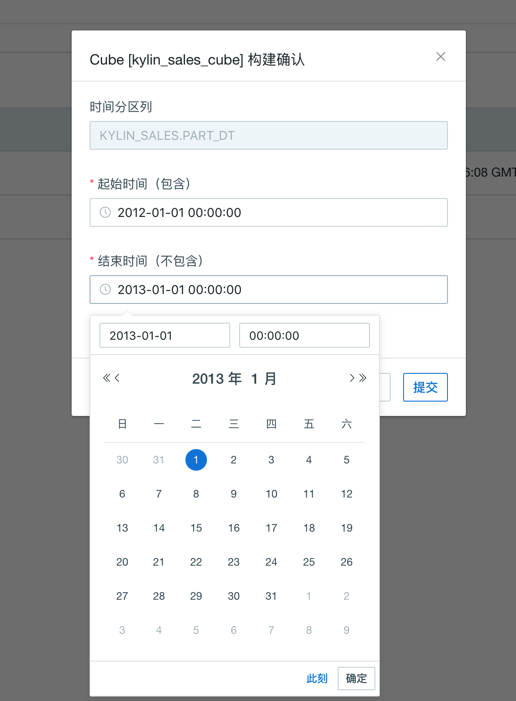
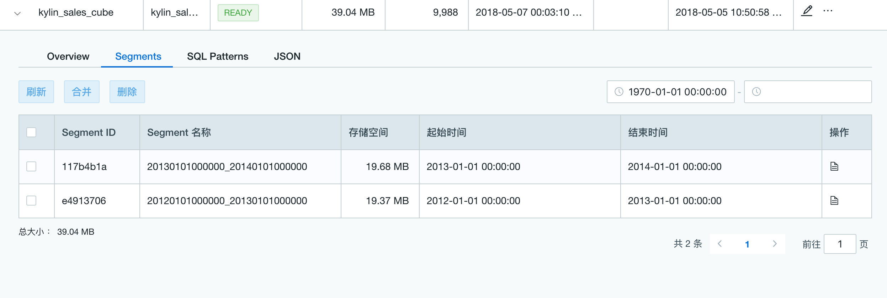

## 构建 Cube

在创建好Cube之后，只有对Cube进行构建，才能利用它执行SQL查询。本文以本产品自带样例数据为例，介绍Cube构建的过程。
#### 初次构建
首先打开本产品的Web UI，并选择learn_kylin项目，然后跳转到建模页面，找到Cube列表。在Cube列表中找到**Kylin_Sales_Cube**。单击右侧的**Action**按钮，在弹出的菜单中选择**构建**（build）。



第二步，在弹出的Cube构建确认对话框中确认Cube的分段时间列（Partition Date Column）是DEFAULT.KYLIN_SALES.PART_DT，以及起始时间是2012-01-01 00:00:00。在Kyligence Enterprise中，一次构建会为Cube产生一个新的Segment，每次的SQL查询都会访问一个或多个符合条件的Segment；我们需要尽可能地让一个Segment更好地适用于查询条件，因此我们可以按年构建，即每个年份构建一个Segment。在这个例子中，我们输入结束日期为2013-01-01 00:00:00。设置完成后单击**提交**按钮。
> 注意：增量构建是具体按年构建还是按月构建应该根据实际的业务需求、ETL时效及数据量大小而定。如果一次构建的数据量过大，可能导致构建时间过长，或出现内存溢出等异常。在当前的样例数据中，数据量较小，按年构建是可以顺利完成的。



当任务成功提交之后，切换到Monitor页面，这里会列出所有的任务列表。我们找到列表最上面的一个任务（名称是：**Kylin_sales_cube** - 20120101000000_20130101000000），这就是我们刚刚提交的任务。在这一行单击或点击左侧的箭头图标，页面右侧会显示当前任务的详细信息。
待构建任务完成，可以在Monitor页面看到该任务状态已被置为完成（Finished）。这时候，第一个Segment就构建完成了。前往Cube列表中查看，会发现该Cube的状态已被置为“就绪（Ready）”了。


#### 增量构建
在第一个Segment构建完成之后，我们开始构建第二个Segment。两个 segment 构建的时间周期不能有交集。

首先在建模页面的Cube列表中找到该Cube，单击右侧的**Action**按钮，然后选择“构建(Build)”，打开Cube构建确认对话框。在这个对话框中，首先确认起始时间（Start Date）是2013-01-01 00:00:00，因为这是上次构建的结束日期，为保障所构建数据的连续性，Kyligence Enterprise自动将新一次构建的起始时间更新为上次构建的结束日期。同样的，在结束时间（End Date）里输入2014-01-01 00:00:00，然后单击Submit按钮，开始构建下一年的Segment。

待构建完成，我们可以在Cube的Segment界面中查看，发现Cube的两个Segment都已就绪。




### 常见问题答疑

1. 在构建Cube时，如果遇到 killed by admin错误。

这个问题主要是由于使用Sandbox时，MR任务请求的内存过多，从而被YARN拒绝导致的。您可以通过修改“conf/kylin_job_conf_inmem.xml”配置，调低请求的内存大小来解决这个问题。​

```properties
<property>
	    <name>mapreduce.map.memory.mb</name>
	    <value>1072</value>
	    <description></description>
	</property>
<property>
    <name>mapreduce.map.java.opts</name>
    <value>-Xmx800m</value>
    <description></description>
</property>
```

