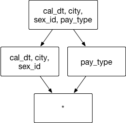
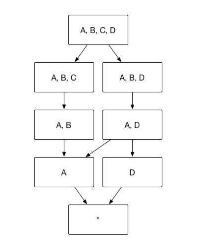

## 聚合组

在所有基于预计算的 OLAP 引擎中，维度灾难是一个广为诟病的问题。在 v1.5 (Kyligence Enterprise v2.1) 之前的版本中，Apache Kylin 试图通过一些基本的技术解决这个问题，也确实在某些程度上减轻了问题的严重性。在之后的开源实践中，我们发现这些基本技术缺乏系统性的设计思维，也无法解决更多更普遍的问题。于是在 Kyligence Enterprise v2.1 及之后的版本中，我们重新设计了聚合组的设计机制使得 Apache Kylin 更好的服务于所有 Cube 的设计场景。


### 背景简介
Apache Kylin 通过预计算 Cubes 提高了查询的性能，而 Cube 则包含了所有维度的不同的两两组合，每一种组合即为一个Cuboid。问题在于随着维度增加，Cuboids 也会急剧增加。比如，一个有3种维度的 Cube 里，总共包括8个 Cuboid；如图1所示，当增加1个维度时，Cuboid 数目翻倍变成16个。即使 Kylin使用可扩展的框架（MapReduce）和可扩展的存储（HBase）来计算和存储 Cubes，当数据增长到原来的几倍后，Cube 仍然会增长到一个难以接受的大小。


为了缓解 Cube 的构建压力，Apache Kylin 引入了一系列的高级设置，帮助用户筛选出真正需要的 Cuboid。这些高级设置包括**聚合组**（Aggregation Group）、**联合维度**（Joint Dimension）、**层级维度**（Hierarchy Dimension）和**必要维度**（Mandatory Dimension）。


在设计 Cube 的维度页面，用户可以从已选择的维度中选取部分维度放入一个聚合组中，即在界面中的包含的维度处，选择放入聚合组的维度。


随后用户可以在该聚合组中设置 `必要维度`、` 层级维度`、 `联合维度 `. 这三个设置中的维度必须是已放入包含的维度中的维度。 所有聚合组的优化设置都设置完毕后，聚合组的页面左上角会显示预估的 Cuboid 数量。这可以帮助用户了解当前 Cube 构建的复杂度。


下面我们会分别介绍高级设置中各聚合组的实现原理和应用场景实例。


### 聚合组（Aggregation Group）

用户根据自己关注的维度组合，可以划分出自己关注的组合大类，这些大类在Kylin里面被称为**聚合组**。例如图1中展示的 Cube，如果用户仅仅关注维度 AB 组合和维度 CD 组合，那么该 Cube 则可以被分化成两个聚合组，分别是聚合组 AB 和聚合组 CD。如图2所示，生成的 Cuboid 数目从16个缩减成了8个。


用户关心的聚合组之间可能包含相同的维度，例如聚合组 ABC 和聚合组 BCD 都包含维度 B 和维度 C。这些聚合组之间会衍生出相同的 Cuboid，例如聚合组 ABC 会产生 Cuboid BC，聚合组 BCD 也会产生 Cuboid BC。这些 Cuboid 不会被重复生成，一份 Cuboid 为这些聚合组所共有，如图3所示。


有了聚合组用户就可以用**粗粒度**地对 Cuboid 进行筛选，获取自己想要的维度组合。

应用实例：

假设创建一个交易数据的 Cube，它包含了以下一些维度：顾客 ID`buyer_id`交易日期`cal_dt`、付款的方式`pay_type`和买家所在的城市`city`。有时候，分析师需要通过分组聚合`city` 、`cal_dt`和`pay_type`来获知不同消费方式在不同城市的应用情况；有时候，分析师需要通过聚合`city` 、`cal_dt`和 `buyer_id`，来查看顾客在不同城市的消费行为。在上述的实例中，推荐建立两个聚合组，包含的维度和方式如图4所示：


聚合组1： `[cal_dt, city, pay_type] `  聚合组2： `[cal_dt, city, buyer_id] `


在不考虑其他干扰因素的情况下，这样的聚合组将节省不必要的3个 Cuboid: [pay_type, buyer_id]、[city, pay_type, buyer_id] 和 [cal_dt,pay_type, buyer_id] 等，节省了存储资源和构建的执行时间。

Case1: 
 ```
Select cal_dt, city, pay_type, count(*) from table
Group by cal_dt, city, pay_type
 ```
则它将击中 Cuboid [cal_dt, city, pay_type]


Case2:
```
Select cal_dt, city, buyer_id, count(*) from table
Group by cal_dt, city, buyer_id
```
则它将击中 Cuboid [cal_dt, city, buyer_id]


Case3: 如果有一条不常用的查询:
```
Select pay_type, buyer_id,count(*)from table  
Group by pay_type, buyer_id
```
则没有现成的 Cuboid 会被击中。
此时，Kylin 会通过在线计算的方式，从现有的 Cuboid 中计算出合适的结果。


## 联合维度（Joint Dimension）

用户有时并不关心维度之间各种细节的组合方式，例如用户的查询语句中仅仅会出现 group by A, B, C，而不会出现 group by A, B 或者 group by C 等等这些细化的维度组合。这一类问题就是联合维度所解决的问题。例如将维度 A、B 和 C 定义为联合维度，Kylin 就仅仅会构建 Cuboid ABC，而 Cuboid AB、BC、A 等等 Cuboid 都不会被生成。最终的 Cube 结果如图5所示，Cuboid 数目从16减少到4。


应用实例：

假设创建一个交易数据的 Cube，它具有很多普通的维度，像是交易日期`cal_dt`，交易的城市`city`，顾客性别`sex_id`和支付类型`pay_type`等。分析师常用的分析方法为通过按照交易时间、交易地点和顾客性别来聚合，获取不同城市男女顾客间不同的消费偏好，例如同时聚合交易日期`cal_dt`、交易的城市`city` 和顾客性别 `sex_id`来分组。在上述的实例中，推荐在已有的聚合组中建立一组联合维度，包含的维度和组合方式如图6所示：



聚合组：`[cal_dt, city, sex_id，pay_type]`

联合维度： `[cal_dt, city, sex_id] `

Case 1: `SELECT cal_dt, city, sex_id, count(*) FROM table GROUP BY cal_dt, city, sex_id`
则它将从 Cuboid [cal_dt, city, sex_id]中获取数据

Case 2: 如果有一条不常用的查询: `SELECT cal_dt, city, count(*) FROM table GROUP BY cal_dt, city`
则没有现成的完全匹配的 Cuboid，Kylin 会通过在线计算的方式，从现有的 Cuboid 中计算出最终结果。


### 层级维度 （Hierachy Dimension）

用户选择的维度中常常会出现具有层级关系的维度。例如对于国家（country）、省份（province）和城市（city）这三个维度，从上而下来说国家／省份／城市之间分别是一对多的关系。也就是说，用户对于这三个维度的查询可以归类为以下三类：

1.    group by country
2.    group by country, province（等同于 group by province）
3.    group by country, province, city（等同于 group by country, city 或者 group by city）


以图7所示的 Cube 为例，假设维度 A 代表国家，维度 B 代表省份，维度 C 代表城市，那么 ABC 三个维度可以被设置为层级维度，生成的 Cube 如图7所示。例如，Cuboid [A,C,D]=Cuboid [A, B, C, D]，Cuboid [B, D] = Cuboid [A, B, D]，因而 Cuboid [A,C, D] 和 Cuboid [B,D] 就不必重复存储。 图8展示了 Kylin 按照前文的方法将冗余的 Cuboid 剪枝从而形成图8的 Cube 结构，Cuboid 数目从16减小到8。




应用实例：

假设一个交易数据的 Cube，它具有很多普通的维度，像是交易的城市`city`，交易的省`province`，交易的国家`country`， 和支付类型`pay_type`等。分析师可以通过按照交易城市、交易省份、交易国家和支付类型来聚合，获取不同层级的地理位置消费者的支付偏好。在上述的实例中，建议在已有的聚合组中建立一组层级维度（国家`country`／省`province`／城市`city`），包含的维度和组合方式如图9：


聚合组：`[country, province, city，pay_type]`

层级维度： `[country, province, city] `


Case 1：当分析师想从城市维度获取消费偏好时：
`SELECT city, pay_type, count(*) FROM table GROUP BY city, pay_type`
则它将从 Cuboid [country, province, city, pay_type] 中获取数据。


Case 2：当分析师想从省级维度获取消费偏好时：
`SELECT province, pay_type, count(*) FROM table GROUP BY province, pay_type`
则它将从 Cuboid [country, province, pay_type] 中获取数据。


Case 3：当分析师想从国家维度获取消费偏好时：
`SELECT country, pay_type, count(*) FROM table GROUP BY country, pay_type`
则它将从 Cuboid [country, pay_type] 中获取数据。


Case 4：如果分析师想获取不同粒度地理维度的聚合结果时，无一例外都可以由图8中的 cuboid 提供数据 。
例如，`SELECT country, city, count(*) FROM table GROUP BY country,city`
则它将从 cuboid [country, province, city] 中获取数据。


### 必要维度（Mandatory Dimension） 

用户有时会对某一个或几个维度特别感兴趣，所有的查询请求中都存在 group by 这个维度，那么这个维度就被称为必要维度，只有包含此维度的 Cuboid 会被生成（如图10）。以图10中的 Cube 为例，假设维度A是必要维度，那么生成的 Cube 则如图11所示，维度数目从16变为9。


 

应用实例：

假设一个交易数据的 Cube，它具有很多普通的维度，像是交易时间`order_dt`，交易的地点`location`，交易的商品`product` 和支付类型`pay_type`等。其中，交易时间就是一个被高频作为分组条件（group by）的维度。如果将交易时间`order_dt`设置为必要维度，包含的维度和组合方式如图12：


### 开始使用

从 Apache Kylin v1.5 (Kyligence Enterprise v2.1) 开始，新聚合定义可以使用。对于使用过 Apache Kylin v1.5 之前版本的 Kylin 用户，您需要将元数据升级至最新版本。 
