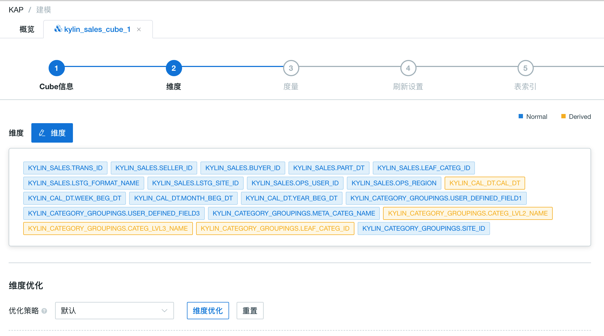

## Cube 设计最佳实践和示例 ##

设计 Cube 是一件专业性较强的工作，尤其是在超大数据集上。某些设置如字典编码、维度表快照，并不建议在超大数据集上开启。为了帮助您更深入了解数据并设计好的 Cube 模型，Kyligence Enterprise 提供了一些工具，比如表采样、模型检测，建议您尽可能充分利用这些工具来辅助 Cube 设计。

在本指南中，我们将使用样例数据集，介绍设计一个好的 Cube 的最佳实践经验。

### 准备样例数据集

在开始之前，我们需要准备[样例数据集](../sample_dataset.cn.md)。如果您还没有准备，请参考[导入 Hive 数据源](../data_import/hive_import.cn.md)导入样例数据。在本指南中，我们将使用此样例数据。

### 运行表采样任务

通常来说，表采样将回答类似如下问题，而这些问题对之后的 Cube 设计来说至关重要。

- 表里有多少行？
- 每一列的基数是多大？
- 每一列的列值都有哪些特性？

为了收集以上表统计信息，请按照如下步骤运行表采样任务：

1. 在左侧导航栏选择**建模**，然后在右侧面板中选择 **概览** -> **数据源**，打开**数据源**面板。

2. 在面板左侧列表中选中需要采样的表，点击右上角的**采样**按钮，开始收集表的统计信息。

   - 在弹窗中，点击**提交**按钮，启动一个表采样任务。
   - 根据表的大小和集群的可用资源，表采样任务可能需要数分钟完成。您可以在**监控**页面中查看任务的具体状态。

3. 表采样任务完成后，您可以查看表的统计信息。

   - 在**数据源**面板中，选择某个表，然后点击右侧的**特征数据**标签页，您可以看到表的行数和每一列的基数信息，如下图。

   - 请留意基数只是一个近似值，但对于设计 Cube 来说，此信息已经足够。

     

4. 对于所有需要创建模型的表重复如上表采样步骤。

> **提示：**尽管您也可以在 Hive 中通过运行如下 HQL 语句来获取表的行数和列基数信息，我们仍然建议您使用表采样任务，因为表采样可以获取更多的统计信息以优化 Cube 设计。
>
> ```sql
> select count(*), count(distinct col), ... from table
> ```

### 模型设计

模型设计的具体步骤已经在[数据建模](../data_modeling.cn.md)章节中详细介绍，这里我们仅介绍其过程中比较容易导致问题的一个关键点。

这个关键点就是是否为维度表创建快照。本产品预先假设维度表都是相对较小的，而这在绝大多数情况下是成立的。因此默认情况下，系统将会为所有维度表创建快照，这带来如下优点：

- 使用维度表快照，维度表可以直接被查询语句查询，而无需将维度表与事实表进行联接，例如：

  ```sql
  select * from TEST_ACCOUNT;

  select count(*), ACCOUNT_COUNTRY
  from TEST_ACCOUNT group by ACCOUNT_COUNTRY;
  ```

- 基于维度表快照，您可以在 Cube 中定义衍生维度。

  尽管如此，如果维度表过大，比如超过 300 MB，在 Cube 构建过程中很可能会报错，提示数据表过大而无法构建快照。因此下面是如何设置维度表与快照的一些最佳实践：

- 在模型定义时尽量避免对大维度表启用快照。

  多大的维度表算大维度表？本产品以数据大小来衡量表的大小，这个大小只在 Cube 构建时才能得知。尽管如此，根据经验判断，**在维度表超过 1 百万行时，您需要特别留意**。

  如果需要禁用对大维度表启用快照，在模型编辑页面的下部，找到**概览** -> **模型**标签页，针对需要禁用快照的维度表反选**以 snapshot 形式存储**复选框。

  

- 谨慎调整参数 `kylin.snapshot.max-mb`

  默认情况下，维度表快照的大小不能超过 300 MB，但这个限制可以通过修改 `config/kylin.properties` 中的参数 `kylin.snapshot.max-mb` 来调整。我们建议您谨慎调整此参数，因为调大此参数会导致 Cube 构建过程中消耗更多的内存，从而给系统带来不稳定的风险。总体而言，我们不建议设置此参数大于 500 MB，即使您系统硬件的可用内存看来非常充足。


- 设计新的模型，将大维度表改为事实表

  如果您确实需要对大维度表进行查询，我们建议您考虑是否可以设计新的模型，在新模型中将此维度表改为事实表。比如在本样例数据集中，如果您需要对大维度表 `TEST_ACCOUNT` 进行查询，分析用户账户的相关信息，那么您可以新建一个模型，将 `TEST_ACCOUNT` 设置为事实表。

### 运行模型检测

模型创建成功后，我们强烈建议您运行模型检测。与表采样类似，尽管这是一个可选步骤，但对于后续的 Cube 设计至关重要。

模型检测会分析基于模型中定义的表联接结果，而这些结果将会被构建进入 Cube，因此分析这个结果可以为后续的 Cube 优化提供建议，比如层级维度和联合维度的设置。

请参考[模型检测](../model_check.cn.md)章节查看如何运行模型检测，下面是一些小技巧：

- 在检测设置中，**请务必为模型检测指定一个数据时间范围**。**时间范围**是比**采样范围**更加有效的设置，它可以更有效地控制系统在检测时需要处理的数据量。在超大数据集上，检测时如果没有合理的设置，将会导致系统可能会对所有数据进行检测，任务长时间执行。
- 模型检测过程中也会运行表采样任务来收集表统计信息。如果之前您已经执行了表采样，那么这一步将会被跳过而不会被重复执行。

### Cube 设计

关于 Cube 设计的详细步骤，请参考[设计 Cube](create_cube.cn.md)章节。下面我们将介绍一些特别需要留意的最佳实践，并解释上述步骤是如何辅助 Cube 设计的。

- **定义普通维度与衍生维度**

  相比普通维度，衍生维度在 Cube 中几乎不占用任何空间，因此理论上来说衍生维度的数量没有上限。尽管如此，维度表快照是定义衍生维度的前提，而只有较小的维度表适合启用快照。

  以样例数据集举例：

  - `TEST_CAL_DT` 是仅包含几千上万行记录的日期表，这是适合启用维度表快照的理想选择，因此可以将 `TEST_CAL_DT` 中的所有列设置为衍生维度。
  - `TEST_ACCOUNT` 是用户账户表，它可能包含有数百万行记录。在此情形下，它不适合启用维度表快照，因此不能将其中的列设置为衍生维度。

- **定义聚合组**

  即使对于有经验的 Cube 设计人员来说，设置合理的聚合组也是一件有挑战性的工作，但这也是我们需要运行表采样和模型检测的原因。在充分了解数据之后，系统才能自动化地优化聚合组设置。

  为了充分利用**维度优**化特性，您需要：

  - 保证已经运行了表采样和模型检测以收集数据信息
  - 在第一步 **Cube 信息**中，提供一些 SQL 语句（可选）
  - 最后，在第二步**维度**的**维度优化**部分点击**维度优化**按钮，系统将根据已收集的数据特性自动设置聚合组。

  

- **设置 Rowkey 编码**

  对于设计 Cube 的新手来说，另外一个比较头疼的事情就是 rowkey 编码的设置。这里尤其需要注意的是，**对于超高基维度，字典编码并不适用**。根据经验，1 百万行是判断是否超高基维度的标准，因此事前了解数据中每列的基数如此重要。

  总体来说，选择 rowkey 编码的规则如下：

  - 优先选择 `date`，`time` 和  `dictionary` 编码。日期和时间都有它们自己特定的编码，而对于基数小于 1 百万行的数字类型或字符串类型的维度，`dictionary` 往往是最高效的编码。
  - 对于数字类型的超高基维度，选择 `integer` 或 `double` 编码
  - 对于其他类型的超高基维度，选择 `fixed_length` 编码。由于 `fixed_length` 编码将会把数据编码成定长字节，不是特别的存储高效，因此是最后的选项。

  以样例数据举例：

  - 大部分维度可以设置为 `date` 和 `dictionary` 编码，如日期类型的 `CAL_DT`，字符串类型的 `LSTG_FORMAT_NAME`，数字类型的 `LSTG_SITE_ID`。
  - 一些维度从业务上判断应该属于超高基维度，比如 `ORDER_ID` 基数与订单数量一致，`SELLER_ID` 基数与卖家数量一致。它们都是 `bigint` 类型，都可以设置为 `integer` 编码。

- **设置 Rowkey 顺序**

  Rowkey 的顺序可能会对 Cube 构建与查询的性能产生非常大的影响。在 rowkey 列表中，您可以上下拖拽各个维度来调整它们的先后顺序。请按照如下优先级设置 rowkey 的先后顺序：

  1. 在查询的筛选条件中高频使用的维度

     在 rowkey 顺序中位置越靠前，含有该维度特定值的数据将在存储上更加的集中，在筛选或扫描时效率更高、性能更好。

  2. 高基维度

  3. 低基维度

  将维度按照基数倒序排列能够有效的提升 Cube 的构建效率。


### 使用“小”数据测试 Cube

Cube 设计完成后，在部署进入生产系统之前，我们强烈建议您使用“小”数据对 Cube 进行测试。因为一旦大量数据被构建进入 Cube，后面对其进行改动或优化就相对比较困难。

以下是如何测试 Cube 的小技巧：

- **尽量先构建小的 Segment**

  小的 Segment 构建很快且成本很低，一旦发现有错误或不足，修正相对非常容易。

  理想状态下，一个小的 Segment 通常只需要 10 到 30 分钟左右

- **验证业务查询是否能够击中 Cube**

  在**分析**页面中，运行业务查询并验证对应的查询引擎是否为刚刚设计完成的 Cube，此时请确认测试场景已经包含了您最复杂的业务查询。

  为了验证设计好的 Cube 是否可以服务于特定业务查询，您也可以使用**验证SQL**功能（在 Cube 列表中的操作菜单中）。如果验证失败，验证结果会给出一些提示和建议，为什么查询无法命中 Cube，以及如何修改 Cube 可以服务该查询。

- **查询性能测试**

  Cube 一旦被验证可以工作后，我们建议您做一些性能基准测试，根据业务查询的性能与并发度要求，进行部署生产系统的硬件资源规划。


