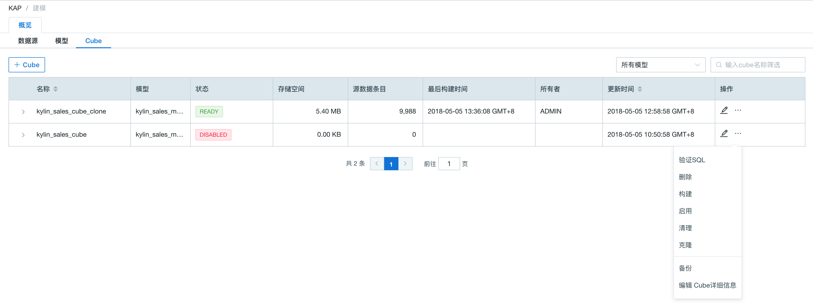
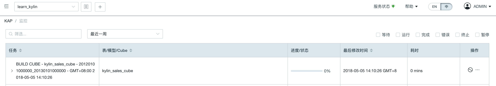
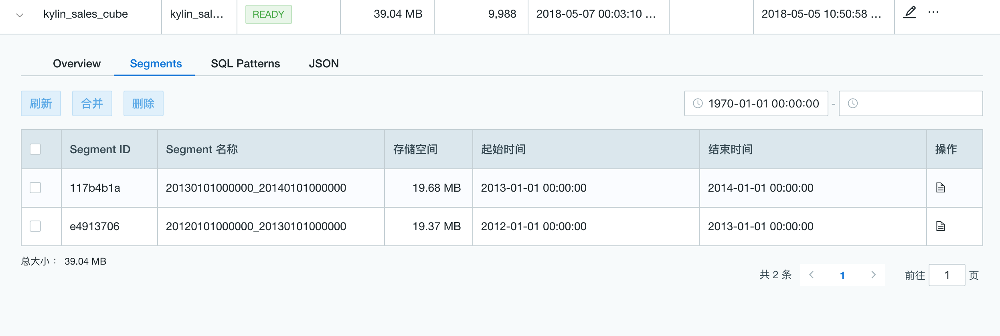

## 按“日期/时间”构建


### 初次构建

首先打开本产品的 Web UI，并选择 learn_kylin 项目，然后跳转到建模页面，找到 Cube 列表。在 Cube 列表中找到 **Kylin_Sales_Cube**。单击右侧的 **Action** 按钮，在弹出的菜单中选择**构建**（build）。



第二步，在弹出的 Cube 构建确认对话框中确认 Cube 的分段时间列（Partition Date Column）是DEFAULT.KYLIN_SALES.PART_DT，以及起始时间是2012-01-01 00:00:00。在 Kyligence Enterprise 中，一次构建会为 Cube 产生一个新的 Segment，每次的 SQL 查询都会访问一个或多个符合条件的 Segment；我们需要尽可能地让一个 Segment 更好地适用于查询条件，因此我们可以按年构建，即每个年份构建一个 Segment。在这个例子中，我们输入结束日期为2013-01-01 00:00:00。设置完成后单击**提交**按钮。
> **注意：**增量构建是具体按年构建还是按月构建应该根据实际的业务需求、ETL 时效及数据量大小而定。如果一次构建的数据量过大，可能导致构建时间过长，或出现内存溢出等异常。在当前的样例数据中，数据量较小，按年构建是可以顺利完成的。


当任务成功提交之后，切换到 Monitor 页面，这里会列出所有的任务列表。我们找到列表最上面的一个任务（名称是：**Kylin_sales_cube** - 20120101000000_20130101000000），这就是我们刚刚提交的任务。在这一行单击或点击左侧的箭头图标，页面右侧会显示当前任务的详细信息。
待构建任务完成，可以在 Monitor 页面看到该任务状态已被置为完成（Finished）。这时候，第一个 Segment 就构建完成了。前往 Cube 列表中查看，会发现该 Cube 的状态已被置为“就绪（Ready）”了。




### 增量构建

在第一个 Segment 构建完成之后，我们开始构建第二个 Segment。两个 Segment 构建的时间周期不能有交集。

首先在建模页面的 Cube 列表中找到该 Cube，单击右侧的 **Action** 按钮，然后选择“构建(Build)”，打开 Cube 构建确认对话框。在这个对话框中，首先确认起始时间（Start Date）是2013-01-01 00:00:00，因为这是上次构建的结束日期，为保障所构建数据的连续性，Kyligence Enterprise 自动将新一次构建的起始时间更新为上次构建的结束日期。同样的，在结束时间（End Date）里输入2014-01-01 00:00:00，然后单击 Submit 按钮，开始构建下一年的 Segment。

待构建完成，我们可以在 Cube 的 Segment 界面中查看，发现 Cube 的两个 Segment 都已就绪。




### 常见问题

**问：Kyligence Enterprise 有没有构建任务并发数限制？如果提交构建任务时，超出了系统允许的并发数怎么办？**

Kyligence Enterprise 有构建任务并发数限制，默认为**10**，可以通过修改系统配置文件`kylin.properties`中的参数`kylin.job.max-concurrent-jobs` 来更改。

提交新构建任务时，如果超出了系统允许的任务并发数限制，那么该提交的构建任务会进入任务队列。当有运行的任务完成时， Kyligence Enterprise 会以先进先出 (FIFO) 的方式调度队列中的任务执行。

**问：在构建Cube时，如果遇到 "killed by admin" 错误。**

这个问题主要是由于使用 Sandbox 时，MR 任务请求的内存过多，从而被 YARN 拒绝导致的。您可以通过修改 `conf/kylin_job_conf_inmem.xml`配置，调低请求的内存大小来解决这个问题。

```properties
<property>
<name>mapreduce.map.memory.mb</name>
<value>1072</value>
<description></description>
</property>
<property>
<name>mapreduce.map.java.opts</name>
<value>-Xmx800m</value>
<description></description>
</property>
```

