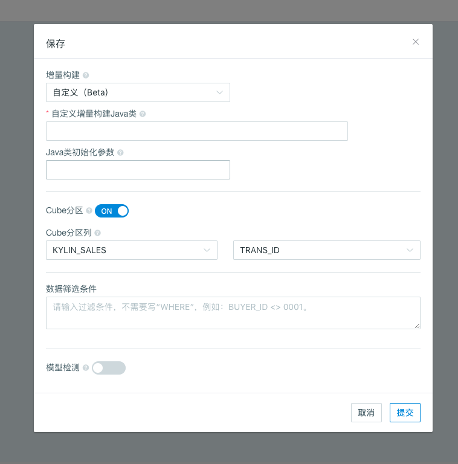

## 自定义增量构建

在有些场景下，新的数据并不能通过日期/时间或文件来识别和加载，比如可以通过自增型数据编号列（类似流式数据的 offset ），或者日期/时间+批次号的方式来识别，因此 Kyligence Enterprise 支持自定义增量构建，您可以在系统中自定义特定的 Cube 增量构建方法，以满足数据加载需求。您可以按照以下步骤，实现 Cube 数据的自定义增量构建。

### 设计模型的增量构建类型为自定义

1. 选择增量构建类型

   如果我们在保存模型时将增量数据加载类型设置为**自定义**，则在该模型中设计的 Cube 的构建类型对应着**自定义增量构建**。

   

2. 自定义增量构建 Java 类和 Java 类初始化参数

   用户需要输入用于实现自定义增量构建的 Java 类的类名，该 Java 类由用户自己定义。当 Java类已经准备好后，首先将该类放入 $KYLIN_HOME/ext 路径下，并重启本产品。

   Java 类初始化参数类型为字符串，多个参数值以逗号隔开，此参数将会传递给上述的 Java 类。

3. 设置 Cube 分区列

   与其他增量构建类型的模型类似，设置了 Cube 分区列后，Cube 数据的构建将可以基于特定的分区进行。

   

4. 点击提交按钮，模型就设置成功了。根据业务需求设计并保存 Cube，使用 REST API 进行构建。

   > **注意：**自定义增量构建的 Cube 的构建任务以及 Segment 的刷新/合并任务只能通过 REST API 提交。更多信息请参考 [Cube API](../../rest/cube_api.cn.md)。

5. 构建任务提交成功后，在监控界面可以看到正在运行的构建任务。等待构建任务完成，可以在对应的Cube列表下看到构建好的Segment。