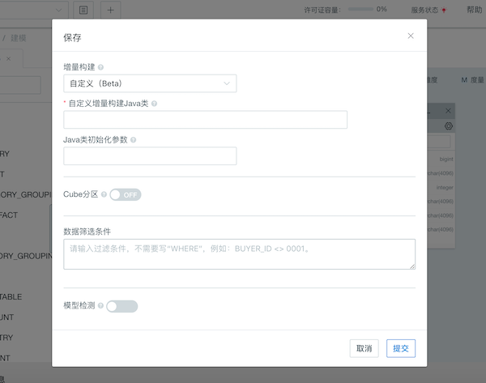

## 自定义增量构建（Beta）

本章节将全面介绍自定义增量构建的使用场景、原理和使用方法。

### 使用场景

在大多数情形下，我们推荐您基于日期/时间列来增量构建 Cube 数据，将过去一周、一天、甚至一小时的新数据构建进入 Cube，从而避免对 Cube 数据进行全量更新，大大节约计算资源并缩短数据刷新的时间。在提交构建任务时，任务会带有日期/时间的起止范围，实现增量数据的选择和加载。

但某些场景下，增量数据并不一定总是能够通过日期/时间列来识别，比如：

- 自增型交易编号（类似流式数据的 offset ），您需要根据交易编号范围来增量构建新数据
- 财务期间（比如201901，201913等），您需要根据财务期间范围来增量构建新数据
- 日期加更新批次的组合，您需要把日期加批次组合起来，增量构建某一批次或某些批次的数据。

因此 Kyligence Enterprise 支持了自定义增量构建，您可以在系统中自定义特定的 Cube 增量构建方法，以满足上述数据加载需求。您可以按照以下步骤，实现 Cube 数据的自定义增量构建。

### 实现原理

在大部分情形下，我们推荐使用时间分区列来进行 Cube 数据的增量构建，以周/天/小时为单位，将最近一周、一天或者一小时的数据增量构建进入 Cube。每一次成功构建后，都会在 Cube 中生成一个新的 Segment，正常情况下这些 Segment 的时间区间会形成一个连续的时间轴，如下图所示：

> **提示：**在实际存储时，Kyligence Enterprise 会将每个 Segment 的时间区间值转换为 Long 类型的数值，因此时间轴实际上是一个 Long 类型的连续区间。

自定义增量构建实质上将 Segment 区间（Long 类型的数值区间）映射至时间轴区间，并在提交构建任务时实现该区间值至增量数据筛选条件的自定义映射，如下图显示。

### 使用方法

1. 设计模型时选择增量构建类型

   在设计并保存模型时，选择增量构建类型为**自定义**，则在该模型中设计的 Cube 的构建类型对应着**自定义增量构建**。

   

2. 自定义增量构建 Java 类和 Java 类初始化参数

   用户需要输入用于实现自定义增量构建的 Java 类的类名，该 Java 类由用户自己定义。当 Java类已经准备好后，首先将该类放入 $KYLIN_HOME/ext 路径下，并重启本产品。

   Java 类初始化参数类型为字符串，多个参数值以逗号隔开，此参数将会传递给上述的 Java 类。关于自定义增量 Java 类的实现，请参考[自定义增量构建开发者指南](../../appendix/customize_build_dev_guide.cn.md)。

3. 点击提交按钮，保存模型。

4. 根据业务需求基于以上模型设计并保存 Cube。

5. 使用 REST API 提交 Cube 构建任务。

   设置了自定义增量构建的 Cube，构建任务以及 Segment 的刷新/合并仅能通过 REST API 提交。更多信息请参考 [Cube 构建 API](../../rest/cube_api/cube_build_api.cn.md)。

6. 构建任务提交成功后，在监控界面可以看到正在运行的构建任务。等待构建任务完成，可以在对应的Cube列表下看到构建好的Segment。