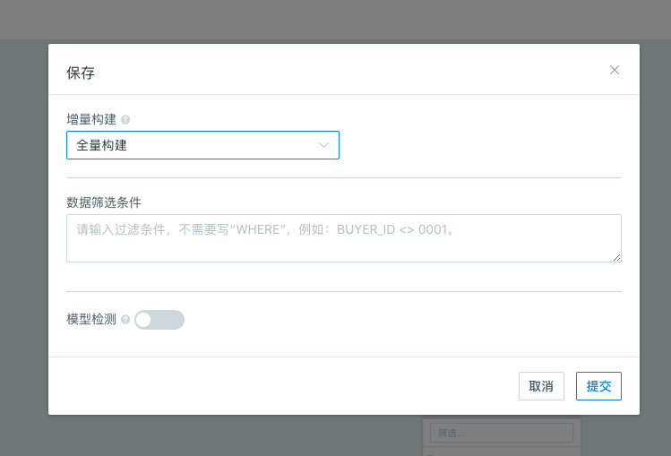
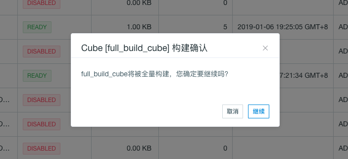
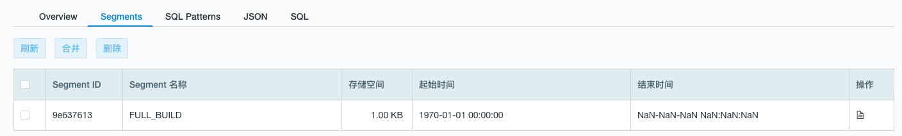

## 全量构建

如果我们在保存模型时将增量数据加载类型设置为**全量构建**，则在该模型中设计的 Cube 的构建类型对应着全量构建。

用户可以在 Web UI 进行全量构建，也可以通过 REST API 进行全量构建。关于使用 REST API 进行全量构建的更多信息，请参考 [Cube API](../../rest/cube_api.cn.md) 。

用户不可以对全量构建的 Segment 进行合并，因为全量构建的 Cube 中只能有最多一个 Segment。Segment 的刷新同样可以通过 Web UI 和 REST API 进行。

### 在 Web UI 进行全量构建

1. 选择全量构建的 Cube，单击右侧的 **Action** 按钮，在弹出的菜单中选择**构建**（build）。弹出提示消息如下：

   

2. 点击继续进行构建。当构建任务完成之后，前往 Cube 列表中查看，会发现该 Cube 的状态已被置为“就绪（Ready）”了。Cube 中会存在一个名为 FULL_BUILD 的 Segment。

   

