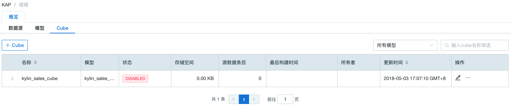
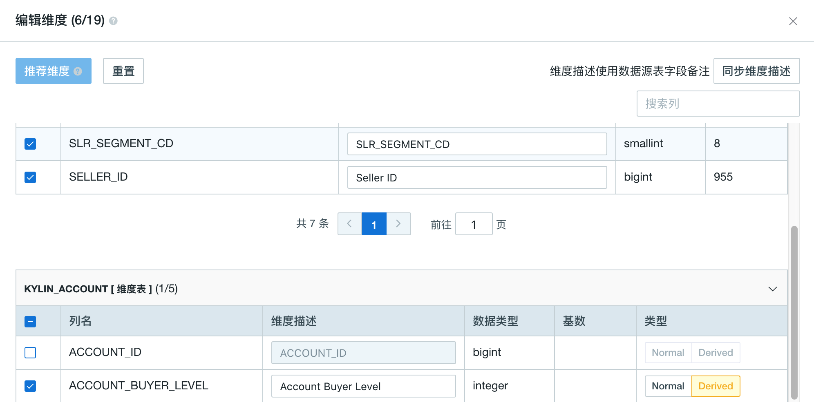

## 基本 Cube 设计

本文将产品自带的样例数据为例，介绍 Cube 的创建过程。


打开产品的 Web UI，首先选择 *learn_kylin* 项目，这里我们创建一个新的 Cube 命名为 *kylin_sales_cube_1*。




### 基本信息

单击提交后，您将会进入 Cube 设计向导。在设计界面的上方，您可以看到当前所在的步骤。


### 维度设计

进入步骤2，点击按钮**维度**，您可以根据分析需要，选择模型中的列作为 Cube 的维度。

需要注意的是，维度的数量会影响到生成的 Cuboid 数量，进而影响 Cube 的计算与存储消耗。为了优化 Cube 数据刷新时的计算和存储开销，避免维度爆炸问题，Kyligence Enterprise 将维度分为了**普通维度**（Normal Dimension）和**衍生维度**（Derived Dimension）。



> **提示：**
>
> 1. 您可以填写维度描述为维度增加语义描述，并且对接特定 BI 工具时可以将维度描述直接提供为可用列名，如导出 TDS （Tableau 的数据源定义文件）。
> 2. 点击“同步”按钮，可以直接同步数据源中表字段的备注作为维度描述，且后续可以自行更改。
> 3. 在 3.4.2 版本中，支持对未勾选的维度同步数据源字段备注作为描述。但如果从3.4.2回退到之前的版本并继续编辑保存cube，其中未勾选的维度的已同步描述将丢失。因此建议您在回滚至 3.4.2 之前的版本前备份元数据。

只有普通维度会影响 Cuboid 的数量和存储膨胀率，衍生维度并不参与 Cuboid 计算，而是由衍生维度对应的外键（FK）参与计算 Cuboid。在查询时，对衍生维度的查询会首先转换为对外键所在维度的查询，因此会牺牲少量查询性能。

普通维度与衍生维度的基本设计规则如下：

- 经常出现在过滤条件中的维度应当设为普通维度，以达到最好的查询性能。

  在 *KYLIN_CATEGORY\_GROUPINGS* 表里，和商品分类相关的三个字段（*META\_CATEG\_NAME*、*CATEG\_LVL2\_NAME*、*CATEG\_LVL3\_NAME*）都可能出现在过滤条件中，我们先把他们添加为普通类型维度。

- 从维度表来的维度，如果基数不高，一般选作**衍生维度**。

  比如，一般在查询中还经常把时间作为过滤或聚合的条件，如按周过滤、按周聚合等。这里我们以按周为例，需要用到 *KYLIN_CAL_DT* 中的 *WEEK_BEG_DT* 字段。该字段来自维度表，且周的基数不高，因此，我们添加 *WEEK_BEG_DT* 字段为衍生维度。

- 同样，*KYLIN_CATEGORY_GROUPINGS* 表中还有一些可作为衍生维度的字段，如 *USER_DEFINED_FIELD1*、*USER_DEFINED_FIELD3*、*UPD_DATE*、*UPD_USER* 等。

- 在事实表上，表征交易类型的 *LSTG_FORMAT_NAME* 字段也会用于过滤或聚合条件，因此，我们再添加 *LSTG_FORMAT_NAME* 字段作为普通维度。

> **注意：**从 3.2.1 版本开始，Kyligence Enterprise 支持对衍生维度设置缓慢变化维处理类型。因此您需要对维度采用缓慢变化维类别1（SCD1）的处理方法，请将它设置为衍生维度，并在模型中对其所在的维度表做相应设置。

最终，维度的设置结果如下图所示：


本产品提供多种方法来优化 Cube 中的维度组合。在**维度优化**设置里，您可以看到聚合组 ( AGG )，Rowkey 和最大组合维度数（ MDC ）的设置。通过合理的配置聚合组和最大组合维度数，Cuboid 的数量可以被大大减少。相关更多信息，请参见[维度聚合组](aggregation_group.cn.md)和 [最大维度组合数](cuboid_pruning.cn.md)。

这里我们推荐您使用（点击）**一键优化**功能。这个功能可以根据您选择的维度和其他信息，对 Cube 的维度做最优的处理，即节省存储空间的同时最大的优化查询速度。

优化后的结果如下图所示：


Rowkey 的顺序对于查询性能来说至关重要，把最常出现在过滤条件列放置在 rowkey 的前面会起到很好的查询优化效果。通常情况下 rowkey 不需要您特别设置，Kyligence  Enterprise 会根据维度字段类型和表采样的结果，智能推荐 rowkey 的编码和顺序。

在本例中，为了向您演示 rowkey 的设置，我们首先把 *PART_DT* 放在 rowkey 的第一位。接下来，按照层级把商品分类的字段跟随其后。由于参与 cuboid 生成的维度都会作为 rowkey，因此我们需要把这些列添加为 rowkey 当中。

在每个 rowkey 上，还需要为列值设置编码方法。本产品支持的**基本编码类型**如下：

  - **dict**：即字典编码，适用于大部分字段，但在超高基情况下，可能引起内存不足的问题。默认情形下，本产品默认对低基情形下的 varchar 和 char 类型的维度选用此编码。
  - **boolean**：适用于字段值为: true, false, TRUE, FALSE, True, False, t, f, T, F, yes, no, YES, NO, Yes, No, y, n, Y, N, 1, 0。默认情形下，本产品默认对 boolean 类型的维度选用此编码。
  - **integer**：适用于字段值为整数字符，支持的整数区间为 [ -2^(8*N-1), 2^(8*N-1)]。默认情形下，本产品默认对 tinyint, smallint, int, bigint 类型的维度选用此编码。
  - **date**：适用于字段值为日期字符，支持的格式包括 yyyyMMdd、yyyy-MM-dd、yyyy-MM-dd HH:mm:ss、yyyy-MM-dd HH:mm:ss.SSS，其中如果包含时间戳部分会被截断。默认情形下，本产品默认对 date 类型的维度选用此编码。
  - **time**：适用于字段值为时间戳字符，支持范围为[ 1970-01-01 00:00:00, 2038/01/19 03:14:07]，毫秒部分会被忽略。“time” 编码适用于 time, datetime, timestamp等类型。默认情形下，本产品默认对 timestamp 类型的维度选用此编码。
  - **fixed_length**：适用于超高基场景，将选取字段的前 N 个字节作为编码值，当 N 小于字段长度，会造成字段截断，当 N 较大时，造成 Rowkey 过长，查询性能下降。只适用于 varchar 或 nvarchar类型。默认情形下，本产品默认对超高基情形下的 varchar 和 char 类型的维度选用此编码。
  - **fixed_length_hex**：适用于字段值为十六进制字符，比如 1A2BFF 或者 FF00FF，每两个字符需要一个字节。只适用于 varchar 或 nvarchar 类型。

在这个案例中，我们除了把 *LSTG_FORMAT_NAME* 设置为 `fixed_length` 类型（长度为12）外，将其余的 rowkey 都设置为 `dict` 编码。 

Rowkey 设置的结果如下：


> **提示：**维度表上的列可以作为普通维度，也可以作为衍生维度。普通维度会保存在 Cube 中，而衍生维度则以快照的形式存储。更多内容，请参考 [设置维度表快照](../model_design/data_modeling.cn.md#其他高级设置：设置维度表快照)。


> **注意：**在同一个维度表中，不建议将衍生维度和普通维度混合使用。这有可能造成比较混淆的查询结果，因为一些列来自于 Cube，而另一些列来自于快照，它们会反映不同时期的数据值而造成混淆。


### 度量设计

Cube 度量设计主要包括聚合函数和需要聚合统计的列，目前 Kyligence Enterprise 支持的聚合函数有：

- SUM：算数加总
- MIN：取最小值
- MAX：取最大值
- COUNT：计数
- COUNT_DISTINCT：去重计数，其中包含了精确去重和近似去重（HyperLogLog）两种算法。
- TOP_N：去前N位，支持前10位，100位和1000位。
- CORR（Beta）：相关系数
- PERCENTILE_APPROX：近似百分位

默认系统将会创建一个 COUNT 度量，统计数据记录条数。如果您点击**推荐度量**，根据底层模型中的数据类型，系统会自动创建好一些默认的 COUNT() 聚合和 SUM() 聚合。

在本例中，假设我们需要通过 *PRICE* 的不同聚合形式考量销售额，如总销售额为 *SUM(PRICE)*、最高订单金额为 *MAX(PRICE)*、最低订单金额为 *MIN(PRICE)*。因此，我们手动创建三个度量，分别选择聚合表达式为 SUM、MIN、MAX，并选择 *PRICE* 列作为统计列。

其次，我们还需要通过 COUNT_DISTINCT(SELLER_ID) 统计卖家个数。Kyligence Enterprise 默认使用 HyperLogLog 近似算法进行 COUNT_DISTINCT 的计算，该算法是个近似算法，但可以大幅节约该度量的计算开销，查询性能大幅优于精确算法。在海量数据情形下，如果对结果精确度没有严格要求，我们推荐您使用该算法。假设本案例对商家数量的精确性要求不高，这里我们选择精度较低的 **Error Rate < 9.75%**。同样，我们再创建一个 COUNT(DISTINCT LSTG_FORMAT_NAME) 的度量考量不同条件下的交易类型。


在销售业务分析的场景中，往往需要挑选出销售业绩最好的商家，这时候就需要 TOP-N 的度量了。在这个例子中，我们会选出 *SUM(PRICE)* 最高的一些 *SELLER_ID*，实际上就是执行如下的 SQL 语句：

```sql
SELECT SELLER_ID, SUM(PRICE) FROM KYLIN_SALES 
GROUP BY SELLER_ID 
ORDER BY SUM(PRICE)
```
因此，我们创建一个 TOP-N 的度量，选择 *PRICE* 字段作为 SUM/ORDER BY 字段，选择 *SELLER_ID* 字段作为GROUP BY字段，并选择 TOPN(100) 作为度量的精度。


最终 Cube 的度量如下图所示：


> **提示：**
>
> 在 3.4.2 及之后的版本中，您可以直接同步数据源中表字段的备注作为度量的描述，如果度量涉及多个字段，则会将多个字段的备注拼接后作为度量描述。


> **注意**：当列上有 NULL 值时，`COUNT(col)` 不等于 `COUNT(1)`，此时必须显示地定义 `COUNT(col)` 度量才能获得正确的查询结果。
>
> - 作为默认行为，系统假设列不含 NULL 值，因此可以用 `COUNT(1)` 回答 `COUNT(col)` 的查询。这也是为什么用户一般不需要为每个列都定义 `COUNT(col)` 度量。
> - 但若列上有 NULL 值时，用户必须显示地定义 `COUNT(col)` 度量，从而确保对 `COUNT(col)` 查询结果的正确性。


### 刷新设置

**触发自动合并的时间阈值 (Auto Merge Threshold) **：每次 Cube 成功构建后，都会生成一个 Segment 数据块。为了避免 Cube 中数据块过多，导致查询性能下降，我们建议对 Cube 中的数据块按周或月进行自动合并，如下图所示：


> **注意：** 自动合并仅支持按日期/时间增量构建的 Cube，对于其他增量构建类型的 Cube，请勿启用此选项。

**保留时间阈值**：对于时间久远的不需要再被查询的 Segment，Kyligence Enterprise 通过设置**保留时间阈值**可以自动清除这些 Segment，以节省磁盘空间。每当构建新的 Segment时，Kyligence Enterprise 会自动检查老的 Segment，当这些 Segment 的结束日期与当前最新 Segment 的结束日期的差值大于**保留时间阈值**，则会被清除。如设置为 1 年，最新的 Cube 构建到当天，那么结束日期是一年以前的 Segment 会被清除。

> **提示：**如果无需自动清理，可以默认设置**保留时间阈值**为0。

**分区起始时间**：在创建数据模型的时候我们提到，我们希望采用增量构建方式对 Cube 进行构建，并选择了 *PART_DT* 字段作为分区时间列。在创建 Cube 时，我们需要指定 Cube 构建的起始时间，在这个例子中，根据样例数据中的时间条件，在 Cube 的创建过程中，“1970-01-01 08:00:00“ 默认为分区起始时间。


### 表索引

为了支持对明细数据进行高效的查询，Kyligence Enterprise 提供了表索引功能。对于定制查询，Kyligence Enterprise 使用构建良好的 Cube 来进行高效的处理；对于非定制查询，Query Pushdown 提供了补充和完善。上述功能使得用户能够快速获取聚合查询的结果。如果用户在分析过程中对明细数据感兴趣，则可以通过表索引来达成目的。

具体使用步骤与注意事项参见[明细表索引](table_index.cn.md)。


### 高级设置

在这里添加的配置项可以在 Cube 级别覆盖从 `kylin.properties` 配置文件读取出来的全局配置。在这个案例中，我们可以直接采用默认配置，在此不做任何修改。
> **提示：**关于 Cube 配置参数的修改可以参见[多重配置重写](../../installation/config/config_override.cn.md)。

在**高级设置**中，可以选择 Cube 的构建引擎。默认情况下，Kyligence Enterprise 使用 MapReduce 作为 Cube 构建引擎，但也可以手动切换成 Spark (Beta)。
> **提示：**关于如何配置和使用 Spark 构建引擎的详情，参见[配置 Spark 构建引擎](../../installation/spark_cubing/spark_engine.cn.md)。


### Cube 概览

请读者仔细确认这些基本信息，包括数据模型名称、事实表以及维度和度量个数。确认无误后单击**保存**按钮，并在弹出的确认提示框中选择**确定**。

最终，Cube 的创建就完成了。我们可以刷新 Cube 列表，从中可以看到新创建的Cube了。因为新创建的 Cube 并没有数据，是不能被查询的，所以状态仍然是 DISABLED。


