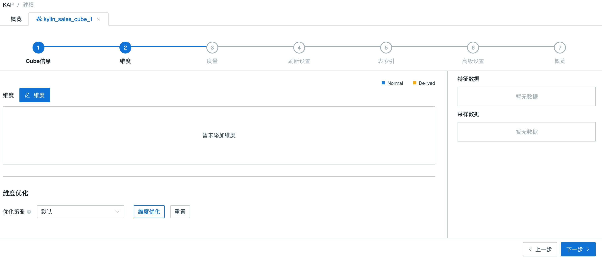
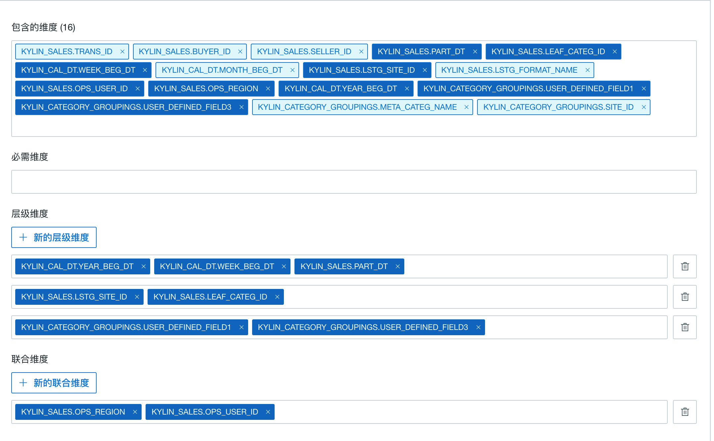
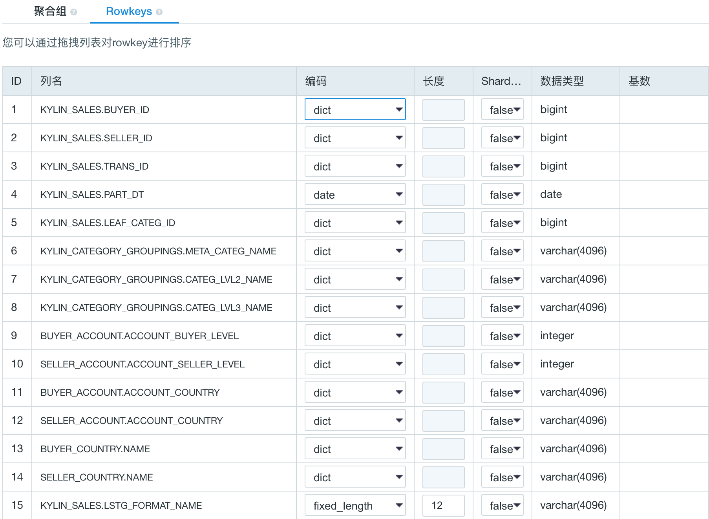

## 基本 Cube 设计

本文将产品自带的样例数据为例，介绍 Cube 的创建过程。


打开产品的 Web UI，首先选择 “learn_kylin” 项目，这里我们创建一个新的 Cube 命名为 “kylin_sales_cube_1”。


### 基本信息

单击提交后，您将会在界面上方，看到创建一个 Cube 的全部流程。




### 维度设置

从数据模型的维度中选择一些列作为 Cube 的维度。这里的设置会影响到生成的 Cuboid 数量，进而影响 Cube 的数据量大小。维度分为**普通维度**（Normal Dimension）和**衍生维度**（Derived Dimension）。只有来自维度表的列，且在维度表配有快照（Snapshot）时，才可以作为衍生维度。其余维度均为普通维度。

> 注意：只有普通维度会影响 Cuboid 的数量和 Cube 的总数据量。
>
> 相对于普通维度来说，衍生维度并不参与维度的 Cuboid 的计算，而是由衍生维度对应的外键（FK）参与维度 Cuboid，从而降低 Cuboid 数。在查询时，对衍生维度的查询会首先转换为对外键所在维度的查询，因此会牺牲少量查询性能。

维度的基本设计规则如下：

- 经常出现在过滤条件中的维度应当设为普通维度，以达到最好的查询性能。

  在 “KYLIN_CATEGORY\_GROUPINGS” 表里，和商品分类相关的三个字段（“META\_CATEG\_NAME”、“CATEG\_LVL2\_NAME”、“CATEG\_LVL3\_NAME”）都可能出现在过滤条件中，我们先把他们添加为普通类型维度。

- 从维度表来的维度，如果基数不高，一般选作**衍生维度**。

  比如，一般在查询中还经常把时间作为过滤或聚合的条件，如按周过滤、按周聚合等。这里我们以按周为例，需要用到 “KYLIN_CAL_DT” 中的 “WEEK_BEG_DT” 字段。该字段来自维度表，且周的基数不高，因此，我们添加 “WEEK_BEG_DT” 字段为衍生维度。

- 同样的，“KYLIN_CATEGORY_GROUPINGS” 表中还有一些可作为衍生维度的字段，如 “USER_DEFINED_FIELD1”、“USER_DEFINED_FIELD3”、“UPD_DATE”、“UPD_USER” 等。

- 在事实表上，表征交易类型的 “LSTG_FORMAT_NAME” 字段也会用于过滤或聚合条件，因此，我们再添加 “LSTG_FORMAT_NAME” 字段作为普通维度。

最终，维度的设置结果如下图所示：


本产品提供丰富的工具来优化 Cube 中的维度组合。在**维度优化**设置里，您可以看到聚合组 ( AGG )，Rowkey 和最大组合维度数（ MDC ）的设置。通过合理的配置聚合组和最大组合维度数，Cuboid 的数量可以被大大减少。相关更多信息，请参见[维度聚合组](aggregation_group.cn.md)和 [Cuboid 剪枝](cuboid_pruning.cn.md)。

这里我们推荐您使用（点击）**一键优化**功能。这个功能可以根据您选择的维度和其他信息，对 Cube 的维度做最优的处理，即节省存储空间的同时最大的优化查询速度。

优化后的结果如下图所示：



Rowkey 的顺序对于查询性能来说至关重要，一般把最常出现在过滤条件中的列放置在 Rowkey 的前面，在这个案例中，我们首先把 “PART_DT” 放在 Rowkey 的第一位。接下来，按照层级把商品分类的字段跟随其后。由于参与 Cuboid 生成的维度都会作为 Rowkey，因此我们需要把这些列添加为 Rowkey 当中。

在每个 Rowkey 上，还需要为列值设置编码方法。本产品支持的**基本编码类型**如下：

  1. "dict" 适用于大部分字段，默认推荐使用，但在超高基情况下，可能引起内存不足的问题。
  2. "boolean" 适用于字段值为: true, false, TRUE, FALSE, True, False, t, f, T, F, yes, no, YES, NO, Yes, No, y, n, Y, N, 1, 0
  3. "integer" 适用于字段值为整数字符，支持的整数区间为 [ -2^(8*N-1), 2^(8*N-1)]。
  4. "date" 适用于字段值为日期字符，支持的格式包括 yyyyMMdd、yyyy-MM-dd、yyyy-MM-dd HH:mm:ss、yyyy-MM-dd HH:mm:ss.SSS，其中如果包含时间戳部分会被截断。
  5. "time" 适用于字段值为时间戳字符，支持范围为[ 1970-01-01 00:00:00, 2038/01/19 03:14:07]，毫秒部分会被忽略。“time” 编码适用于 time, datetime, timestamp等类型。
  6. "fix_length" 适用于超高基场景，将选取字段的前 N 个字节作为编码值，当 N 小于字段长度，会造成字段截断，当 N 较大时，造成 Rowkey 过长，查询性能下降。只适用于 varchar 或 nvarchar类型。
  7. "fixed_length_hex" 适用于字段值为十六进制字符，比如 1A2BFF 或者 FF00FF，每两个字符需要一个字节。只适用于 varchar 或 nvarchar 类型。

在这个案例中，我们除了把 “LSTG_FORMAT_NAME” 设置为 “fixed_length” 类型（长度为12）外，将其余的 Rowkey 都设置为 “dict” 编码。 

Rowkey 设置的结果应该如下：



> 提示：维度表上的列可以作为普通维度，也可以作为衍生维度。普通维度会保存在 Cube 中，而衍生维度则以快照的形式存储。更多内容，请参考 [设置维度表快照](../model_design/data_modeling.cn.md#其他高级设置：设置维度表快照)。


> 注意：在同一个维度表中，不建议将衍生维度和普通维度混合使用。这有可能造成比较混淆的查询结果，因为一些列来自于 Cube，而另一些列来自于快照，它们会反映不同时期的数据值而造成混淆。


### 度量设置

根据数据分析中的聚合需求，我们需要为 Cube 定义度量的聚合形式。如果您继续点击**一键优化**，根据数据类型，系统会自动创建好一些默认的 COUNT() 聚合和 SUM() 聚合。默认建好的聚合仍然可以手动修改或删除。在这个案例中，我们还需要通过 “PRICE” 的不同聚合形式考量销售额，如总销售额为 SUM(PRICE)、最高订单金额为 MAX(PRICE)、最低订单金额为 MIN(PRICE)。因此，我们手动创建三个度量，分别选择聚合表达式为 SUM、MIN、MAX，并选择 “PRICE” 列作为目标列。

其次，我们还需要通过 COUNT(DISTINCT SELLER_ID) 考量卖家个数。根据前面章节的介绍，Kyligence Enterprise 默认使用 HyperLogLog 算法进行 COUNT_DISTINCT 的计算，该算法是个近似算法，在创建度量时需要选择一个近似度，本案例对精确性要求不高，为了提升查询性能，我们选择精度较低的 “Error Rate < 9.75%”。同样的，我们再创建一个 COUNT(DISTINCT LSTG_FORMAT_NAME) 的度量考量不同条件下的交易类型。


在销售业务分析的场景中，往往需要挑选出销售业绩最好的商家，这时候就需要 TOP-N 的度量了。在这个例子中，我们会选出 SUM(PRICE) 最高的一些 ”SELLER_ID“，实际上就是执行如下的SQL语句：

```sql
SELECT SELLER_ID, SUM(PRICE) FROM KYLIN_SALES 
GROUP BY SELLER_ID 
ORDER BY SUM(PRICE)
```
因此，我们创建一个TOP-N的度量，选择PRICE字段作为SUM/ORDER BY字段，选择SELLER_ID字段作为GROUP BY字段，并选择TOPN(100)作为度量的精度。


最终添加的度量如下图所示：


### 更新设置

**触发自动合并的时间阈值 (Auto Merge Threshold) **：一般的，一个销售统计的 SQL 查询往往会按周、月进行过滤和聚合，所以我们可以设置 Cube 自动按周或月进行自动合并，设置**触发自动合并的时间阈值 (Auto Merge Threshold) **如下所示：


**保留时间阈值**：对于时间久远的不需要再被查询的 Segment，Kyligence Enterprise 通过设置**保留时间阈值**可以自动清除这些 Segment，以节省磁盘空间。每当构建新的 Segment时，Kyligence Enterprise 会自动检查老的 Segment，当这些 Segment 的结束日期与当前最新 Segment 的结束日期的差值大于**保留时间阈值**，则会被清除。如设置为1年，最新的 Cube 构建到当天，那么结束日期是一年以前的 Segment 会被清除。

> 提示：如果无需自动清理，可以默认设置**保留时间阈值**为0。

**分区起始时间**：在创建数据模型的时候我们提到，我们希望采用增量构建方式对 Cube 进行构建，并选择了 “PART_DT” 字段作为分区时间列。在创建 Cube 时，我们需要指定 Cube 构建的起始时间，在这个例子中，根据样例数据中的时间条件，在 Cube 的创建过程中，“1970-01-01 08:00:00“默认为**分区起始时间**。


### 表索引

为了支持对明细数据进行高效的查询，Kyligence Enterprise 提供了表索引功能。对于定制查询，Kyligence Enterprise 使用构建良好的 Cube 来进行高效的处理；对于非定制查询，Query Pushdown 提供了补充和完善。上述功能使得用户能够快速获取聚合查询的结果。如果用户在分析过程中对明细数据感兴趣，则可以通过表索引来达成目的。

具体使用步骤与注意事项参见[明细表索引](table_index.cn.md)。


### 高级设置

在这里添加的配置项可以在 Cube 级别覆盖从 `kylin.properties` 配置文件读取出来的全局配置。在这个案例中，我们可以直接采用默认配置，在此不做任何修改。
> 提示：关于 Cube 配置参数的修改可以参见[多重配置重写](../../installation/config/config_override.cn.md)。

在**高级设置**中，可以选择 Cube 的构建引擎。默认情况下，Kyligence Enterprise 使用 MapReduce 作为 Cube 构建引擎，但也可以手动切换成 Spark (Beta)。
> 提示：关于如何配置和使用 Spark 构建引擎的详情，参见[配置 Spark 构建引擎](../../installation/spark_cubing/spark_engine.cn.md)。


### Cube 概览

请读者仔细确认这些基本信息，包括数据模型名称、事实表以及维度和度量个数。确认无误后单击“保存”按钮，并在弹出的确认提示框中选择 “确定”。

最终，Cube 的创建就完成了。我们可以刷新 Cube 列表，从中可以看到新创建的Cube了。因为新创建的 Cube 没有被构建过，是不能被查询的，所以状态仍然是 “DISABLED”。


