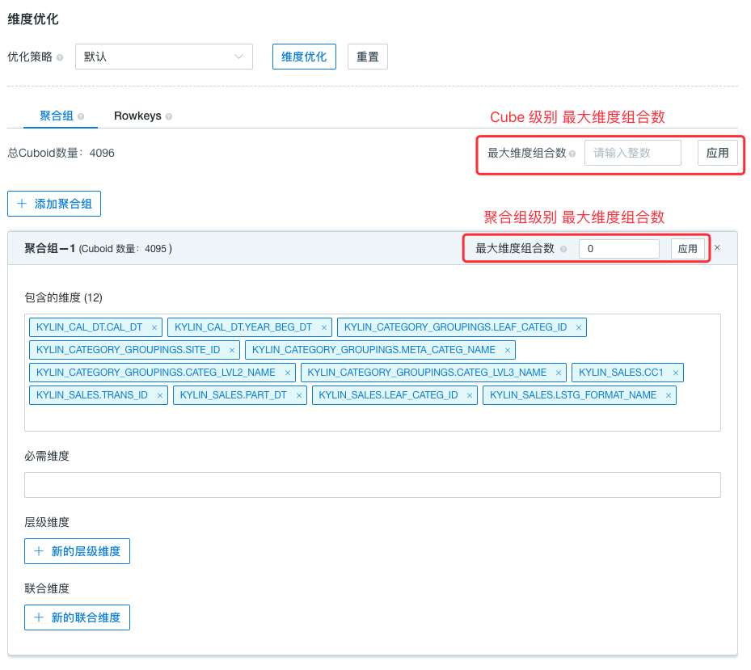
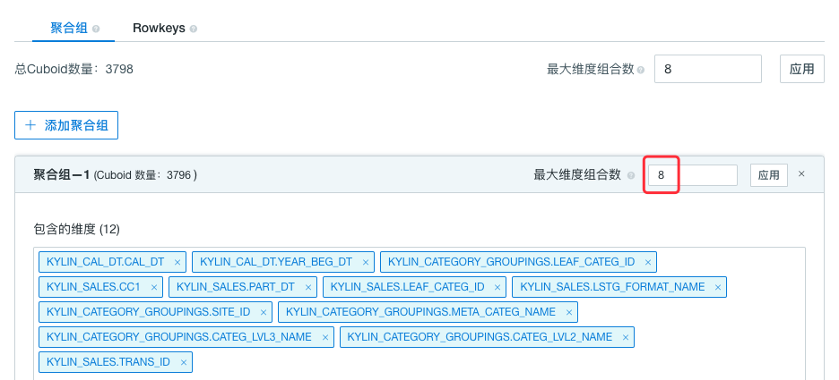
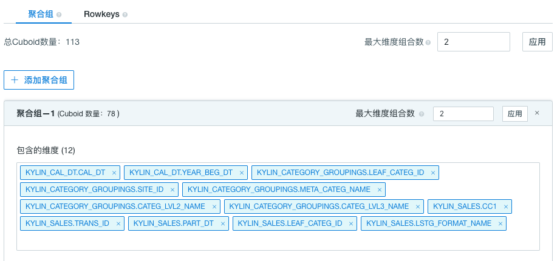

## 最大维度组合数

聚合组以及其他的高级优化功能很好得解决了 Cuboid 数量爆炸问题，但为了达到优化效果用户需要对数据模型有一定了解，这对于初级用户有一定使用难度。这一章将介绍一种简单的 Cuboid 剪枝工具——最大维度组合数（MDC），MDC 表示一个 Cuboid 能够包含的最大维度数。这个剪枝方法能够避免生成大的 Cuboid（包含 dimension 数目过多的 Cuboid），从而减少生成 Cube 的开销。该剪枝方法适用的场景为大多数查询语句访问的维度不多于 N 的情况，这里的 N 是可以配置的 MDC 参数。


### 查询维度的计算方法 ###

计算 cuboid 中维度数的方法（产品 V2.4.3 版本以上），我们在 Cuboid 剪枝中将同在一个联合维度组的维度当做一个整体，即为一个维度；同理一个层级维度组也当做一个维度，而将必要维度在 cuboid 计算中，不算做维度。如下例所示：

```sql
select count(*) from table group by column_mandatory, column_joint1, column_joint2, column_hierarchy1, column_hierarchy2, column_normal
```

查询涉及到一个必要维度，属于一个联合维度组的两个维度，属于一个层级维度组的两个维度及一个普通维度。根据上述计算 cuboid 维度的方法，该查询涉及到3个维度的 cuboid。


### 剪枝原理图 ###


如上图所示，该图为一个维度为7时的 Cuboid 生成图，为了方便理解剪枝功能，该生成图部分内容进行了省略。

当 MDC = 4 时，包含多于4个维度的 Cuboid 会被剪裁掉，如：ABCDEF，ABCDEG，ABCDE，ABCDF 等。

当 MDC = 3 时，包含多于3个维度的 Cuboid 会被剪裁掉，如：ABCDEF，ABCDEG，ABCD，ABCE 等。

考虑到 Cube 构建过程中性能问题，Base Cuboid 和一些 Cuboid 不会被剪裁掉即使包含维度大于当前 MCD 的值，如当 MDC =4时，ABCEF 可能不会被剪裁掉。同时根据上一节关于查询维度计算方法，当一个 Cuboid 中含有必要维度，联合维度组和层级维度组时，这两个维度组均算做一个维度，必要维度不算做维度。因此在使用自动剪枝功能时需要考虑到当含有以上维度组或者必要维度时，Cuboid 的实际所含维度数。


### 设置最大维度组合数（MDC）

这一小节将介绍如何设置最大维度组合数。在 Cube 维度设计页中，用户可以设置 Cube 级别的最大维度组合数和聚合组级别的 MDC，如下图所示。在输入框中输入大于或等于 0 的整数，并点击 **应用** 按钮，即保存了 MDC 设置。



Cube 级别的最大维度组合数作用于所有聚合组，聚合组级别的 MDC只对聚合组生效。聚合组级别优先级高于 Cube级别。具体设置的规则如下：

1. 若聚合组级别的 MDC 设置为0，此聚合组的 MDC 将会被 Cube 级别 MDC 覆盖。

   

   保存 Cube 后，再次编辑 Cube 时可以看到聚合组的 MDC 变为与 Cube 级别 MDC 一致。

   

2. 若聚合组级别的 MDC 设置为大于0的整数，此聚合组的 Cuboid 维度数只被聚合组级别的 MDC 所限制。

3. 若 Cube 级别的 MDC 设置为0或者留空，意味着用户关闭了 Cube 级别的 MDC 设置。此时 MDC 为0的聚合组生成的 Cuboid 中维度数量不受限制。MDC 非零的聚合组级别 MDC 不受影响。


根据上图的例子，设置 Cube 级别的 MDC 为2，保留聚合组级别的 MDC 为0并保存 Cube 。再次编辑 Cube，可以看到聚合组的 Cuboid 数量从4095下降为78，总的 Cuboid 变为113。除了 Base Cuboid，包含多于2个维度的 Cuboid 都被剪裁掉了。




### 注意事项 ###

一方面该剪枝方法能够显著减少 Cube 中包含的 Cuboid 数目，另一方面一些需要访问许多维度的复杂查询则会命中较大的 Cuboid，造成大量的在线计算，最终导致查询速度变慢。和其他的剪枝方法一样，该方法是一种数据模型的妥协和权衡，要在存储空间和查询速度间进行取舍。当多数查询访问的维度数目不多时，该方法能起到显著的作用。
