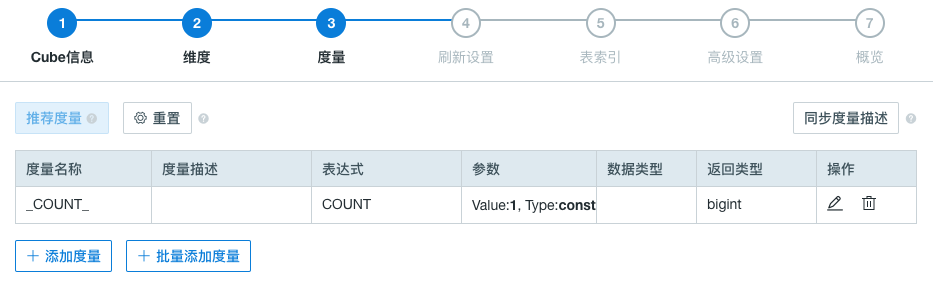
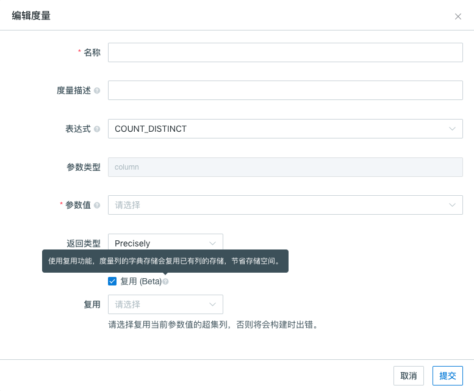

## 精确去重计数（Beta）

Count Distinct 是一个对大多数数据分析师都很常用的函数。本产品 v2.1版本开始，通过位图算法支持了 Count distinct 精确查询。对于数据型为 tinyint， smallint 和 int 的数据，将把数据对应的值直接打入位图中。对于数据型为 long，string 和其他的数据，产品将他们编码成字符串放入字典，然后再将对应的值打入位图。返回的度量结果是已经序列化的位图数据，而不仅是计算的值。这确保了不同的 segment 中，甚至跨越不同的 segment 来上卷，结果也是正确的。

### 查询前提

在使用 count distinct 查询之前，你需要确认目标列是否预存了 count distinct 的预计算结果。在 Cube 展示界面点击需要查看的 Cube 的名称，可以通过点击 Cube Designer 界面的 **度量（measures）**来查看 Cube 中所有 measure 的预计算信息。如果目标列已经被进行过 count distinct 的预计算（**表达式**(Expression)为count_distinct 并且 **返回类型**(Return Type)为 **bitmap**）则意味着此列可以直接进行 count distinct 的精确查询。否则，你需要创建新 Cube 来存储目标列的 count distinct 预计算结果。

### Count Distinct 精确查询设置 

首先在创建新 Cube 的界面，点击左下角**添加度量**来开始新度量的设置。

然后，在编辑度量窗口从 **参数值** 下拉列表中选择目标列，并从 **表达式** 选择 **COUNT_DISTINCT**。之后请谨慎选择 **返回类型** 中的误差选项。产品提供 count distinct 的近似查询和精确查询。如需要得到某列的精确查询预计算值，你应选择基于位图（bitmap）算法的返回类型: **Precisely**。这种精确查询将会在**存储资源充足**的情况下返回一个非常精确的结果。例如，如果查询数据为百万级，则返回的一个结果的大小将为百兆左右。

> Count distinct 精确查询因为使用位图算法，所以需要消耗的资源也较多，在使用 count distinct 精确查询计算具有**亿级**基数的表时，请咨询[Kyligence技术支持](../../introduction/get_support.cn.md)评估集群资源是否充足。

产品在默认状态下会将值编码进 Cube segment 级的字典。设置 count distinct 精确查询时，被设置的列的值都会被编码进 **全局目录** 来确保一个值只被编码为一个 ID，即使是在不同的 segment 中。

当 Cube 中已有一列（例如：客户ID）被设置为 count distinct 精确查询的度量时，与该列具有包含关系的列（例如：新客户ID），可以直接**复用**该列的编码。设置时，依次在返回类型里选择 **Precisely** 、勾选"**复用**"、在**复选框**中选择要被复用的列。
 > **注意：** 
 >+ 复用列表中仅显示与参数值数据类型相同的精确去重度量列；
 >+ 若复用列不是被复用列的子集，会导致构建失败。

### 参考文献

[Use Count Distinct in Apache Kylin](http://kylin.apache.org/blog/2016/08/01/count-distinct-in-kylin/) (Yerui Sun)

