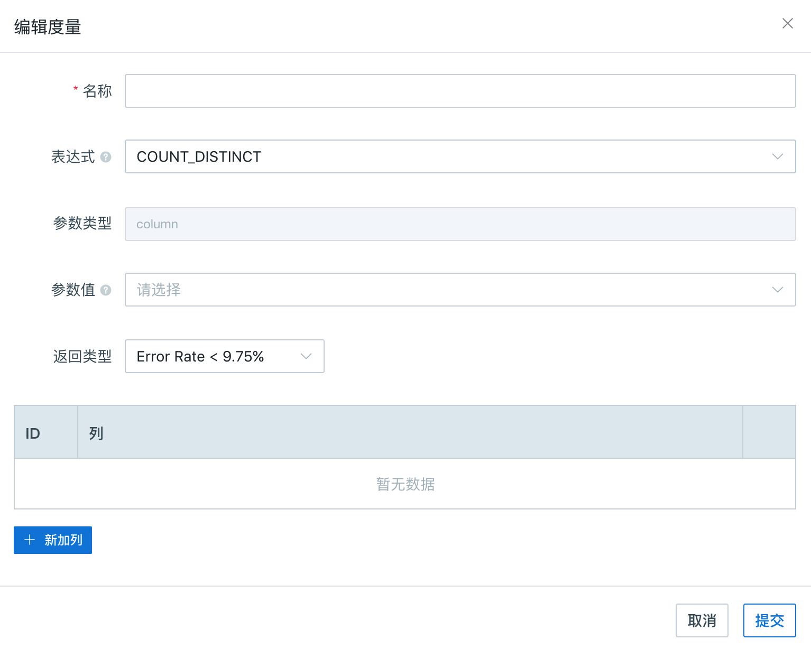
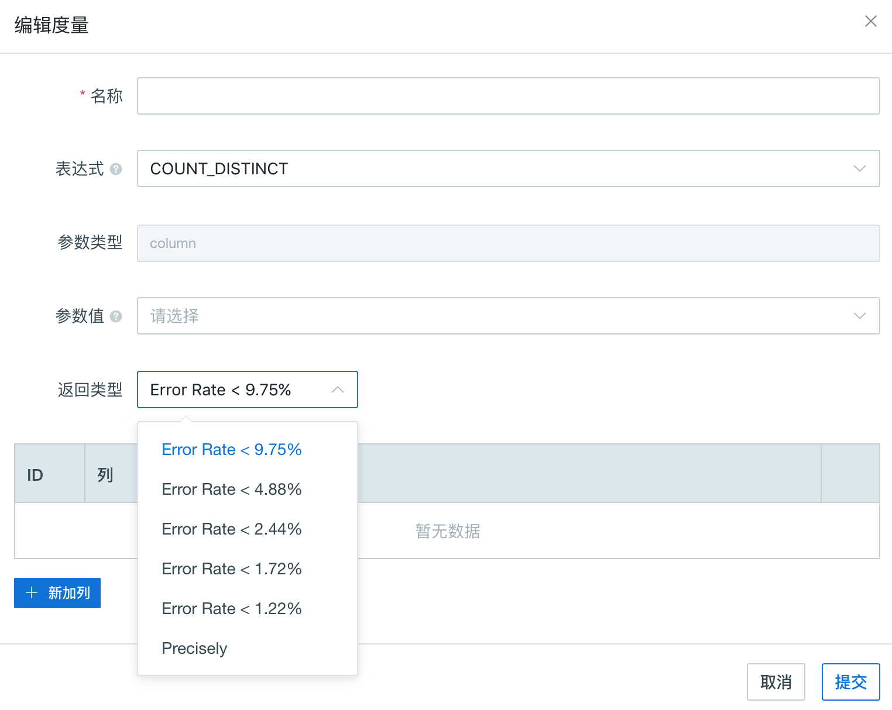
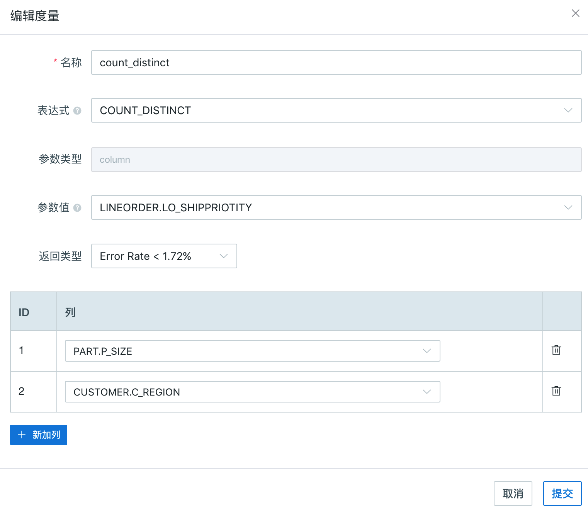

## 近似去重计数

Count distinct 是一个对大多数数据分析师都很常用的函数。本产品 v2.1版本开始，通过 [HyperLogLog](https://hal.inria.fr/hal-00406166/document) 算法支持了 count distinct 查询，并提供了从9.75%到 1.22%几种不同的误差率以支持不同的查询需求。查询结果具有理论上 2^N b 的存储体积上限，比如对于最大维度 N =16的查询，结果上限为64KB，结果最低误差率为1.22%。 

> 如果你不要求非常精准的查询结果，这种近似的 Count Distinct 查询就可以在有限的存储资源条件下，完美的得到你需要的结果。


### 查询前提

在使用 count distinct 查询之前，你需要确认目标列是否预存了 count distinct 的预计算结果。在 Cube 展示界面点击需要查看的 Cube 的名称，可以通过点击 Cube Designer 界面的 **度量（measures）**来查看 Cube 中所有度量的预计算信息。如果目标列已经被进行过 count distinct 的预计算（**表达式(Expression)**为 count_distinct 并且 **返回类型(Return Type)**： **hllc**）则意味着此列可以直接进行 count distinct 的近似查询。否则，你需要创建新 Cube 来存储目标列的 count distinct 预计算结果。


### Count Distinct 近似查询设置 

首先在创建新 Cube 的界面，点击左下角 **添加度量** 来开始新度量的设置。


然后，在编辑度量窗口从 **表达式** 选择 **COUNT_DISTINCT**，并从 **参数值** 下拉列表中选择目标列。



之后请谨慎选择 **返回类型** 中的误差选项。如需要得到某列的近似查询预计算值，您应选择基于 HyperLogLog 算法的返回类型: **Error rate< x%** ，这种近似查询能够在有限的存储资源条件下，返回一个相对准确的查询结果。




### 多列 Count Distinct

Kyligence Enterprise v2.4以来通过 [HyperLogLog](https://hal.inria.fr/hal-00406166/document) 算法支持了多列的 Count distinct 查询。设置方法如下图所示。对应的查询语句为(列的顺序无差别)：

```sql
SELECT COUNT (DISTINCT P_LINEORDER.LO_SHIPPRIORITY, PART.P_SIZE, CUSTOMER.C_REGION) FROM P_LINEORDER 
INNER JOIN PART on XXX=XX
INNER JOIN CUSTOMER on XXXX=XX
```



创建 Cube 的后续步骤请参见 [基本 Cube 设计](../create_cube.cn.md) 。当您按照 [构建 Cube](../../build_cube.cn.md) 的介绍，完成 Cube 的构建后，该 Cube 即准备完毕。

关于 count distinct 的精确查询信息请参见[精确去重计数](count_distinct_bitmap.cn.md)介绍。


### 参考文献

[Use Count Distinct in Apache Kylin](http://kylin.apache.org/blog/2016/08/01/count-distinct-in-kylin/) (Yerui Sun)

