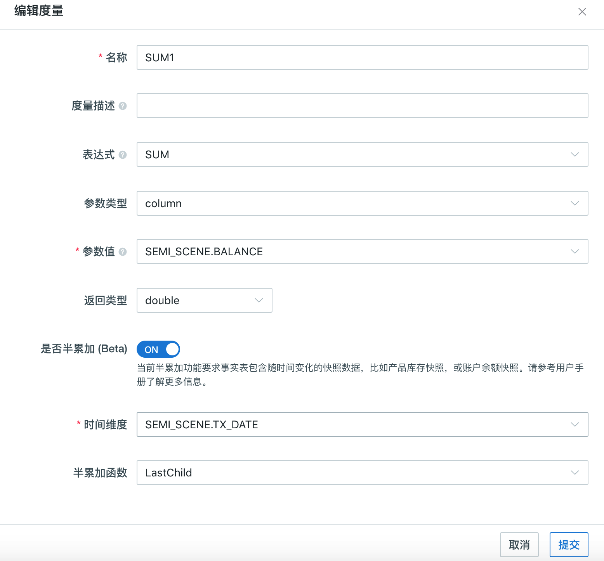

## 半累加度量（Beta）

在很多业务的数据分析场景中，半累加度量是很常见的，它可以用于处理证券、账户余额、人力资源等业务领域。比如在银行在使用账户交易记录数据来统计储蓄账户余额时，对于非时间维度，使用正常的求和，而对于时间维度，则需要取最后一条记录的值（LastNonEmpty）。

本产品从 v3.3 版本开始，实现了对半累加度量的支持。在 Kyligence Enterprise 中定义聚合函数为 SUM 的度量时，可以启用半累加度量，指定半累加函数（LastNonEmpty）、账号维度和时间维度（TIMESTAMP 或 DATE 类型），即可实现度量的半累加行为。在查询时，Kyligence Enterprise 会对于同一账号维度下的多条记录，只取时间维度上的最后一个值，然后再在其他维度上进行正常的累加（SUM）。

###  使用方法

以基于银行交易流水数据进行余额分析为例，以下是银行账户流水记录表 *FLOW_RECORD* ：

| Part_DT    | Account   | Expense | Income | Balance |
| ---------- | --------- | ------- | ------ | ------- |
| 2018-01-01 | account_a | 100     |        | 1000    |
| 2018-01-01 | account_b | 200     |        | 800     |
| 2018-01-02 | account_b | 300     |        | 500     |
| 2018-02-15 | account_a |         | 200    | 1200    |
| 2018-02-18 | account_b |         | 300    | 800     |

在这种情形下，就可以将账户余额 *Balance* 定义为半累加度量，默认使用 SUM 函数对 *Balance* 进行聚合，但当查询包含的数据中同一账号 *Account* 下若存在多条记录，则使用半累加函数 LastNonEmpty，在交易时间 *Part_DT* 维度上对账户余额进行聚合。接下来我们将演示如何定义该半累加度量。

首先，在新建 Cube 界面，点击左下角**添加度量**来添加新的度量。

第二步，输入度量名称，选择 *SUM* 为表达式，输入参数值，并勾选“是否半累加”。



第三步，选择账号维度与时间维度，并设置半累加表达式。

> **注意**：对于在同一账号下的多条数据，当前版本只支持 **LastNonEmpty** 聚合函数。如果您看到 **LASTVALUE**，那是一个 Beta 版本中的缺陷，将会很快修复。它的实际行为就是 LastNonEmpty。

第四步，设计并构建完 Cube 后，转至**分析**页面进行查询。

查询示例如下：

1. 分析每个账户支出总额、收入总额和账户余额

   ```sql
   SELECT ACCOUNT, SUM(EXPENSE),SUM(INCOME),SUM(BALANCE)
   FROM FLOW_RECORD
   GROUP BY ACCOUNT
   ```

   结果为

   ```sql
   account_a, 100, 200, 1200
   account_b, 500, 300, 800
   ```

2. 获得 2018 年 1 月底的所有账户余额

   ```sql
   SELECT ACCOUNT, SUM(BALANCE)
   FROM FLOW_RECORD
   WHERE PART_DT <= '2018-01-31'
   GROUP BY ACCOUNT
   ```
   
   结果为
   
   ```sql
   account_a, 1000
   account_b, 500
   ```
   
3. 分析 2018 年所有账户的总支出、总收入、总账户余额

   ```sql
   SELECT SUM(EXPENSE),SUM(INCOME),SUM(BALANCE)
   FROM FLOW_RECORD
   WHERE YEAR(PART_DT) = 2018
   ```

   结果为

   ```sql
   600, 500, 2000
   ```

4. 分析 2018 年每个月所有账户的总支出、总收入、总账户余额

   ```sql
   SELECT MONTH(PART_DT),SUM(EXPENSE),SUM(INCOME),SUM(BALANCE)
   FROM FLOW_RECORD
   WHERE YEAR(PART_DT) = 2018
   GROUP BY MONTH(PART_DT)
   ```

   结果为

   ```sql
   201801, 600, 0, 1500
   201802, 0, 500, 2000
   ```

### 注意事项和已知限制

1. 为了确保获得正确的查询结果，查询的时候有以下几点请特别留意：
  
   - 查询的过滤条件必须命中足够多的记录，以保证每个需要返回的账户至少出现一条记录。
   
     比如，下面的查询将无法返回 `account_a` 的账户余额，因为过滤条件只选中了 `2018-01-02` 一天，而这一天不包含 `account_a` 的任何记录。
   
     ```sql
     SELECT ACCOUNT, SUM(BALANCE)
     FROM FLOW_RECORD
     WHERE PART_DT = '2018-01-02'
     GROUP BY ACCOUNT
     ```
   
     错误的结果为
   
     ```sql
     account_b, 500
     ```
   
     为了获得 `2018-01-02` 这天所有的账户余额，正确的查询是
   
     ```sql
     SELECT ACCOUNT, SUM(BALANCE)
     FROM FLOW_RECORD
     WHERE PART_DT <= '2018-01-02'
     GROUP BY ACCOUNT
     ```
   
     得到正确结果为
   
     ```sql
     account_a, 1000
     account_b, 500
     ```
   
   - 查询中的 Group By 所产生的记录组必须包含足够多的记录，以保证在每个记录组中，每个需要返回的账户至少出现一条记录。
   
     比如，下面按月 Group By 的查询能正确返回每个月底的总余额，因为每个月都包含了 account_a 和 account_b 的记录。
   
     ```sql
     SELECT MONTH(PART_DT), SUM(BALANCE)
     FROM FLOW_RECORD
     WHERE YEAR(PART_DT) = 2018
     GROUP BY MONTH(PART_DT)
     ```
   
     但下面按天 Group By 的查询将**不能**正确返回每天的总余额，因为并不是每天每个账户都有记录。
   
     ```sql
     SELECT PART_DT, SUM(BALANCE)
     FROM FLOW_RECORD
     WHERE YEAR(PART_DT) = 2018
     GROUP BY PART_DT
     ```
   
   - 如果在同一个时间点、同一个账户上出现多条记录，由于无法确定那一条记录为最后，半累加的结果将无法确定。
   
   - 半累加度量不支持表索引、查询下压和异步查询。在上述情况中，查询结果将返回全累加值。
2. 只有聚合函数为 SUM 的度量才可以设置半累加度量，半累加函数只支持 LastNonEmpty。
3. 在同一个项目中，基于事实表中的同一列不能同时定义半累加度量和全累加度量。即在一个项目中，基于某列定义了半累加度量后，不能再基于其定义普通的 SUM 度量；定义了普通 SUM 度量的列，不能再被使用与定义半累加度量。
