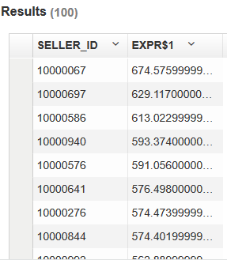
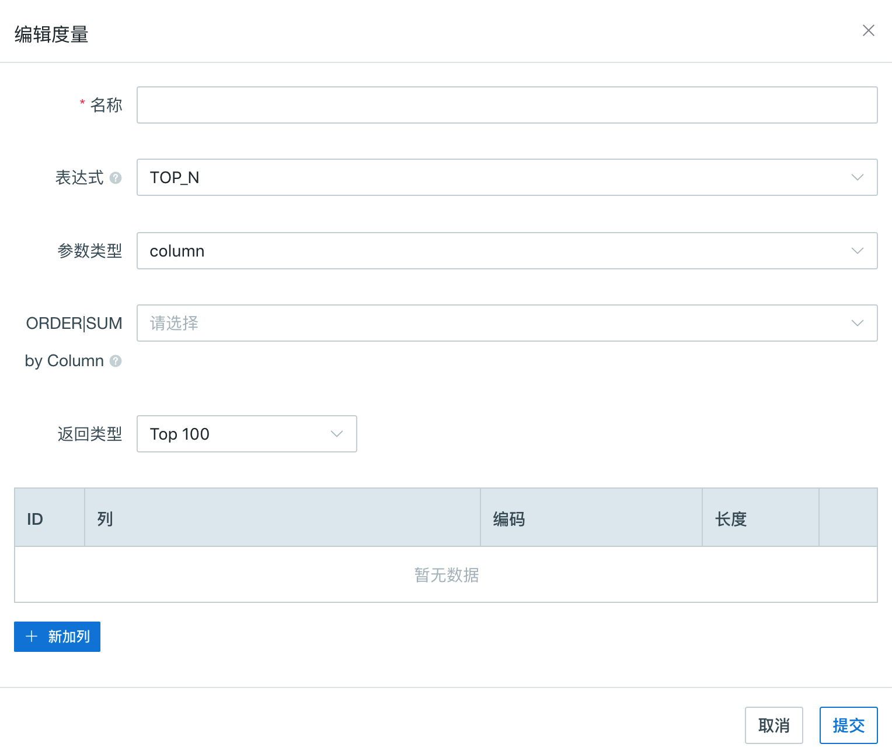

## Top-N 查询

我们在生活中也总是看到“世界100强公司”、“最受欢迎的20大电子产品”等新闻标题的报道。分析 Top-N 也是数据分析场景中常常遇到的需求。因而易见，人们普遍认同分析顶级项对大多数数据分析都是很有价值也很有必要的。在大数据时代，这种需求显现得越来越强，因为明细数据集越来越大。在没有预计算的情况下，得到一个分布式大数据集的 Top-N 结果需要很长时间，导致点对点查询的效率很差。

在本产品v2.1版本以上，我们引入了 “Top-N” 度量，旨在在 Cube 构建的时候预计算好需要的 Top-N；在查询阶段，Kyligence Enterprise 就可以迅速的获取并返回 Top-N 记录。这样，查询性能就远远高于没有 Top-N 预计算结果的 Cube，使得分析师对数据查询更有力。

> **注意**：这里的 “Top-N” 度量是一个近似的实现，为了更好的应用它，你需要更多的了解 Top-N 背后的算法和数据分布的结构。


### Top-N 查询语句

让我们用 Kyligence Enterprise 包中初始默认的项目 `learn_kylin`（在 Kyligence Enterprise Web 中也已经提前上传好了）。我们将重点使用其中的事实表 `kylin_sales`。如果你还没有建立过 Cube，请参见以下文档构建 Cube： [Quick Start with Sample Cube](https://kylin.apache.org/docs15/tutorial/kylin_sample.html).

这张样例表 “default.kylin_sales” 模拟了在线集市的交易数据，内含多个维度和度量列。这里我们仅用其中的四列即可：“PART_DT”，“LSTG_SITE_ID”，“SELLER_ID”和“PRICE”。下表为这些列的内容和基数简介，其中易见 “SELLER_ID” 是一个高基列。

| 列名         | 描述                       | 基数              |
| ------------ | -------------------------- | ----------------- |
| PART_DT      | Transaction Date           | 730: two years    |
| LSTG_SITE_ID | Site ID, 0 represents ‘US’ | 50                |
| SELLER_ID    | Seller ID                  | About one million |
| PRICE        | Sold amount                | -                 |

**方法1**： 该电商公司需要查询卖家中特定时段内交易额最高的100位卖家。查询语句如下：

```sql
SELECT SELLER_ID, SUM(PRICE) FROM KYLIN_SALES
 WHERE 
	PART_DT >= date'2012-02-18' AND PART_DT < date'2013-03-18' 
		AND LSTG_SITE_ID in (0) 
	group by SELLER_ID 
	order by SUM(PRICE) DESC limit 100
```

结果返回迅速，如下所示：

 

**方法2**: 为了得到同样的查询结果。如果在创建 Cube 时，对需要的 Top-N 进行了预计算则查询会更加高效。在创建 Cube 时，对所需的度量进行如下编辑，则可以在 Cube 构建时完成对目标列的预计算。如果 Cube 已被建立且没有对目标列进行过 Top-N 预计算，则需要重新建立 Cube。度量编辑界面如下：




### 无 Top-N 预计算

本产品较早前的版本( v2.1版本以下)，只有维度列可以用 “group by” 查询，于是我们设计如下：用 `PART_DT`、 `LSTG_SITE_ID` 、 `SELLER_ID` 作为维度，同时定义 SUM(PRICE) 作为度量。Cube 构建之后，基本的 Cuboid 则如下所示：

| RowKey of base cuboid     | SUM(PRICE) |
| ------------------------- | ---------- |
| 20140318_00_seller0000001 | xx.xx      |
| 20140318_00_seller0000002 | xx.xx      |
| …                         | …          |
| 20140318_00_seller0999999 | xx.xx      |
| 20140318_01_seller0999999 | xx.xx      |
| …                         | …          |
| …                         | …          |
| 20160318_49_seller0999999 | xx.xx      |

假设这些维度都是彼此独立的，则基本 Cuboid 中行数为：$730 \* 50 \* 1 million = 36.5 billion = 365亿。其他包含`SELLER_ID` 字段的 Cuboid 也有百万行。现在你应该意识到这种处理方法会使得 Cube 的膨胀率很高，如果维度更多或基数更高，则情况更糟。但真正的挑战还不在这里。

之后你还可能发现 Top-N 查询并不能正常工作，或者花费特别长的时间。假设你想查30天内美国销售额排名最前的100名卖家，则查询引擎会从存储读取3000万记录行，然后聚合，分类，最终返回排名最前的100个卖家。由于没有进行预计算，即使最终结果很小，内存和其中的控制器都被严重耗用了。


### Top-N 预计算

如果在 Cube 创建时，设置了目标列 Top-N 的预计算，则当这个 Cube 被构建时，预计算结果会被存成一个新列。在这个例子中，`SELLER_ID`现在由维度变成了度量，不再出现在 RowKey 中。而以上场景中，新设计好的 Cube 中只有两个维度和一个 Top-N 的度量。

| RowKey of base cuboid | Top-N measure                            |
| --------------------- | ---------------------------------------- |
| 20140318_00           | seller0010091:xx.xx, seller0005002:xx.xx, …, seller0001789:xx.xx |
| 20140318_01           | seller0032036:xx.xx, seller0010091:xx.xx, …, seller000699:xx.xx |
| …                     | …                                        |
| 20160318_49           | seller0061016:xx.xx, seller0665091:xx.xx, …, seller000699:xx.xx |

现在 Cuboid 中只有 $730 * 50 = 36.5 k行。在度量的单元格中，预计算的 Top-N 结果先被以倒序的方式存储在一个容器中，而序列尾端的记录已经被筛选掉。

现在，同样的查询语句 "Top sellers in past 30 days in US”, 只需要从内存中读取30行。度量对象，也就是计数容器将会在存储端进一步聚合或者并和，最终只有一个容器被返回。Kyligence Enterprise 将会从中抽出`SELLER_ID`和`SUM(PRICE)`然后返回客户端。现在的成本就减少很多，查询性能也得到很大的提升。

