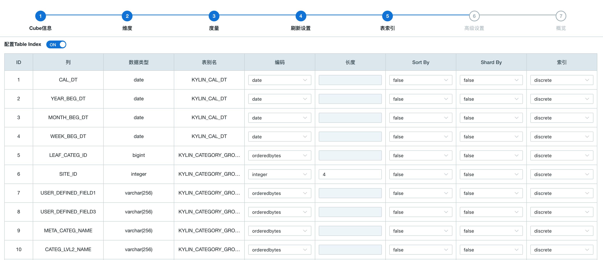
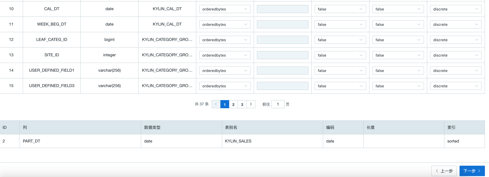

## 明细表索引

为了支持对明细数据进行高效的查询，产品提供了表索引功能。对于定制查询，使用构建良好的 Cube 来进行高效的处理；对于非定制查询，Query Pushdown 提供了补充和完善。上述功能使得用户能够快速获取聚合查询的结果。如果用户在分析过程中对明细数据感兴趣，则可以通过表索引来达成目的。

### 创建表索引

表索引的创建流程嵌套在 Cube 创建流程内。如图所示，点击创建 Cube 的按钮，进入 Cube 创建向导的第5步（以2.4以上版本为准）——表索引，可以观察到配置表索引的选项，默认状态下未被勾选：

勾选表索引选项以启用表索引。勾选后可以看到表索引设置的详细情况。其中每一行的内容是对数据表中某一列可以进行的配置：

在 SortBy 和 ShardBy 中选择适当的列，点击下拉列表将其设置为 SortBy 或 ShardBy，并为每一列选择适当的编码方式。完成 Cube 创建流程。构建该 Cube 之后，即可对相应数据进行明细查询。

### SortBy 和 ShardBy

合理地设置表中的某列为 SortBy 以及 ShardBy，可以显著提高表索引的查询效率。下面为用户详细介绍这两项属性的含义和设置技巧。

在设置表索引时，用户需要将至少1列设置为 SortBy。被设置为 SortBy 的列将显示在表索引各列设置信息的下方，如图所示：

对于所有被设置为 SortBy 的列，明细数据将按照这些列的顺序依次进行排序。用户可以拖拽其中一列并向上或向下以改变它们的顺序。

SortBy 列表中的第1列编码必须为 “integer”，“date” 或 “time” 类型。其他列的类型不做限制。关于编码的内容详见下文。

在 SortBy 列表中排序靠前的列，作为查询过滤条件时将获得更高的效率。因此推荐用户将 SortBy 的各列按照实际情况下作为过滤条件的概率进行排序。不建议用户将过多的列设置为 SortBy，因为排序靠后的列对提高查询效率的效果有限，且会增加表索引构建时的开销。推荐用户使用时间字段的列作为 SortBy 的第1列，以便在以时间相关的大量查询上达到更快的查询效果。

在设置明细表时，用户可以选择1列设置为 ShardBy 或不指定 ShardBy。如果用户指定了 ShardBy 的列，则明细数据将按照该列的值分片。如果用户没有指定 ShardBy 的列，则默认将根据所有列中的数据进行分片。

选择适当的 ShardBy 列，可以使明细数据较为均匀的分散在多个数据片上，提高并行性，进而获得更理想的查询效率。建议选择基数较大的列作为 ShardBy 列，以避免数据分散不均匀。

### 编码

在表索引设置页中，点击每一字段对应的编码下拉列表 ，可以为该字段的列选择编码，如图所示：

1. “orderedbytes” 可用于所有类型。它会在编码时保持数据的顺序。它也是大多数情况下的默认的编码。
2. “var” 类似于 “orderedbytes”，除了它不会保存顺序 信息。因此该编码不建议使用，请用 “orderedbytes” 代替。 
3. “boolean” 适用于字段值为：true、false、TRUE、FALSE、True、False、t、f、T、F、yes、no、YES、NO、Yes、No、y、n、Y、N、1、0等的列。
4. “integer” 适用于字段值为整数的列，支持的整数区间为[-2^(8\*N-1), 2^(8*N-1)]。 
5. “int” 已弃用，请使用 “integer” 代替。 
6. “date” 适用于字段值为日期的列，支持的格式包括 yyyyMMdd、yyyy-MM-dd、yyyy-MM-dd HH:mm:ss、yyyy-MM-dd HH:mm:ss.SSS，其中如果包含时间戳部分会被截断。
7. “time” 适用于字段值为时间戳的列，支持范围为[1970-01-01 00:00:00, 2038/01/19 03:14:07] ，毫秒部分会被忽略。“time” 编码适用于 “time”、“datetime”、“timestamp” 等类型。
8. “fix_length” 适用于超高基场景，将选取字段的前 N 个字节作为编码值。当 N 小于字段长度时，会造成字段截断。当 N 较大时，会造成 RowKey 过长，查询性能下降。只适用于 varchar 或 nvarchar 类型。
9. “fixed_length_hex” 适用于字段值为十六进制字符，如 1A2BFF 或者 FF00FF。每两个字符需要一个字节。只适用于 varchar 或 nvarchar 类型。

注意：“dict” 编码在表索引中并不支持。

### 索引

在明细表设置页中，点击每一字段对应的索引下拉列表 ，可以为该字段的列选择索引类型，如图所示：

1. “discrete” 索引是默认索引。该索引可以支持快速匹配相等查询，在大于或小于查询时，会退化为全表查询。

2. “fuzzy” 索引是服务于含有 like 过滤的查询的。如果某一列可能应用 like 过滤，请将其设置为 “fuzzy”。不建议将过多的列设置为 “fuzzy”，因为该类型索引会增加存储开销。

   > 使用明细查询时，如果 like 过滤的列并未设置为 fuzzy 属性，可能会导致查询时间增加。
