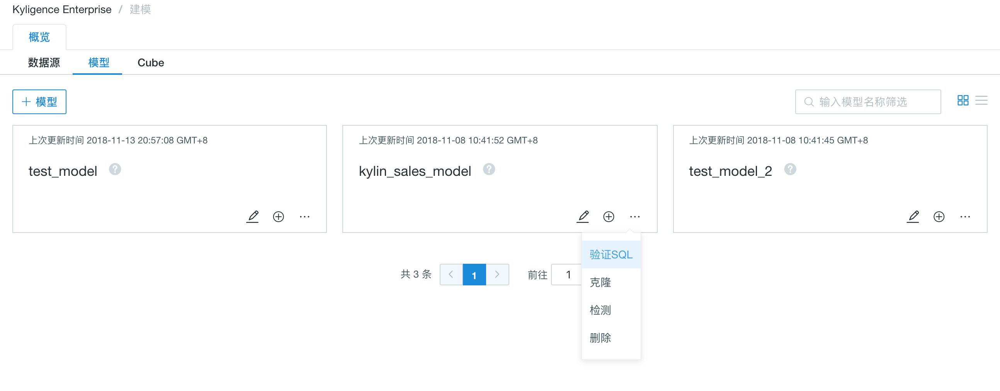
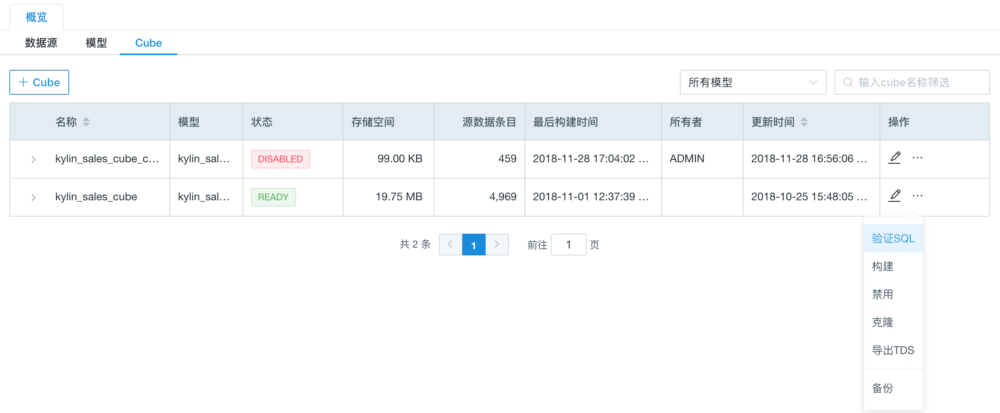
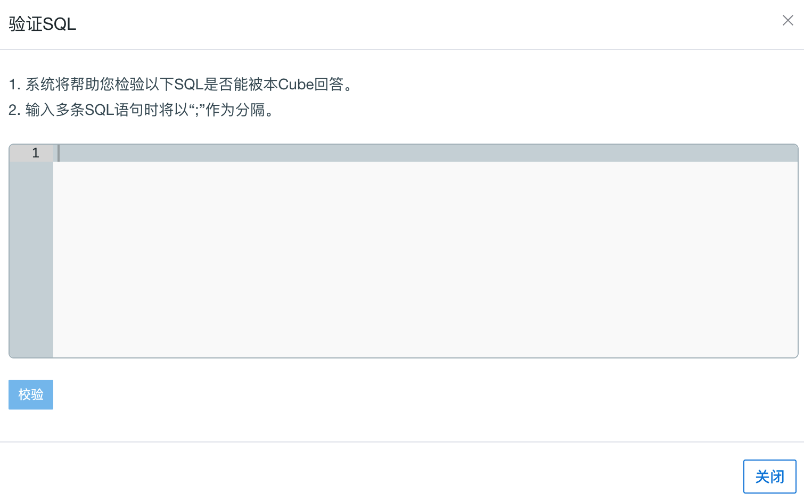
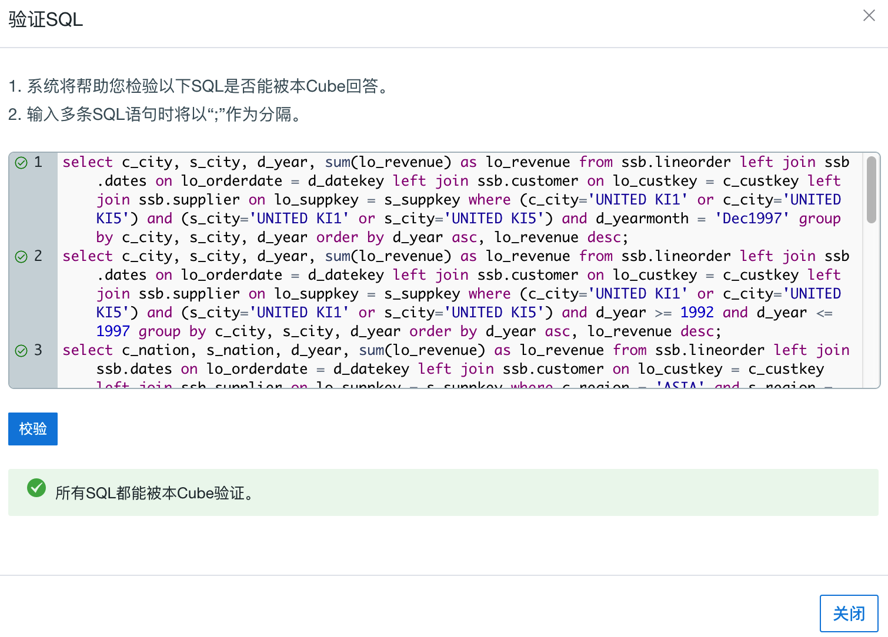
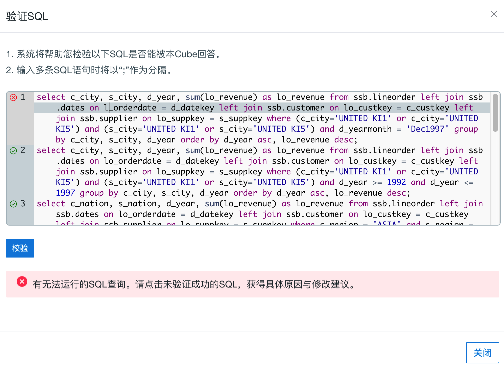
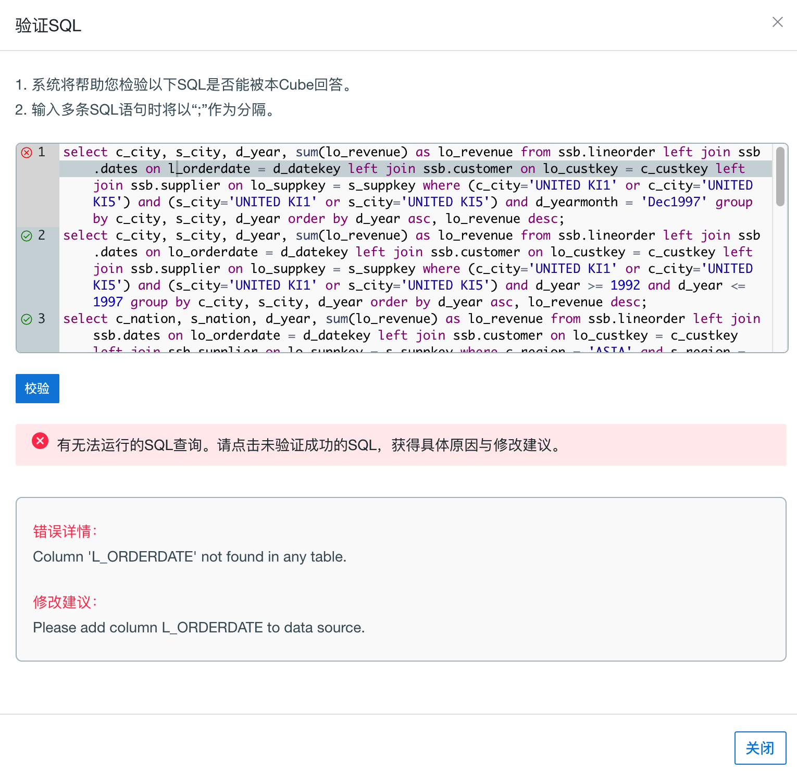

## 验证 SQL 

很多用户在设计好模型或 Cube 后，就希望立即得知该模型或 Cube 的设计是否合理，能否良好的满足某些查询需求，进而快速得到反馈，修改设计。从本产品2.5版本开始，每一个设计好的模型或 Cube 都可以在不需要构建 Cube 的情况下，直接得到验证。

### 使用方法

第一步，当你设计好一个模型或 Cube，保存该模型／Cube 后可以在右上角点击“验证 SQL”。

第二步，在弹出的输入框中粘贴你希望验证的查询语句（SQL）。

第三步，输入完点击左下角的校验并等待校验结果。如果设计合理，可以良好的回答所有查询语句（SQL），展示如下图。

第四步，如果验证 SQL 有未通过的部分，则可以通过点击该条查询前端的 “x”，了解设计模型或 Cube 的具体方法，来满足该查询。

