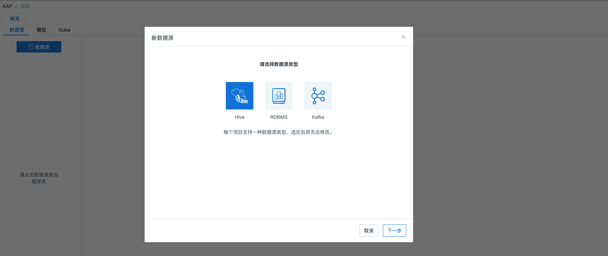

## 导入Hive数据源
Kyligence Enterprise 支持Hive作为默认的输入数据源。

本小节将结合样例数据集介绍Hive数据源使用方式，具体步骤如下：

### 准备样例数据集

用户可通过执行脚本方式，将本产品中自带的样例数据导入至Hive。

该可执行脚本为 **sample.sh** ，其默认存放路径为系统安装目录下的 **/bin** 目录

```shell
$KYLIN_HOME/bin/sample.sh
```


> 注意：运行 sample.sh 之后， 在本产品的 **系统** 功能页面下点击 **重载元数据**，否则会导致建模出错。


脚本执行成功之后，可在服务器终端执行 **hive** 命令行，进入hive，并执行查询语句验证导入正常。

```shell
hive
```

可检查已导入hive的表清单

```shell
hive> show tables;
```

可检查导入hive的具体表

```
hive> select count(*) from kylin_sales;
```


### 创建基于Hive数据源的项目


1. 登录本产品的Web UI

2. 主界面顶端左侧的项目管理工具栏中，点击加号 **“＋” ** 以新建项目

3. 在弹出的窗口中，输入**项目名称** （必选）和 **项目描述**, 点击 **确定** 按钮，完成项目创建。

4. 进入具体项目**建模** 功能，选择 **数据源** 选项卡

5. 点击蓝色的**数据源**按钮

6. 在弹出窗口中，选择 **Hive** 类型作为数据源类型，如下图所示

   

7. 点击 **下一步** 按钮，进入 **加载Hive表元数据** 窗口，用户可按需在左侧的Hive表清单中，单击选中需要建模的表，也支持输入关键字进行搜索。

8. 点击右下方 **同步** 按钮进行加载

   
> 提示：默认不勾选**表采样**， 您可以根据需要自行设置是否采样和采样比例。

9. 同步完成后，可以在**建模** 中**数据源** 面板中，选中具体加载的表，查看表的详细信息。


