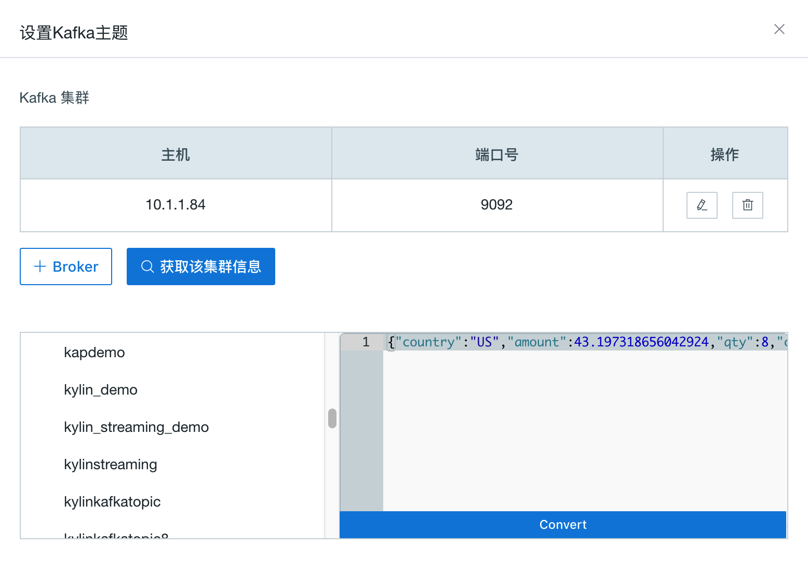

## 导入Kafka数据源
本节介绍如何导入 Kafka 数据源，以及将Kafka消息流解析为事实表。

### 环境准备

在开始本教程前，请确保您已准备好Hadoop环境并且已经安装了**Kyligence Enterprise 2.3 (或以上版本)和 Kafka v2.10-0.10.1.0**及以上版本。在本教程中，我们使用Hortonworks HDP 2.4 Sandbox虚拟机作为Hadoop环境。

Kafka Broker无需与本产品部署在同一个节点上。

> 注意：如果Kyligence Enterprise节点上没有部署Kafka Broker，建议将与其他已部署节点相同版本的Kafka二进制包复制并解压在本产品启动节点上的任意路径（如/usr/local/kafka_2.10-0.10.1.0），并设置KAFKA_HOME指向该路径。确保KAFKA_HOME/libs 目录下有Kafka的客户端library。

本例中，假设用户没有安装过Kafka Broker，包含了将Kafka Broker部署到本机，以及启动的过程，对于已经安装过Kafka Broker的用户该步骤可以省略。

```shell
curl -s https://archive.apache.org/dist/kafka/0.10.1.0/kafka_2.10-0.10.1.0.tgz | tar -xz -C /usr/local/
cd /usr/local/kafka_2.10-0.10.1.0/
./bin/kafka-server-start.sh config/server.properties &
```

务必确保产品实例启动前，已经将**KAFKA_HOME**变量正确导出，操作如下。

```shell
export KAFKA_HOME=/usr/local/kafka_2.10-0.10.1.0
```

### 创建Kafka Topic并模拟流数据（可选）

> 提示：该创建Topic步骤为可选，用户如果已经有了Kafka Topic可以忽略这个步骤。
>
> 以下例子假设Kafka Broker运行在127.0.0.1:9092，ZooKeeper运行在127.0.0.1:2181，用户在自己环境中请自行更新IP地址。

通过以下命令，我们创建一个名为"kylindemo"的topic。

```shell
./bin/kafka-topics.sh --create --zookeeper 127.0.0.1:2181 --replication-factor 1 --partitions 3 --topic kylindemo
```

接着，我们需要启动一个产生消息流的工具，持续往topic中导入数据。本产品提供了一个简单的Producer工具用于产生数据。

```shell
cd $KYLIN_HOME
./bin/kylin.sh org.apache.kylin.source.kafka.util.KafkaSampleProducer --topic kylindemo --broker 127.0.0.1:9092
```
这个工具每秒会向Kafka中发送100条消息。在学习本教程的过程中，请保持本程序持续运行。同时，你可以使用Kafka自带的Consumer来检查消息是否成功导入。

```shell
cd $KAFKA_HOME
bin/kafka-console-consumer.sh --bootstrap-server 127.0.0.1:9092 --topic kylindemo --from-beginning
```


### 从流式数据中定义事实表

本产品中，支持将Kafka消息流抽象为数据表（事实表）。通过快速构建数据，实现对消息流近实时的处理。后续，设计流失数据模型和cube，请参见[流式cube](../streaming_cube.cn.md)。

步骤一：启动产品, 从Web GUI 登录, 新建一个项目。选择数据源为Kafka。

步骤二：输入Broker集群信息，注意：这里Host要填写实际IP地址，是YARN集群上运行的Job可以访问的地址。


步骤三：点击 √ 确认Broker后，点击**获取该集群信息 ->kylindemo**, Kafka的采样消息会出现在右边，点击 **Convert**。



步骤四：您需要为流式数据源定义一个表名，本产品将消息流中的数据作为此表的数据。这张数据表将作为后续创建模型和查询的事实表。本例将表命名为 "KAFKA_TABLE_1" 。


步骤五：检查表结构是否正确，**确保至少有一列被选择为timestamp**。


步骤六：设置解析器

解析器名称: 默认为 org.apache.kylin.source.kafka.TimedJsonStreamParser，支持自定义解析器；

时间戳字段名称: 必须为解析器指定一列用于分段的时间字段，本例选择了 order_time；

解析器属性: 为解析器定义更多属性；

tsParser：指时间戳解析器，对 tsColName 的数值解析成时间戳；

> 注意：tsParser 有两种内置解析器，一种是 org.apache.kylin.source.kafka.DefaultTimeParser，对 long 型的timestamp 值（epoc time）解析成 timestamp。另一种是org.apache.kylin.source.kafka.DateTimeParser，它根据给定的 tsPattern，将 string 类型的时间表达式解析成 timestamp；如果没有指定 tsPattern，默认使用 "yyyy-MM-dd HH:mm:ss" 的格式。

tsPattern：指时间戳样式，供 tsParser使用。


步骤七：点击**提交**。至此，您完成了将Kafka输出的消息流定义为事实表。


