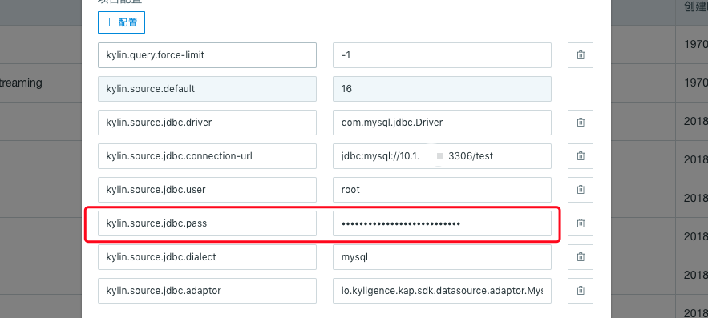

## RDBMS 数据源配置

本产品从 3.0 版本开始支持 RDBMS 作为数据源。

### 支持的 RDBMS

| 数据源 | 版本 | 推荐驱动 |
| - | - | - |
| Greenplum | Greenplum 5.3.0 | - |
| MySQL | 5.5，5.6，5.7 | mysql 5.1.41 |
| Microsoft SQL Server | SQLServer2008，SQLServer2012 | sqlserver08:4-4.0 |


### 准备工作

连接 RDBMS 数据源，需要先完成相关驱动程序下载准备工作:

- 下载各 RDBMS 官方 JDBC 驱动程序 jar 包
- 下载 Kyligence 特定的数据源适配器 (下载链接：[Kyligence Account](http://download.kyligence.io/#/addons))
- 拷贝相关 jar 包放置在`$KYLIN_HOME/ext`目录下
- 拷贝相关 jar 包放置 sqoop 安装目录的 lib 目录下, 并检查全局参数。在`kylin.properties`中添加`kylin.source.jdbc.sqoop-home=<sqoop_path>;`，其中 <sqoop_path> 为 sqoop 安装的目录。


### 连接参数配置

用户通过**项目配置**或**全局配置**进行参数设置：

| 参数名                           | 解释                                      |
| -------------------------------- | ----------------------------------------- |
| kylin.source.jdbc.driver         | JDBC 驱动类名                              |
| kylin.source.jdbc.connection-url | JDBC 连接字符串                            |
| kylin.source.jdbc.user           | JDBC 连接用户名                            |
| kylin.source.jdbc.pass           | JDBC 连接密码                              |
| kylin.source.jdbc.dialect        | JDBC 方言                                  |
| kylin.source.jdbc.adaptor        | JDBC 连接的数据源对应的适配器              |

如果需要开启查询下压，还需要配置以下参数：

```properties
kylin.query.pushdown.runner-class-name=io.kyligence.kap.query.pushdown.PushdownRunnerSDKImpl
```

### 为项目设置 RDBMS 数据源

Kyligence Enterprise 可以通过如下步骤，为特定项目设置 RDBMS 数据源：

1. 登录本产品的 Web UI；
2. 主界面顶端左侧的项目管理工具栏中，点击加号 **“＋” ** 以新建项目；
3. 在弹出的窗口中，输入**项目名称** （必选）和 **项目描述**, 点击 **确定** 按钮，完成项目创建；
4. 进入具体项目**建模**功能，选择 **数据源** 选项卡；
5. 点击蓝色的**数据源**按钮；
6. 在弹出窗口中，选择 **RDBMS**作为数据源类型；
7. 在项目配置中添加数据源参数配置(可参考相关受支持的 RDBMS 参数项目配置参考)
8. 点击**下一步**按钮，进入**加载表元数据**窗口，用户可按需在左侧表清单中，单击选中需要建模的表，也支持输入关键字进行搜索。
9. 点击右下方**同步**按钮进行加载。

### 支持的 RDBMS 连接参数项目配置参考

- 基本参数

```properties
kylin.source.jdbc.connection-url=jdbc:<sqlserver>://<HOST>:<PORT>;database=<DATABASE_NAME>
kylin.source.jdbc.user=<username>
kylin.source.jdbc.pass=<password>
```

- Greenplum 数据源

```properties
kylin.source.jdbc.driver=com.pivotal.jdbc.GreenplumDriver
kylin.source.jdbc.dialect=greenplum
```

- MySQL 数据源

```properties
kylin.source.jdbc.driver=com.mysql.jdbc.Driver
kylin.source.jdbc.dialect=mysql
kylin.source.jdbc.adaptor=io.kyligence.kap.sdk.datasource.adaptor.MysqlAdaptor
```

- Microsoft SQL Server数据源

```properties
kylin.source.jdbc.driver=com.microsoft.sqlserver.jdbc.SQLServerDriver
kylin.source.jdbc.dialect=mssql08
kylin.source.jdbc.adaptor=io.kyligence.kap.sdk.datasource.adaptor.Mssql08Adaptor
```


### 隐藏、加密数据库密码

* **项目级配置**

  在项目配置页，当添加了 `kylin.source.jdbc.pass` 配置时，参数的值将会自动进行隐藏处理，如下图：

  

* **全局配置**

  本产品可以在**系统**页面配置系统级参数。为了防止在此页面上密码的明文显示，本产品提供了加密工具，将数据库密码进行加密处理后，在写入配置中。加密步骤如下：
1. 在 `$KYLIN_HOME/tomcat/webapps/kylin/WEB-INF/lib` 目录下运行如下命令，就可得到加密后的密码：

      ```shell
        java -classpath kap.jar:spring-beans-4.3.10.RELEASE.jar:spring-core-4.3.10.RELEASE.jar:commons-codec-1.7.jar org.apache.kylin.rest.security.PasswordPlaceholderConfigurer AES yourpassword
      ```

      > **注意：** 加密后的密码是形如 ${xxxxxxxxx} 的格式。为了防止系统将用户的原始密码识别为加密后的密码，建议用户在设置数据库密码时避开 ${xxxxxxxxx} 的格式。

2. 在**系统**页面配置参数 `kylin.source.jdbc.pass` 时，使用密文密码，系统会自动识别进行后续的处理。


> **提示：** Microsoft SQL SERVER 2008 数据源支持存在已知限制:
>
> - 不支持含 limit 子查询
> - 不支持空间查询 如'geometric', 'geography'
> - 不支持 INITCAP, MEDIAN, STDDEV_POP, FIRST_VALUE 等高阶统计函数
> - 不支持开窗函数，如 avg/count/max/min/sum over() 等语法
