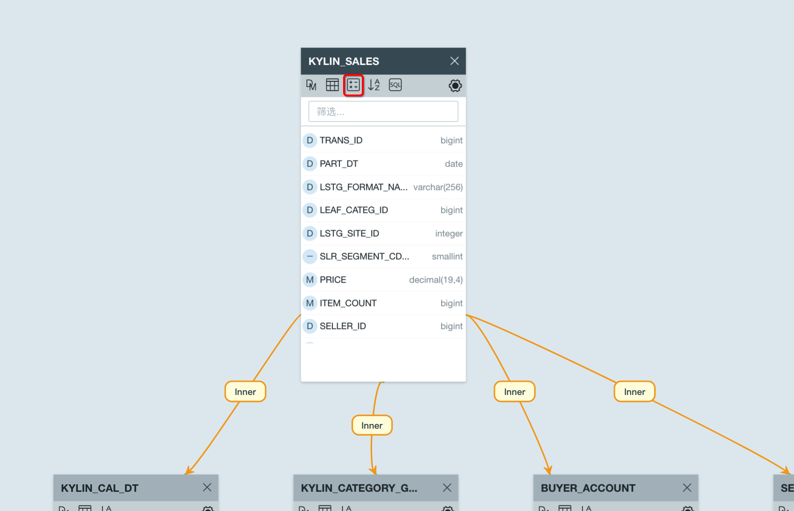
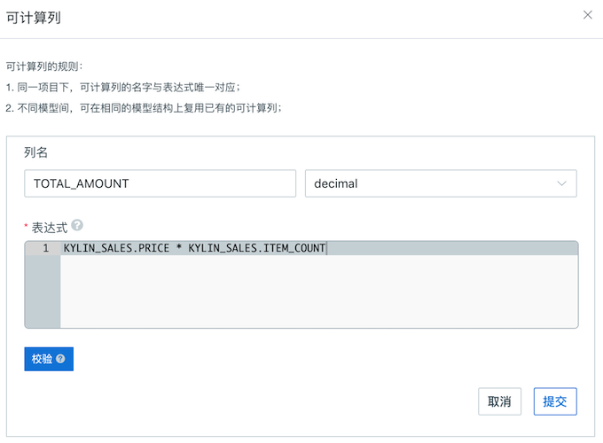
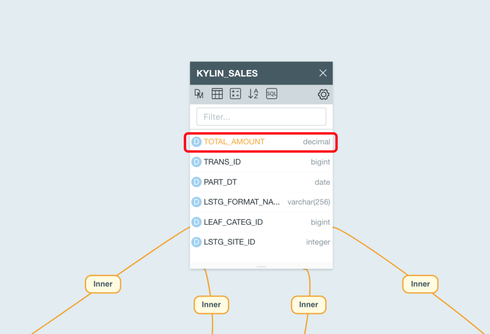
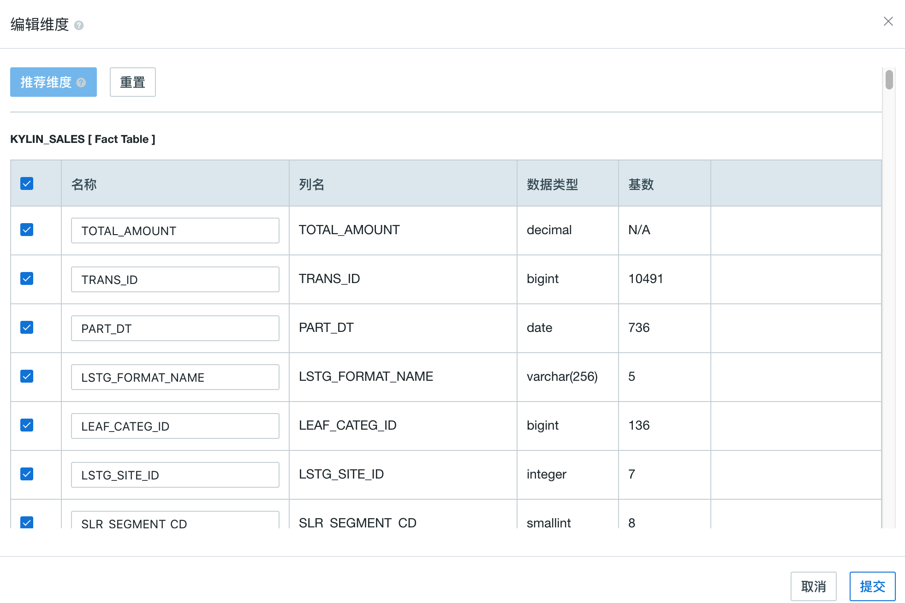
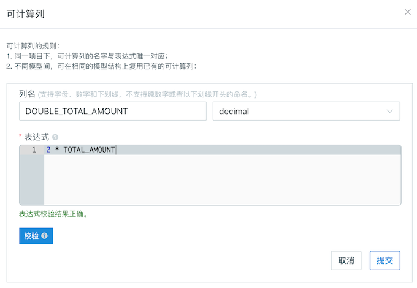

## 可计算列

本节介绍本产品中支持的可计算列，包括可计算列使用方法以及可计算列支持的函数。


## 可计算列 (Computed Column)

**可计算列**支持将数据的转换、重定义等操作预先定义在模型中，增强数据语义层，同时将查询中的在线计算转换为预计算，进一步提升查询性能。可计算列支持 Hive UDF，从而可以重用已有业务代码。

> **注意：** 请勿在可计算列中使用仅包含常量的表达式，以免查询出错。


### 基本概念与使用方法
- **命名：**
  - 支持字母、数字和下划线，不支持纯数字或者以下划线开头的命名。
  - 一个项目中，可计算列的名字不允许和源表上已有的列名重复。
- **表达式：**指可计算列的计算逻辑。可计算列的表达式可以包含不同表上的列，包括事实表和维度表。
- **复用与嵌套：**
  - 同一个项目下，可计算列是可以在不同模型上复用的。因此可计算列的名字和表达式需要一一对应，即同样名字与表达式的可计算列，在一个项目中只能被定义一次，但可以多次引用。
  - 在新模型中，可以复用其他模型已有的可计算列，但可计算列所在的表的位置需要一致。
  - 可计算列的表达式里，可以嵌套其它可计算列，且支持多层嵌套。
- **其他注意事项：**
  - 建议您将可计算列定义在事实表上，在一些特殊情况下，也支持定义在非 snapshot 存储的维度表。
  - 在不同模型中，可以定义不同的可计算列，同时也要遵循上述复用的原则。
  - 权限：如果用户在某列上的列级权限受到限制，该列被用来包含在某可计算列中，则该用户也不能查询这个可计算列。


### 创建可计算列

首先，点击下图所标示的**可计算列**按钮，就可以根据提示创建可计算列。

例如，模型中有一个事实表 *kylin_sales*，包含以下列：

- *price* - 交易的单价
- *item_count* - 交易数量
- *part_dt* - 交易时间

您可以在这张事实表上定义两个可计算列：

- `total_amount = kylin_sales.price * kylin_sales.item_count` 
- `deal_year = year(kylin_sales.part_dt)`

在创建 Cube 的时候，您也可以选择可计算列 *total_amount* 和 *deal_year* 作为 Cube 的维度或者度量。



其次，需要填写如下内容：



+ **列名**：定义可计算列的名称。

+ **表达式**：可计算列的计算逻辑。注意：表达式可以包含当前模型中任何其他表上的列，请务必保证所有包含的列都满足 **别名.列名** 的形式（别名：这里指当前模型中，表的别名）。

+ **数据类型**：定义可计算列本身的数据类型。

最后，提交保存后，从模型视图就能观察到新加的计算列 *total_amount* 了：



此外，在模型中定义完可计算列后，需要在创建 Cube 添加维度/度量的时候选入可计算列。可计算列被预计算后，才能体现性能优势。



### 可计算列查询

在一个表上创建了可计算列后，可计算列将作为衍生列存在，您可以像查询普通的列一样查询这个列。

一般来讲， 可计算列能够被查询的前提是这个某个 Ready 状态的 Cube**/**Table Index 包含了该列。如果有 Ready 状态的 Cube/Table Index 不包含可计算列，但启用了查询下压，用户仍然可以查询可计算列。

此时本产品会分析当前的查询，把查询中的可计算列翻译成原有的表达式后下压到下层引擎进行计算。

比如用户用如下查询语句，包含已定义的可计算列 *total_amount*， 其表达式为 `price * item_count`

```sql
select sum(total_amount) from kylin_sales
```

假设没有Cube可以满足这个查询，在查询下压启用的情况下，这个查询会被翻译成

```sql
select sum(price * item_count) from kylin_sales
```

被下压到下层 SQL on Hadoop 引擎进行计算。


### 显式查询与隐式查询

- **显示查询**

  在上面的查询例子中，直接查询可计算列，查询语句如下：	

  ```Sql
  select sum(total_amount) from kylin_sales
  ```

  我们将这种查询方式称为可计算列的**显式查询**。


- **隐式查询**

  在上面的查询例子中，查询可计算列的表达式，查询语句如下：

  ```sql
  select sum(price * item_count) from kylin_sales。
  ```

  本产品会识别表达式`price * item_count`可以由可计算列 *total_amount* 替代，且 *sum(total_amount)* 已经在某个 Cube 中被预计算完毕。产品将您的原始查询翻译为：

  ```sql
  select sum(total_amount) from kylin_sales
  ```

  我们将这种查询方式成为可计算列的**隐式查询**。

> **提示：**隐式查询默认**开启**状态，如果要关闭它，可以全局配置文件`KYLIN_HOME/conf/kylin.properties`中，取消注释并修改参数 `kylin.query.system-transformers`的默认值，将`io.kyligence.kap.query.util.ConvertToComputedColumn`从值中移除： 

```properties
kylin.query.system-transformers=io.kyligence.kap.query.util.EscapeTransformer,org.apache.kylin.query.util.DefaultQueryTransformer,org.apache.kylin.query.util.KeywordDefaultDirtyHack,io.kyligence.kap.query.security.RowFilter,io.kyligence.kap.query.security.HackSelectStarWithColumnACL
```


### 嵌套可计算列

可计算列的表达式里，可以嵌套其它可计算列。嵌套时支持的表达式规范，与可计算列支持的表达式规范一致。

1. 定义一个可计算列 *TOTAL_AMOUNT*，点击**提交**。


2. 定义可计算列 *DOUBLE_TOTAL_AMOUNT*，并在表达式中引用第一个可计算列。



点击**验证**检查嵌套表达式是有效的。一个例外是 Kafka 事实表，由于技术原因，暂不支持可计算列的校验功能。


### 高级函数的使用

由于可计算列的计算是直接下沉到数据源进行处理的，而当前 Hive 是本产品的默认数据源，因此可计算列的表达式定义默认需要以 Hive SQL 的语法为准。

可计算列的表达式可以支持丰富的高级函数，但请勿在表达式中定义包含聚合的结果。比如：可计算列的表达式无法直接支持 count(distinct)，像是“select count(distinct Seller_ID) from kylin_sales”这类查询语句无法直接定义为可计算列。

欲在可计算列中使用更多的函数，请在下面链接中参考 Hive SQL 函数的使用规范：
https://cwiki.apache.org/confluence/display/Hive/LanguageManual+UDF#LanguageManualUDF-StringFunctions


### 使用案例

有关可计算列函数的具体使用案例，请参考 Kyligence 官网的技术博客：

http://kyligence.io/zh/2017/07/17/kap-2-4-new-feature-computed-column/ 

http://kyligence.io/zh/2017/08/24/kap-v2-4-new-feature-computed-column-udf/  


