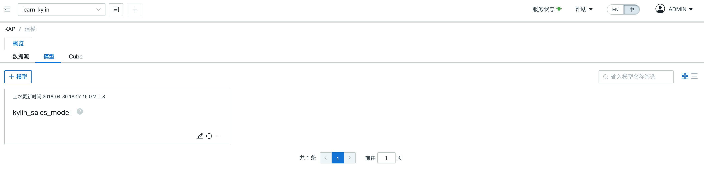
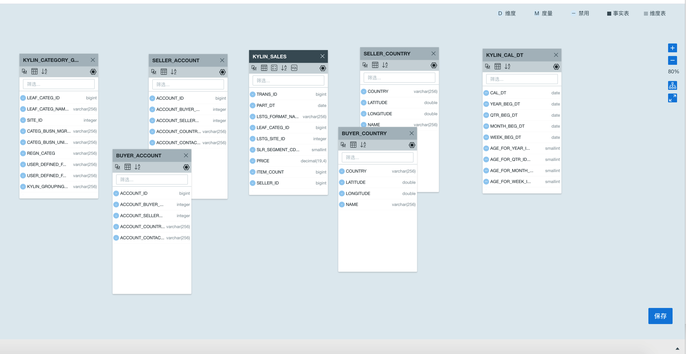
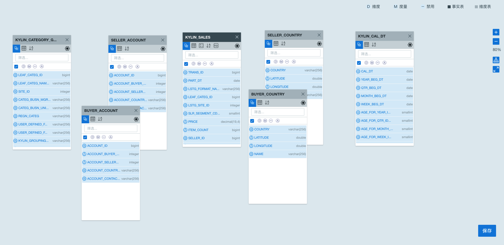
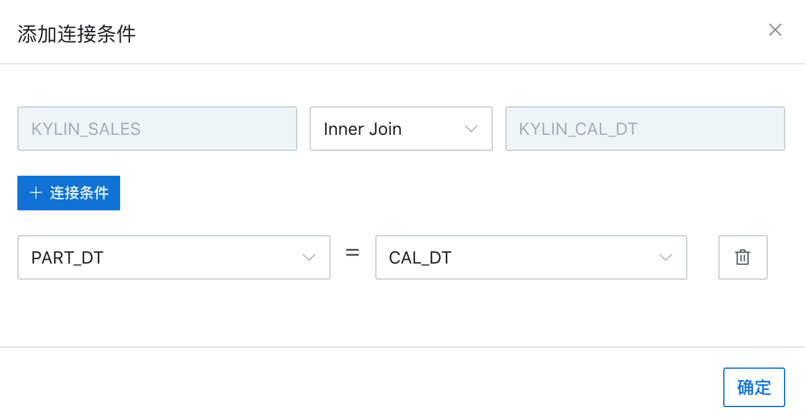
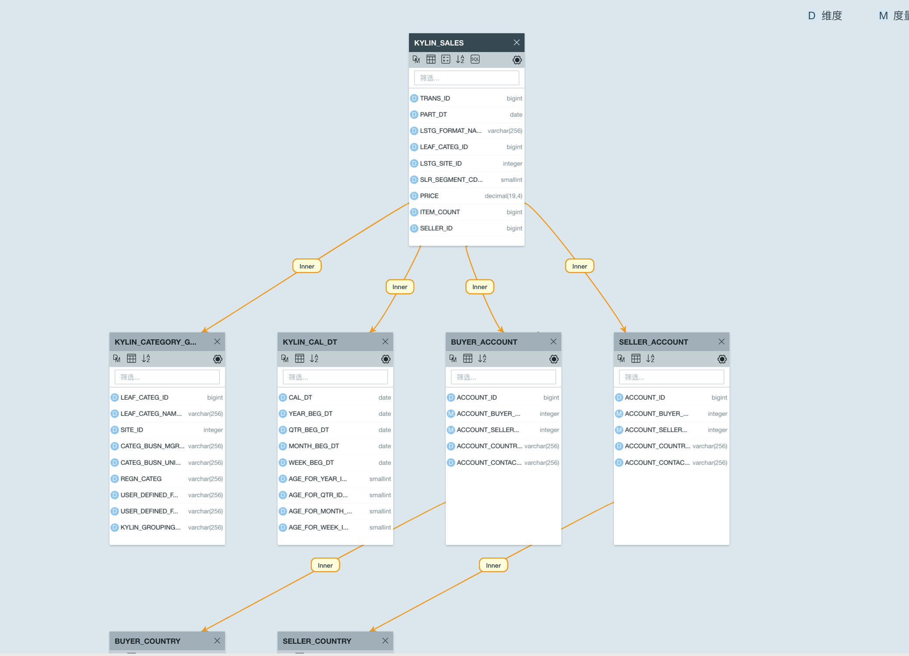

## 基本模型设计

### 概述

本章节将基于样例数据集，介绍模型设计的基本思想和相关步骤。

### 什么是模型设计

在数据源可连通的基础之上，建模用户或分析用户根据需求进行数据模型的设计。

模型设计主要包含以下内容：

- 定义事实表与维度表类型

- 定义字段的类型 (维度或者度量)

- 定义表与表的关联关系

### 如何进入数据模型设计

**步骤一：** 登录本产品 Web UI，切换进入具体项目

**步骤二：** 点击左侧导航栏的**“建模”**，再点击右侧**“概览”** -> **“模型”**标签页， 主页面将以卡片形式显示已有的数据模型列表

### 新建或编辑模型

- **新建模型**

1. 点击 ** “+ 模型“ ** 按钮
2. 在弹出窗口中，输入**模型名称** （必填）和 描述
3. 点击 **提交** 按钮，进入模型编辑界面。

> 提示：新建模型能够完成保存必须要满足以下条件：
>
> - 模型至少包含一个事实表
> - 模型表至少需要选择一个维度列

- **编辑模型**

  在已有的模型列表中， 选择具体模型，点击右下角铅笔形状的**编辑**图标，进入模型编辑页面。

### 设计模型

在模型编辑页面下，用户可以通过可视化的方式定义事实表 ( Fact Table ) 或维度表 ( Lookup Table )。

具体操作步骤如下：

**步骤一**：定义事实表

1. 从左侧数据源表清单中，将事实表拖至建模画布中央， 本样例数据集中的事实表为 “KYLIN_SALES”
2. 单击表右上角的**设置**图标，选择表的类型设为**事实表**

**步骤二**：定义维度表

- 从左侧数据源表清单中，将多个维度表拖至建模画布中央

  > 提示：维度表可以基于场景进行重命名，如本样例中, 我们的模型可定义多个维度表如下：
  > “KYLIN_CAL_DT”，“KYLIN_CATEGORY_GROUPINGS”，“KYLIN_ACCOUNT”，“KYLIN_COUNTRY”
  > 由于 “KYLIN_ACCOUNT” 和 “KYLIN_COUNTRY” 表数据既包含卖家账户也包含卖家用户，我们可以分别将其拖出来两次，修改表别名为 “SELLER_ACCOUNT”，“BUYER_ACCOUNT” 以及 “SELLER_COUNTRY” 和 ”BUYER_COUNTRY“

- 单击这些表右上角的**设置**图标，选择表的类型设为**维度表**

**步骤三：** 对表字段定义维度和度量类型

> 提示：从本产品2.5.4版本开始，支持表字段类型批量定义，并新增系统自动推荐定义设置。

- 单击表上方左侧第一个图标 **DM** ，开启可编辑模式。再次点击图标会关闭编辑模式。
- 在可编辑模式下， 表字段列表上方会显示工具栏
  - 图标 `D` 表示维度
  - 图标 `M` 表示度量
  - 图标 `—` 表示禁用
  - 图标 `A` 表示使用系统推荐类型（自动定义维度和度量）。
- 选择需要参与建模的表字段，再点击工具栏类型图标设定该字段类型。

在本例中，我们勾选工具栏左侧，全选表字段， 并点击图标 `A` 使用系统推荐定义功能，完成快速字段类型定义。

**步骤四**：建立表与表连接关系

表与表关系的建立可以通过拖拽表上的列完成。

本例中，我们选中事实表  ”KYLIN_SALES“ 的时间外键字段 ”PART_DT“ 拖向时间维表 ”KYLIN_CAL_DT“ 的主键字段 ”CAL_DT“。

在弹出窗口我们可以修改连接方式或增加其他字段关联关系。

点击 **确认** 按钮保存新建连接

参照以上方法，设置好所有连接条件（如下所示）：

1. KYLIN_SALES **INNER JOIN** KYLIN_CAL_DT 
   连接条件：
   DEFAULT.KYLIN_SALES.PART_DT = DEFAULT.KYLIN_CAL_DT.CAL_DT

2. KYLIN_SALES **INNER JOIN** KYLIN_CATEGORY_GROUPINGS 
   连接条件：
   KYLIN_SALES.LEAF_CATEG_ID=KYLIN_CATEGORY_GROUPINGS.LEAF_CATEG_ID
   KYLIN_SALES.LSTG_SITE_ID=KYLIN_CATEGORY_GROUPINGS.SITE_ID 

3. KYLIN_SALES  **INNER JOIN**  BUYER_ACCOUNT (alias of KYLIN_ACCOUNT)
   连接条件：
   KYLIN_SALES.BUYER_ID=BUYER_ACCOUNT.ACCOUNT_ID 

4. KYLIN_SALES  **INNER JOIN** SELLER_ACCOUNT (alias of KYLIN_ACCOUNT) 
   连接条件：
   KYLIN_SALES.SELLER_ID=SELLER_ACCOUNT.ACCOUNT_ID 

5. BUYER_ACCOUNT (alias of KYLIN_ACCOUNT)  **INNER JOIN** BUYER_COUNTRY(alias of KYLIN_COUNTRY) 
   连接条件：
   BUYER_ACCOUNT.ACCOUNT_COUNTRY=BUYER_COUNTRY.COUNTRY 

6. SELLER_ACCOUNT (alias of KYLIN_ACCOUNT)  **INNER JOIN**  SELLER_COUNTRY(alias of KYLIN_COUNTRY)
   连接条件：
   SELLER_ACCOUNT.ACCOUNT_COUNTRY=SELLER_COUNTRY.COUNTRY

下图是设置好之后的界面（单击连接中的 "Inner" 标志，可以展开连接具体内容）：

> 提示：本产品还支持添加可计算列，充分利用了产品预计算能力，进一步提升查询性能，更多设置详情请参考[可计算列章节](../model/computed_column/README.cn.md)

**步骤五**：完成模型定义后， 单击右下角**保存**按钮

**步骤六：**设置分区列：

在保存时， 系统弹出窗口（如下图所示），用户可以设置分区字段列。分区列是可选项，如果不设置，则留空。

本产品自带时间分区列定义，字段类型可以支持时间型（time／date／datetime），也支持整数型（integer / tinyint / smallint / bigint / int4 / long8），以及字符型（varchar / string）。

> 提示：本样例中，假设 “KYLIN_SALES” 表事实表的销售数据与日俱增的，我们表的 “PART_DT” 字段为时间分区列， 选择 yyyy-MM-dd 为其时间格式。我们选择增量构建方式构建 Cube

**步骤七**：单击**提交**按钮，到此数据模型就创建成功了。

### 其他高级设置：设置维度表快照

当维度表小于 300 MB 时，推荐以快照 (Snapshot) 形式存储维表，以简化 Cube 设计和提高系统整体效率。由于系统默认所有维度表都比较小，因此缺省地，所有维度表的快照都被启用。

- **启用维度表快照的优点**
  1. 允许单独对维度表进行明细查询
  2. 设计 Cube 时可将维度表的列设置为衍生维度，并在查询中使用

- **关闭维度表快照**

  当您的维度表过大，比如超过 300 MB 的上限，则需要关闭维度表快照才能顺利构建数据。

  您可以在页面下方的窗口依次单击 “概览” -> “模型" 对显示的维度表进行设置。

  

  > **注意：**
  >
  > 1. 当维度表大于 300 MB 时，我们通常不建议以快照形式存储。如确实有必要，可在`kylin.properties` 中调整参数 `kylin.snapshot.max-mb` 至更大值。
  > 
  > 2. 300 MB 是本产品推荐的维度表以快照存储的大小，请您谨慎修改  `kylin.snapshot.max-mb` 的值，这个值如果被设置的过大，基于这个模型进行设计的 Cube 在构建时，有很大概率会在 Build Dimension Dictionary (在这一步会进行快照的构建) 这一步失败，甚至还会影响整个系统的稳定性。如果您的使用场景必须对超大的维度表设置以快照形式存储，请联系 [Kyligence 技术支持](../introduction/get_support.cn.md )获取解决方案，
  > 
  > 3. 存在重复主键的维度表不能以快照形式存储。
  > 如果您在模型检测的 Check Duplicate Key 或者 Cube 构建的 Build Dimension Dictionary 失败，`kylin.log` 中的报错信息 "java.lang.IllegalStateException: The table:{tableName} Dup key found, key=[..], value1=[...],value2=[...]"，您需要确认报错信息提示的表是否需要以快照形式存储，如果不需要的话，可以取消对这张表的以快照形式存储的设置后，重新进行模型检测，或者重新设计 Cube 并进行构建；如果需要这张维度表以快照形式存储，请您对这张表进行数据清洗，去除重复主键。

- **缓慢变化维度（Slowly Changing Dimension）**

  在多维分析场景中，维度表会时不时的发生变化，业界称之为缓慢变化维并有着一套成熟的理论。对于启用了 snapshot 存储的维度表，Kyligence Enterprise 支持定义其衍生维度的缓慢变化维处理方法，以支持不同的分析需求。更多细节请参考[缓慢变化维度](data_modeling_SCD.cn.md).

