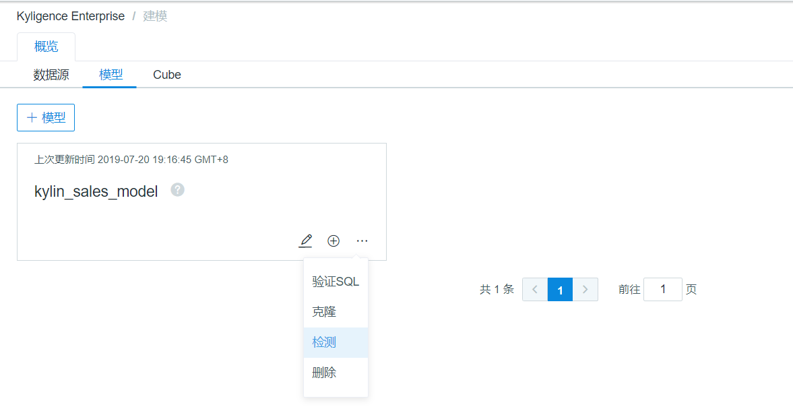
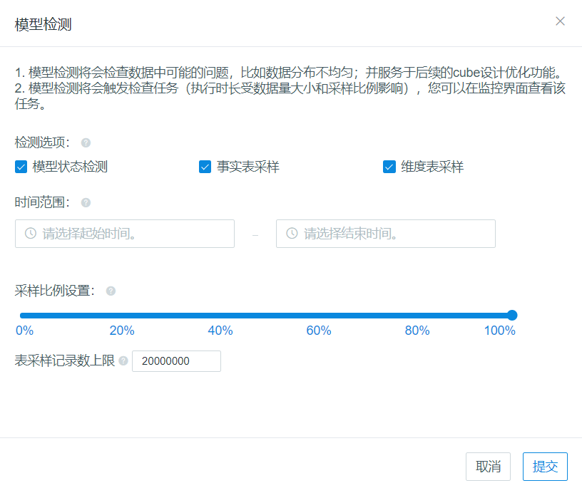

## 模型检测

模型设计完毕之后，我们强烈建议您进行模型检测，确认数据模型是否正确与合理，避免在后续的 Cube 设计与构建时发现问题再进行修正。

### 什么是模型检测

模型检测主要是针对创建好的数据模型进行一系列的检查，检测主要包括以下内容：

- **维表采样检测**：检查维表的主键是否存在重复的值，如果有重复的值且超过设定的容忍度将直接终止模型检查，用户需要先完成数据去重清洗工作。
- **事实表采样检测**：检查事实表数据是否分布均匀，是否存在数据倾斜的可能性。
- **模型状态检测**： 检测模型关联条件是否合理。

### 如何进行模型检测

1. 登录本产品 Web UI，切换进入需要进行检测的模型所在的项目

2. 点击左侧导航栏的**建模**，再点击右侧**模型**标签页，查看待检测的模型列表

3. 选中需要检测的模型，点击右角的菜单，点击**检测**功能

   

   > **提示：**在 **新建模型** 的最后一步，点击 **保存** 按钮弹出的窗口中也可以启动模型检测任务。

4. 调整检测范围

   模型检测默认为全量数据检测，用户可以根据需要缩小检测范围，缩短检测过程时间， 如下图所示主要方式有：

   - 调整时间范围：按照模型数据的时间分区，自定义设置检测的时间范围

   - 调整采样范围：在选定的时间段内数据只进行部分检测，比如，50%比例表示每两条数据只检测一条，以此类推。

   

5. 设置都完成后，点击**提交**按钮，则开始检测任务。

6. 点击左侧导航栏的 **监控** 模块，观察模型检测任务进度。

7. 检测任务完成后，可通过**建模** -> **模型**功能下，具体模型名称旁边的状态标识来查看模型检测结果。

> **提示：**根据模型检测结果，模型会存在如下状态：
>
> - 未检测：未经过模型检测，创建模型的默认状态
> - 正在检测：表示正在跑检测任务
> - 健康：表示模型正常
> - 警告：表示模型检测存在上述错误的一种
> - 错误：表示模型检测存在上述错误的两种及以上
