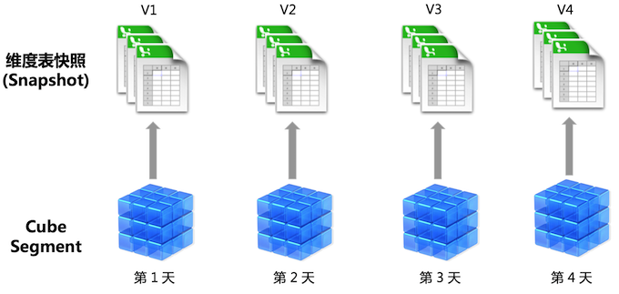
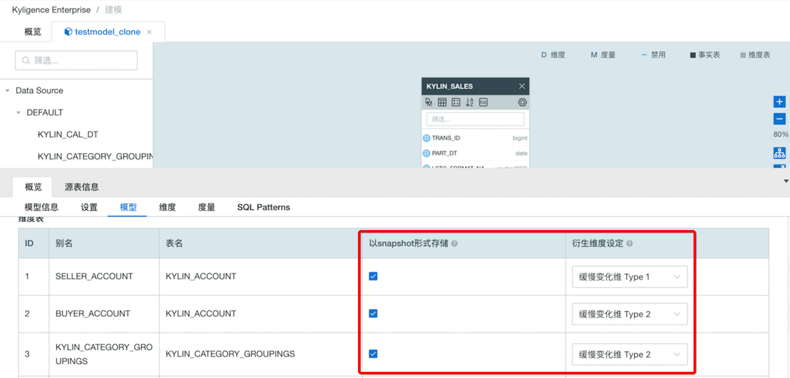

## 缓慢变化维度

在多维分析场景中，维度表可能随着时间发生变动，比如产品表、客户表中的属性可能会不定期的发生变化，而这些属性很可能是多维分析中需要使用的维度，这种情形下需要根据查询分析的特定需求对这种变化进行处理，业界称之为缓慢变化维度（Slowly Changing Dimension, SCD）的处理。

一般来说，最为常见的缓慢变化维度的处理方法有**类别 1**(TYPE1) 和**类别 2**（TYPE 2）：

- 类别 1：查询时使用最新的维度表信息；
- 类别 2：查询时使用当时的维度表信息。

在 Kyligence Enterprise中，默认情形下对所有维度均做类别2处理，无论是普通维度（normal dimension）还是衍生维度（derived dimension），我们都在查询时使用 Cube 构建当时的维度表信息，反应当时的历史事实，其原理如下图：

对于普通维度，Kyligence Enterprise 会将其编码进入 rowkey 从而构建进入 cube segment；对于衍生维度，系统将基于其所在的维度表在构建时生成快照（snapshot），所有历史构建任务生成的快照都会被保留并与对应的 segment 关联。在查询时，系统会将查询需要的 segment 与对应的快照表进行联接，然后将结果返回。

### 启用缓慢变化维度类别1

对于衍生维度，Kyligence Enterprise 会将其存储在快照表中而不构建进入 cube segment，因此启用快照存储的维度表是定义衍生维度的前提。

Kyligence Enterprise 支持基于快照表来统一定义衍生维度的缓慢变化维度类别。在定义模型时，对于启用了**以snapshot形式存储**的维度表，可以在**衍生维度设定**列中设置缓慢变化维度类别，默认为**缓慢变化维度 Type 2**。

对于启用了**缓慢变化维度 Type 1**的快照表，Kyligence Enterprise 将仅保留一个最新版本的快照，所有 cube segment 都将指向该维度表的快照。当进行 cube 构建时，系统会更新当前最新版本快照，同时只执行插入和更新操作，保证快照表中是该维度表所有历史的去重合并。其原理如下图所示：

