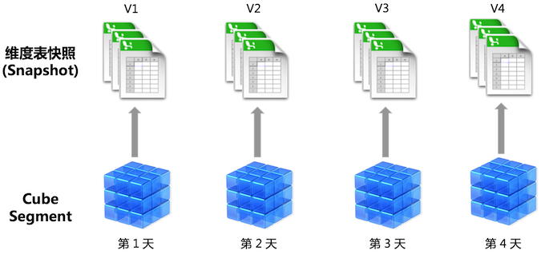
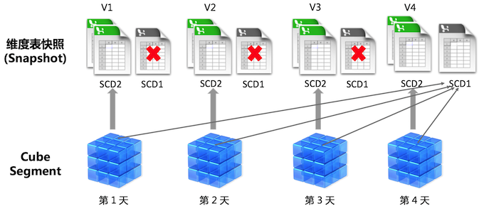

## 缓慢变化维度

在多维分析场景中，维度表可能随着时间发生变动，比如产品表、客户表中的属性可能会不定期的发生变化，而这些属性很可能是多维分析中需要使用的维度，这种情形下需要根据查询分析的特定需求对这种变化进行处理，业界称之为缓慢变化维度（Slowly Changing Dimension, SCD）的处理。

一般来说，最为常见的缓慢变化维度的处理方法有**类别 1**（Type 1) 和**类别 2**（Type 2）：

- 类别 1：维度表中直接覆盖原值，查询时只能使用最新的维度属性，反应维度最新状态（Latest Status）
- 类别 2：维度表中添加新的记录，通常增加有效期字段来区分，记录维度表所有历史变化，从而使得历史可追溯。在查询时一般使用当时的维度属性，反应历史事实（Historical Truth）

在 Kyligence Enterprise中，默认情形下对所有维度均做类别2处理，无论是普通维度（Normal Dimension）还是衍生维度（Derived Dimension），我们都在查询时使用 Cube 构建当时的维度表，反应当时的历史事实，其原理如下图：



对于普通维度，Kyligence Enterprise 会将其编码进入 Rowkey 从而构建进入 Cube Segment；对于衍生维度，系统将基于其所在的维度表在构建时生成快照（Snapshot），所有历史构建任务生成的快照都会被保留并与对应的 Segment 关联。在查询时，系统会将查询需要的 Segment 与对应的快照表进行联接，然后将结果返回。


### 启用缓慢变化维度类别 1

Kyligence Enterprise 支持基于快照表来统一定义衍生维度的缓慢变化维度类别。在定义模型时，对于启用了**以Snapshot 形式存储**的维度表，可以在**衍生维度设定**列中设置缓慢变化维度类别，默认为**缓慢变化维度 Type 2**。


对于设定了了**缓慢变化维度 Type 1** 的维度表，Kyligence Enterprise 将仅保留一个最新版本的快照，所有 Cube 的历史数据 （即 Segment） 都将指向该维度表的快照。当进行 Cube 构建时，系统会更新当前最新版本的维度表快照，执行插入和更新操作，保证快照表中是该维度表所有历史的去重合并。其原理如下图所示：




### 缓慢变化维度 Type 1 的假设和限制

- 缓慢变化维度 Type 1 只适用于**叶子维表**上的**衍生维度**。

  所谓叶子维表指位于 Join 树叶子位置的维表。比如：

  ```sql
  F inner join A on F.aid=A.id      --      F --- A -- B
    inner join B on A.bid=B.id      --         |- C
    inner join C on F.cid=C.id
  ```

  上例中，表 B 和 C 是叶子维表，表 A 处于表 F 和 B 之间，因此不是叶子维表。

  非叶子维表无法简单的变更，因为它的内容会参与构建时的 Join 预计算，并作为 Segment 数据保存。而 Segment 数据必需通过刷新 Segment 更新。

  类似的，普通维度也是保存在 Segment 数据中，因此必需刷新 Segment 才能更新。

- 缓慢变化维度 Type 1 表的主键（PK）**只能新增**，不可以删减。

  PK 的稳定对 Join 结果的正确性至关重要，Kyligence Enterprise 假设缓慢变化维度 Type 1 表的主键（PK）只会新增，而不会删减。

  如果维表中有 PK 被删除，那可能会导致 Join 结果变化，因此整个 Segment 需要刷新来体现 Join 结果变化。如果只更新维表快照而不刷新 Segment，那将会导致查询结果不正确。

  