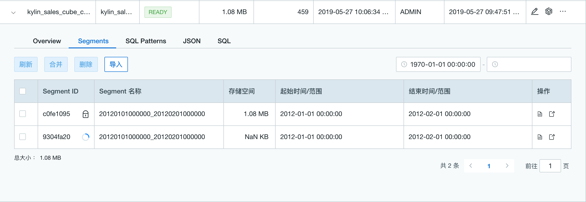

## Cube 与 Segment 管理

### Cube 管理

- **访问Cube管理页面**

用户可按如下步骤进入Cube管理界面

**步骤一：** 登录本产品Web UI，切换进入具体项目

**步骤二：** 点击左侧导航栏的**建模**，再点击右侧**概览**->**Cube**标签页，查看**Cube**列表（如下图所示）

- **Cube 状态与操作类型**

  构建的Cube包含4种， 可在Cube列表的 **状态** 列进行查看， 以及最右侧 **操作** 进行Cube操作管理

  - **Draft（草稿）**：尚未正式保存的cube，可以继续编辑、删除、查看cube(查看cube描述信息)。

  - **Disabled（禁用）**：已经设计好但尚未构建因而无法查询的cube。当cube经过构建自动转成ready状态后，才能查询。除了查看Cube描述信息之外，该状态支持的其他操作如下：

    - 验证SQL
    - 删除
    - 编辑
    - 构建
    - 启用（将具有segment的cube转化为ready状态）
    - 清理（清空cube下所有segment数据）
    - 克隆（复制cube，但不复制segment数据）
    - 备份（备份cube元数据）
    - 编辑cube详细信息（查看或编辑cube的json信息）。

    > 注意： 当 cube 启用后重新禁用时，将无法编辑维度和度量。此时如果需要编辑维度和度量，需要重新设计并构建新的 cube。

  - **Ready（启用）**：设计完成且经过构建的cube，此时cube包含segment且可以查询，无法直接删除或清理。除查看Cube描述信息外，该状态支持操作如下：

    - 查看cube(查看cube描述信息)
    - 验证SQL
    - 构建
    - 禁用（将具有ready cube转化为disable状态）
    - 克隆（复制cube，但不复制segment数据）
    - 备份（备份cube元数据）

  - **Broken**（损坏）：cube元数据被破坏，处于异常状态。

  ​

### Segment 管理

Cube数据由一个或多个Segment组成。因此当Cube构建后，会生成segment数据。Segment的生成是以分区列（partition column）为依据的。

用户可通过如下步骤进入Segment管理界面：

1. 点击**Cube**列表中， Cube **名称** 列的**>**箭头
2. 选择 **Segments** 标签页

Segments管理页面下，支持如下操作：

- 刷新（重新构建该segment）
- 合并（将多个segment合并为一个，segment不连续也可以合并， 合并segment时，老segment会被重新构建）
- 删除

> 提示：点击正在被构建、刷新、合并的segment ID，可以跳转至**监控**页面，查看关联Segment任务。Segment合并任务名一般以MERGE CUBE开头

  