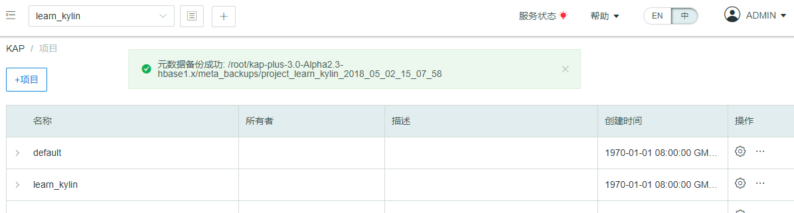

## 元数据备份

元数据是 Kyligence Enterprise 中最重要的数据之一，备份元数据是运维工作中一个至关重要的环节。只有这样，在由于误操作导致整个 Kyligence Enterprise 服务或某个 Cube 异常时，才能将 Kyligence Enterprise 快速从备份中恢复出来。一般来说，在每次进行故障恢复或系统升级之前，对元数据进行备份是一个良好的习惯，这可以保证 Kyligence Enterprise 服务在系统更新失败后依然有回滚的可能，在最坏情况下依然保持系统的稳定性。

此外，元数据备份也是故障查找的一个工具，当系统出现故障导致前端频繁报错，通过该工具下载元数据并查看文件，往往能对确定元数据是否存在问题提供帮助。

### 命令行下的元数据备份

Kyligence Enterprise 提供了一个**命令行**工具用于备份 Kyligence Enterprise 的元数据，具体用法是：

系统级别

```shell
$KYLIN_HOME/bin/metastore.sh backup
```
项目级别

```shell
$KYLIN_HOME/bin/metastore.sh backup-project PROJECT_NAME PATH_TO_LOCAL_META_DIR
```

Cube级别

```shell
$KYLIN_HOME/bin/metastore.sh backup-cube CUBE_NAME PATH_TO_LOCAL_META_DIR
```

当看到如下提示时即为备份成功：

```shell
metadata store backed up to /usr/local/kylin/meta_backups/meta_2016_06_10_20_24_50
```
> 注释：PROJECT_NAME 和 CUBE_NAME 表示您所需要备份的项目和cube的名字，如learn_kylin；
>
> PATH_TO_LOCAL_META_DIR 表示您想要备份的元数据保存路径, 
>
> 如 `/usr/local/kylin/meta_backups/meta_2016_06_10_20_24_50`；
>
> 在上面的例子里，这个命令会把 Kyligence Enterprise 用到的所有元数据以文件形式下载到本地目录当中（如`/usr/local/kylin/meta_backups/meta_2016_06_10_20_24_50`）。


### 用户界面下的元数据备份 ###

除了使用命令行进行元数据备份，Kyligence Enterprise 还支持在用户界面下进行元数据备份。

* **系统元数据保存**

进入页面左侧系统页面后，点击备份按钮进行系统元数据备份，元数据文件会备份在 Kyligence Enterprise 安装目录下的 meta\_backups 文件夹中（如图中的 `/root/kap-plus-2.5-hbase1.x-236/kap-plus-2.5.5-alpha3.1-hbase1.x/meta\_backups`）。文件命名为 meta\_当前备份时间（如 meta_2018_01_11_07_00_25）。


* **项目元数据保存**

点击页面上方项目展开按键后，选择需要备份的项目点击操作按键后进行备份，项目元数据文件会备份在Kyligence Enterprise安装目录下的 meta\_backups 文件夹中。文件命名为 `project_备份项目名_当前时间`（如 `project_learn_kylin_2018_01_11_19_02_23`）。




* **Cube 元数据保存**

点击页面左侧建模按键后，选择 Cube 界面，选择需要备份的 Cube 点击操作按键后进行备份，Cube 元数据文件会备份在 Kyligence Enterprise 安装目录下的 meta\_backups 文件夹中。文件命名为 `cube_备份Cube名_当前时间`（如cube_corr_2018_01_11_19_04_47）。


### 元数据目录结构

系统级别的元数据主要包括的目录如下表所示：

| 目录名             | 介绍                                                 |
| :----------------- | :--------------------------------------------------- |
| project            | 包含了项目的基本信息，项目所包含其它元数据类型的声明 |
| bad_query          | 慢查询信息                                           |
| column_acl         | 列级acl权限信息                                      |
| history            | 包含垃圾清理，元数据检测，数据使用的历史信息         |
| hybrid             | hybrid数据                                           |
| info               | 文件包时间，类型                                     |
| kafka              | Kafka表数据                                          |
| kylin_env          | 环境信息                                             |
| kylin.properties   | 配置项文件                                           |
| model_opt_log      | 模型操作信息（sql建议结果等）                        |
| model_stats        | 模型检测信息                                         |
| project_dict       | 项目级别字典信息                                     |
| row_acl            | 行级acl权限                                          |
| streaming          | streaming表数据                                      |
| user_group         | 用户组信息                                           |
| UUID               | 是每个metadata instance的标识                        |
| model_desc         | 包含了描述数据模型基本信息与结构的定义               |
| cube_desc          | 包含了描述 Cube 模型基本信息与结构的定义             |
| cube               | 包含了 Cube 实例的基本信息                           |
| cube_statistics    | 包含了 Cube 实例的统计信息                           |
| table              | 包含了表的基本信息                                   |
| table_exd          | 包含了表的扩展信息，如维度                           |
| table_snapshot     | 包含了 Lookup 表的镜像                               |
| dict               | 包含了使用字典列的字典                               |
| execute            | 包含了 Cube 构建任务的步骤信息                       |
| execute_output     | 包含了 Cube 构建任务的步骤输出                       |
| raw_table_desc     | 包含了表索引的基本信息与结构的定义                   |
| raw_table_instance | 包含了表索引实例的基本信息                           |
| user               | 包含了用户信息                                       |
| acl                | 包含了数据访问控制信息                               |
| query              | 包含了保存的历史查询                                 |
| draft              | 包含了 Model 与 Cube 的草稿                          |

> 提示：
>
> **系统级别**元数据目录包含表中全部目录；
>
> **项目级别**的元数据目录包括 commit_SHA1, cube, cube_desc, model_desc, streaming, UUID, info, kylin_env, project, table；
>
> **cube级别**包括  commit_SHA1, cube, cube_desc, info, kylin_env, model_desc, table, table_exd, UUID。

