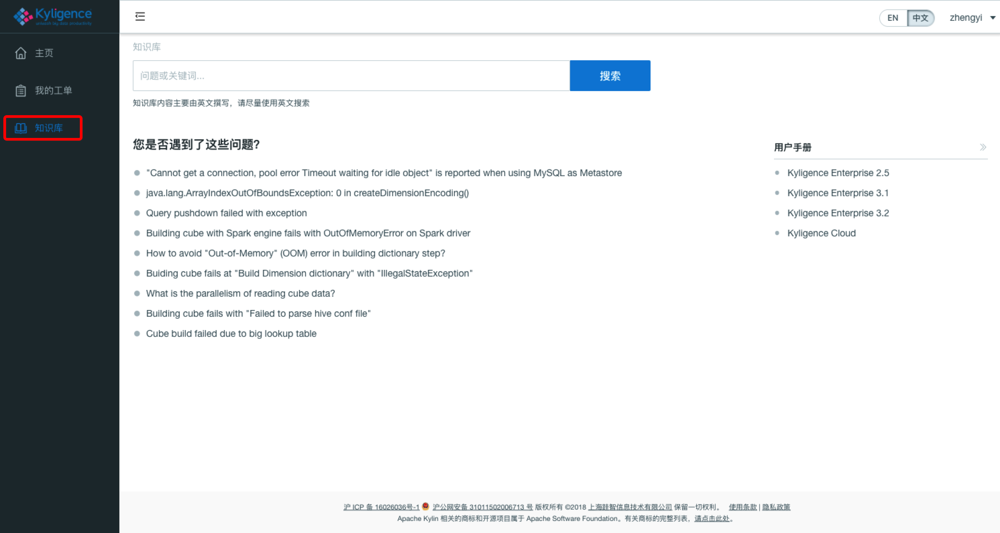
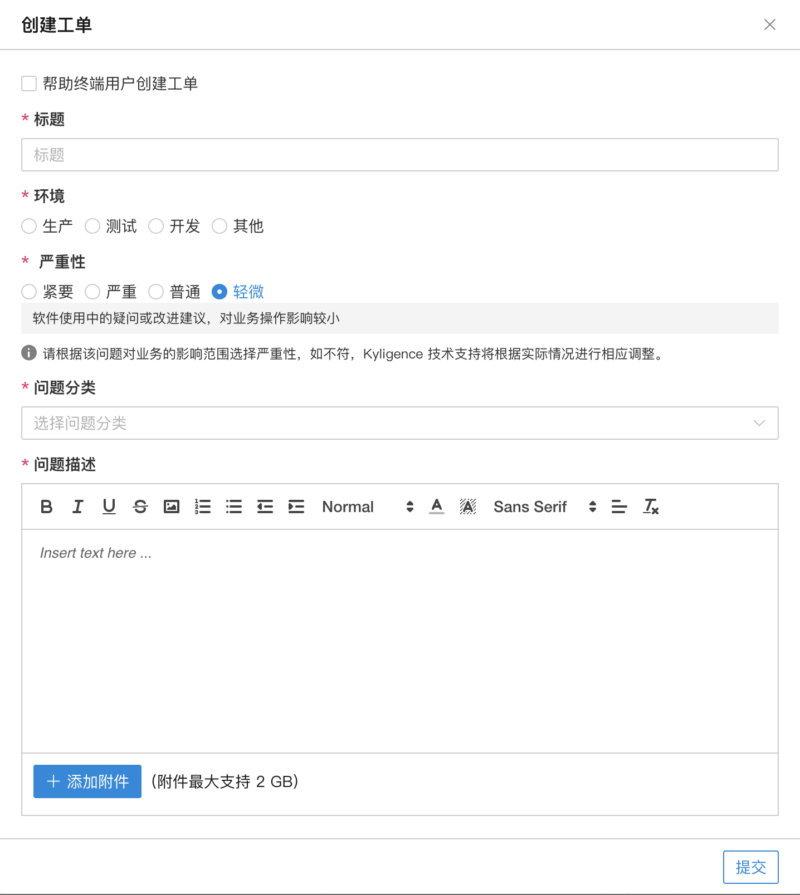
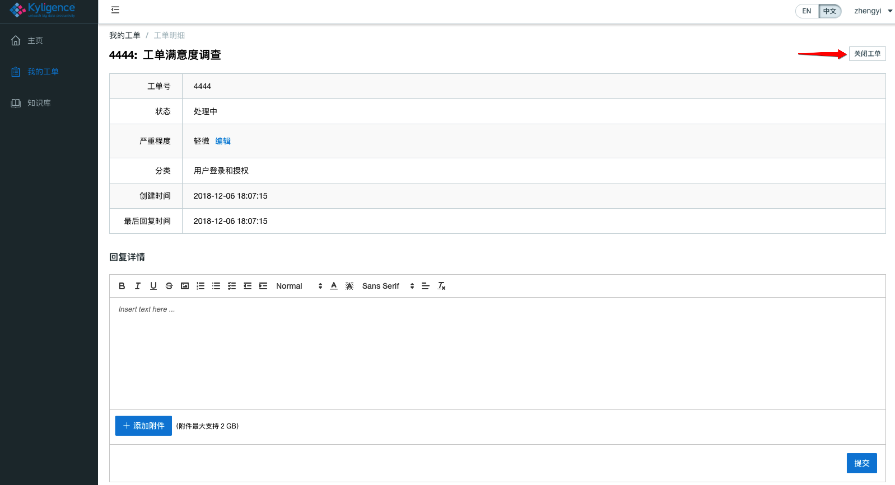

## 获取技术支持

Kyligence 提供对 Kyligence Enterprise 的原厂支持，企业级用户可以在  [Kyligence 支持中心](https://support.kyligence.io) 使用知识库功能自助搜索获得相应的答案，或者通过工单快速提交相关的支持请求。

以下是 **Kyligence 支持中心** 的使用教程：

* [知识库](#知识库)
* [创建工单](#创建工单)
* [查看工单](#查看工单)
* [关闭工单](#关闭工单)
* [用户手册与发布声明](#用户手册与发布声明)

### 知识库  

1. 点击左侧导航栏中的**知识库**标签，进入**知识库**界面。
  
2. 您可以通过输入关键词来搜索是否有已有的知识库文章来解决您的问题。

### 创建工单  

1. 点击**我的工单** --> **创建工单**，进入创建工单界面
2. 在创建工单界面，在相应位置填选**标题**、**环境**、**严重性**、**问题分类**、**问题描述**，可通过**添加附件**按钮上传诊断包、图片等附件从而更详实地描述问题，最后请点击提交按钮，完成工单的创建流程。
   

   > 注意：
   > 1. 严重性请根据问题对业务的影响范围进行选择，如不符，Kyligence 技术支持会根据实际情况做相应调整。
   > 2. 如何生成诊断包请参考[系统诊断与任务诊断](diag.cn.md)章节。
   > 3. 附件最大支持上传 2GB。

### 查看工单  

- 在**我的工单**界面可以看到所有工单的摘要信息，可以通过点击**工单号**进入工单详情页面。

- 工单状态一般分为**处理中**、**待您回复**、**待您确认**和**已关闭**四种状态。

### 关闭工单
您可以在工单详情页面点击**关闭工单**按钮，从而关闭工单。

在关闭工单后，请您进行工单满意度调查，我们期待您的反馈意见以便提高我们的服务质量。

### 用户手册与发布声明  

- **用户手册**

  在知识库界面的右侧，可以找到用户手册的模块。通过单击用户手册模块下对应版本的链接，能够浏览相应 Kyligence Enterprise 版本最新的用户手册。

- **发布声明**

  在支持中心主页的中下侧，可以看到发布声明版块，点击模块内的链接，可以看到 Kyligence 旗下产品最新的发布声明
