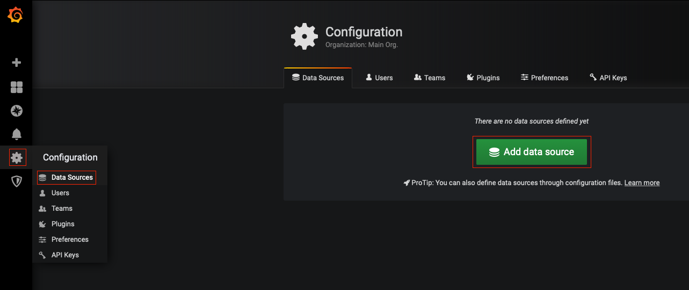
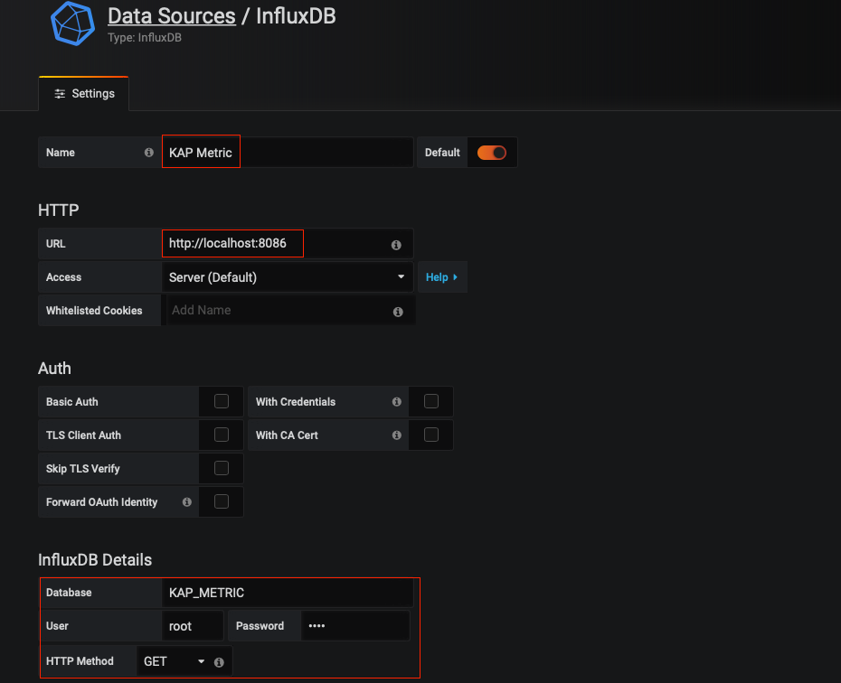
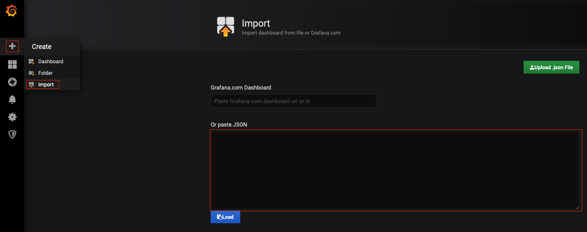
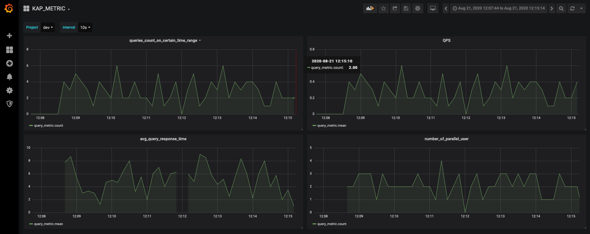

## 指标监控
系统会在查询时记录查询相关的指标数据，包括用户、节点、项目、查询引擎、查询ID、耗时、扫描量等，监控数据存放在配置指定的 [InfluxDB](https://www.influxdata.com/time-series-platform/) 中，通过 [Grafana](https://grafana.com/grafana/) 展示。可以帮助管理员透视系统的运行状况，以便做好风险预估工作。

> **注意**：由于指标监控服务依赖于 InfluxDB 和 Grafana，所以请确保您已经正确配置且正常启动 InfluxDB 和 Grafana。

### InfluxDB
启动 InfluxDB 后，KE需要修改相应配置来指定 InfluxDB, 修改 `$KYLIN_HOME/conf/kylin.properties` 文件，添加如下配置：

```
kap.metric.diagnosis.influxDB-address=ip:port
kap.metric.diagnosis.graph-writer-type=INFLUX
kap.metric.diagnosis.influxDB-database=KAP_METRIC
kap.metric.diagnosis.influxDB-query-measurement=query_metric
kap.metric.diagnosis.query-metric-global-enabled=true
kap.metric.diagnosis.influxDB-username=username
kap.metric.diagnosis.influxDB-password=password
```

其中密码支持 AES 加密后的密码，KE提供加密工具，使用方法为：

`bin/kylin.sh io.kyligence.kap.tool.general.CryptTool AES password`

### Grafana
Grafana 启动成功后打开浏览器访问，默认端口：3000，用户名：admin，密码：admin 

在使用之前还需要： 
1. 配置数据库 
2. 加载默认数据面板

#### 配置数据库
在 Grafana 的设置中选择“Data Sources”，然后点击“Add data sources”，选中 InfluxDB



在数据库配置界面输入数据源名称、地址、数据库名称、用户名、密码及请求方式(此处密码不支持AES加密)，之后点击“Save & Test”即可。



#### 加载默认数据面板
在 Grafana 菜单中选择“Import”, 然后复制<a onclick="window.open('files/grafana_kap_metric.json', '_blank');">默认配置文件</a>至右侧的文本框中，点击“Load”, 并且选择之前添加的数据源即可。
> **注意**：使用默认配置文件要求在KE的配置文件中 `kap.metric.diagnosis.influxDB-query-measurement`必须使用默认值`query_metric`



### 指标数据

默认配置文件中包含了四个指标，用户可以指定统计的时间间隔，四个指标的含义均是在**特定的时间间隔下**的含义，详情如下：

| 名称       | 含义    | 关联项目    |
| :------------- | :---------- | :----------- |
| queries_count_on_certain_time_range | 查询总次数 | Y |
| QPS | 平均每秒查询次数 | Y |
| avg_query_response_time | 平均相应时间 | Y |
| number_of_parallel_user | 并行用户数 | Y |




