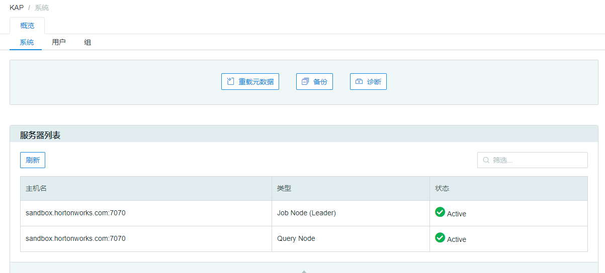

## 服务器状态 ##

在 Kyligence Enterprise 2.5.5及之后的版本中，用户可以在系统页面下的服务器列表看到 Kyligence Enterprise 集群的服务器状态，如下图所示：

### 服务器类型 ###

* Job Node (Leader)：当前充当任务引擎的节点。

* Job Node (Follower)： 若 Leader 节点出现故障负责接管其职能并继续跟踪当前任务及后续请求的节点。

* Query Node：负责充当查询引擎的节点。

  更多相关信息可以查看手册中关于[服务发现及任务引擎高可用](installation/deploy/ha.cn.md)和[集群部署与负载均衡](installation/deploy/cluster_lb.cn.md)的部分。

### 服务器状态 ###

* Active：当前节点正在运行。
* Available：当前 Follower 节点状态正常能够接替 Leader 节点。

若节点未连接则不会出现在服务器列表中。