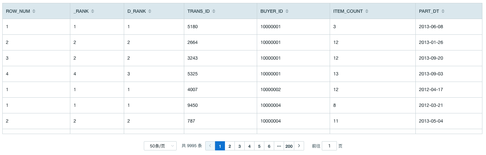
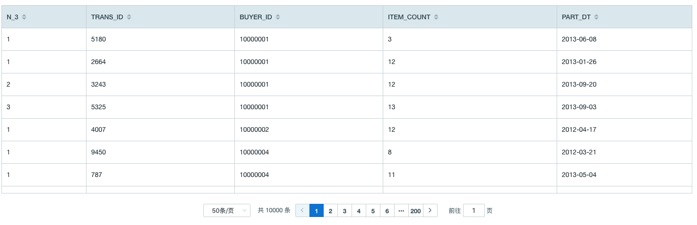
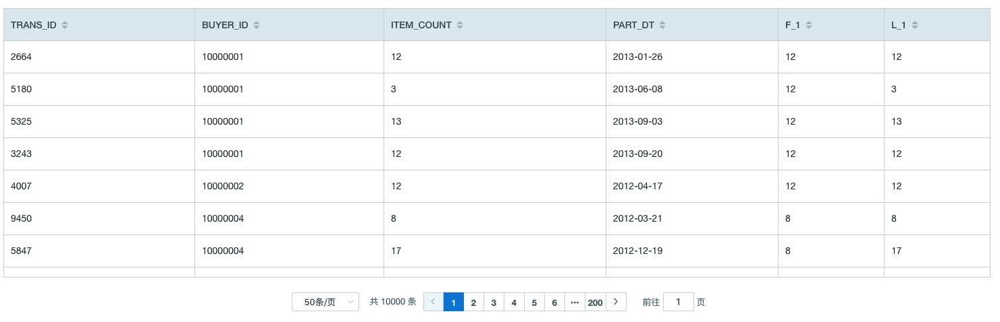
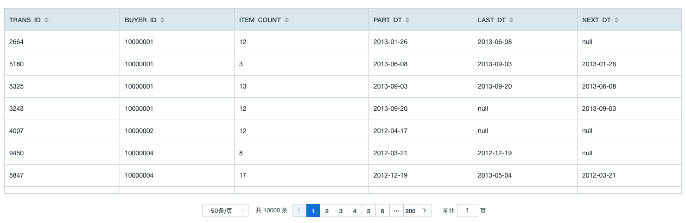

## 窗口函数
用户可以使用窗口函数来完成更多复杂的查询、简化查询过程并且获得更好的统计结果。

Kyligence Enterprise 目前支持两类窗口函数，分别为排名函数和偏移函数。


- 排名函数

  - [ROW_NUMBER()](#ROW_NUMBER() OVER window)
  - [RANK()](#RANK() OVER window)
  - [DENSE_RANK()](#DENSE_RANK() OVER window)
  - [NTILE(value)](#NTILE(value) OVER window)

- 偏移函数

  - [FIRST_VALUE(value)](#FIRST_VALUE(value) OVER window)
  - [LAST_VALUE(value)](#LAST_VALUE(value) OVER window)
  - [LEAD(value, offset, default)](#LEAD(value, offset, default) OVER window)
  - [LAG(value, offset, default)](#LAG(value, offset, default) OVER window)


接下来我们以[样例数据集](../../model/sample_dataset.cn.md) 中的 KYLIN_SALES 为例，介绍每个函数的使用方法。表中字段及其意义如下：

- PART_DT：订单日期；
- TRANS_ID：订单号；
- BUYER_ID：买家 ID；
- ITEM_COUNT：购买商品个数；


### ROW_NUMBER() OVER window

- 返回当前行在其分区中的序列数，数字不重复

### RANK() OVER window

- 返回当前行的位置（可能会有序号间隙）

### DENSE_RANK() OVER window

- 返回当前行的位置（无间隙）


### ROW_NUMBER()，RANK()，DENSE_RANK() 查询示例

> **提示**：使用 RANK() 和 DENSE_RANK() 与 ROW_NUMBER() 在同一条查询语句中，查询每个买家购买商品数最少的前五个订单，进行对比
```SQL
SELECT *
FROM (
	SELECT ROW_NUMBER() OVER w AS ROW_NUM
		,RANK() OVER w AS _RANK
		,DENSE_RANK() OVER w AS D_RANK
		,TRANS_ID
		,BUYER_ID
		,ITEM_COUNT
		,PART_DT
	FROM KYLIN_SALES 
    WINDOW w AS (PARTITION BY BUYER_ID ORDER BY ITEM_COUNT)
	) T
WHERE ROW_NUM <= 5
```

返回示例：


> **提示**：
>
> 对于买家 '10000001' ，购买商品个数为 12 的订单有两条，使用三种排名函数对比如下：
> 1. 使用 row_number() 函数，序号随机为 2 和 3；购买商品个数为 13 的订单序号为 4
> 2. 使用 rank() 函数，序号为 2 和 2；购买商品个数为 13 的订单序号为 4（此处存在序号空隙）
> 3. 使用 dense_rank() 函数，序号为 2 和 2；购买商品个数为 13 的订单序号为 3（此处不÷存在序号空隙）


### NTILE(value) OVER window

- 函数说明

  - 将分区内的有序数据尽量按 value 等分，返回组号
- 查询示例
  > **提示**：将每个买家的订单按照购买商品个数等分为3组
  ```SQL
  SELECT NTILE(3) OVER w AS N_3
    ,TRANS_ID
    ,BUYER_ID
    ,ITEM_COUNT
    ,PART_DT
  FROM KYLIN_SALES
  WINDOW w AS (PARTITION BY BUYER_ID ORDER BY ITEM_COUNT)
  ```

- 返回示例
  


### FIRST_VALUE(value) OVER window
- 返回窗口框架中计算行中第一行的值


### LAST_VALUE(value) OVER window
- 返回窗口框架中计算行中最后一行的值 


### FIRST_VALUE() 和 LAST_VALUE() 查询示例
> **提示**：查询截止到当前订单，按照日期排序的第一个订单和最后一个订单中购买商品个数

```SQL
SELECT TRANS_ID
	,BUYER_ID
	,ITEM_COUNT
	,PART_DT
	,FIRST_VALUE(ITEM_COUNT) OVER w AS F_1
	,LAST_VALUE(ITEM_COUNT) OVER w AS L_1
FROM KYLIN_SALES 
WINDOW w AS (PARTITION BY BUYER_ID ORDER BY PART_DT)
```

返回示例：




### LEAD(value, offset, default) OVER window
- 返回分区内当前行的偏移行中向前的偏移值

### LAG(value, offset, default) OVER window
- 返回分区内当前行的偏移行中向后的偏移值；


### LEAD() 和 LAG() 查询示例
> **提示**：查询当前订单和上一个订单、下一个订单的时间

```SQL
SELECT TRANS_ID
	,BUYER_ID
	,ITEM_COUNT
	,PART_DT
	,LEAD(PART_DT, 1) OVER w LAST_DT
	,LAG(PART_DT, 1) OVER w NEXT_DT
FROM KYLIN_SALES 
WINDOW w AS (PARTITION BY BUYER_ID ORDER BY PART_DT)
```

返回示例：



