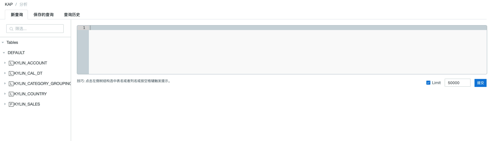
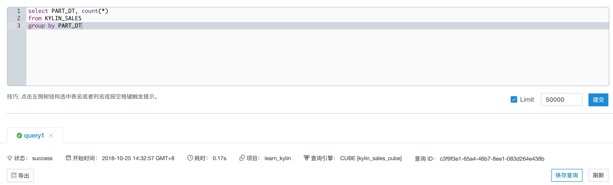
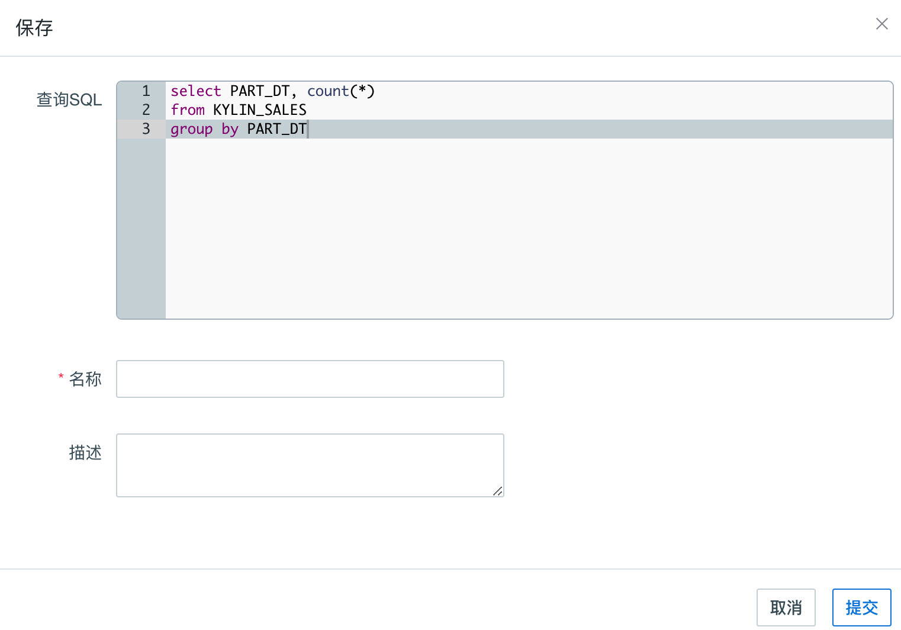
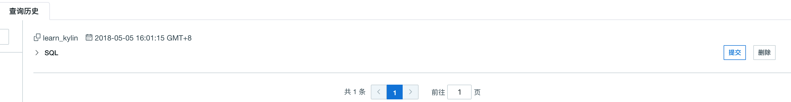
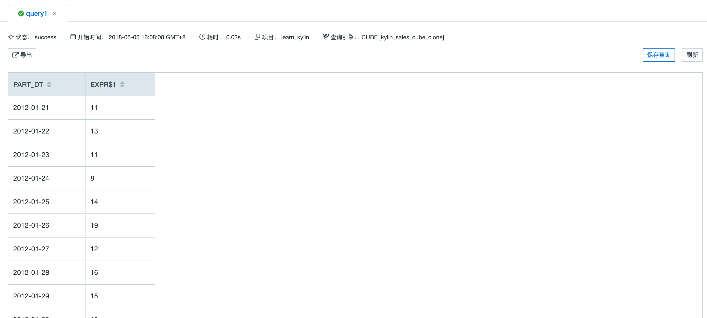

## 在用户界面执行 SQL 查询

打开 Kyligence Enterprise 的 Web UI，点击**分析**标签，左边将列出所有可以查询的表，与这些表相对应的 Cube 已经构建完成。右边给出了输入框，在此输入 SQL 语句，将在下方显示结果。下面详述不同标识对应的解释。

* **F** - Fact，事实表
* **L** - Lookup，维度表

### 执行 SQL 查询

在输入框中输入 SQL 语句，点击**提交**按钮即可进行查询。在右下角提交按钮旁有一个 **Limit** 输入框，如果 SQL 语句中不含 Limit 子句，此处会拼接上一个默认 Limit 值。如果 SQL 语句中有 Limit 子句则以 SQL 语句为准。假如用户想去掉 Limit 限制，可以反选 Limit 前的选择框。

查询结果成功返回后，会在状态下方的查询引擎条目里，显示该查询所命中的 Cube。

> 注意：
> 1. 仅支持 SELECT 查询语句。
> 2. 若开启了查询下压，当查询无法由 Cube 满足时，将会重定向到下压查询引擎执行。这时可能耗时稍长。

### 保存查询
与用户账号关联，用户将能够从不同的浏览器甚至机器上获取已保存的查询。在结果区域点击保存图标，将会弹出名称和描述来保存当前查询。

### 查询历史
仅保存当前用户在当前浏览器中的查询历史，这将需要启用 cookie，并且如果用户清理浏览器缓存，将会丢失已缓存的查询历史。点击**查询历史**标签中，用户可以直接重新提交其中的任何一条并再次运行。

### 查询结果展现
默认情况下，Kyligence Enterprise 会以表格形式展示数据，可以对数据进行升序或降序排列，也可以对字段进行隐藏。也可以点击**导出**按钮以导出 CSV 文件。

### 其他执行 SQL 查询的方式

- [与BI工具集成](../integration/README.md)

- [REST API](../rest/README.md)