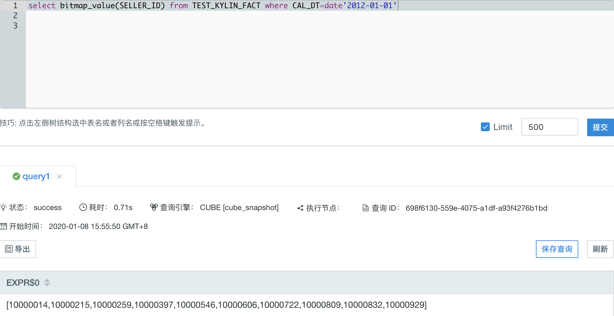
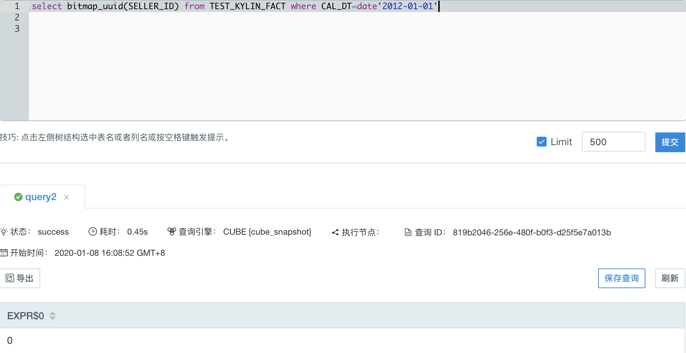
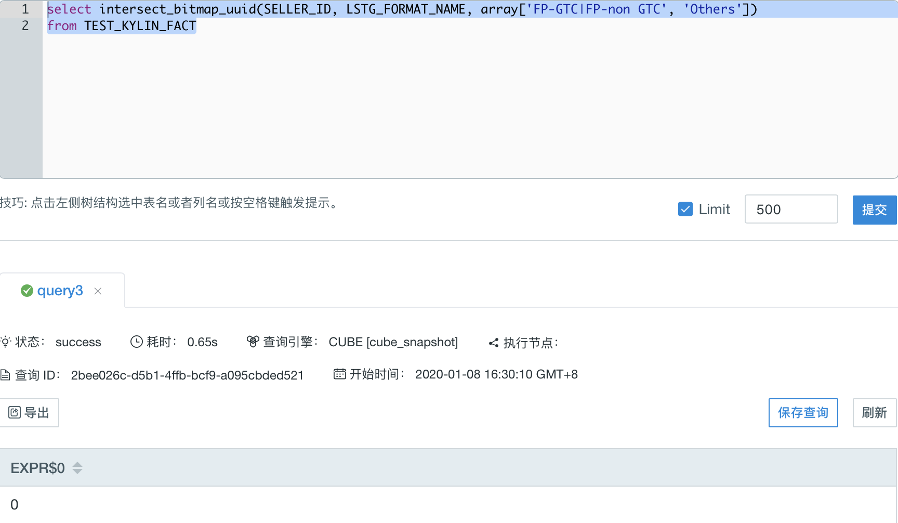
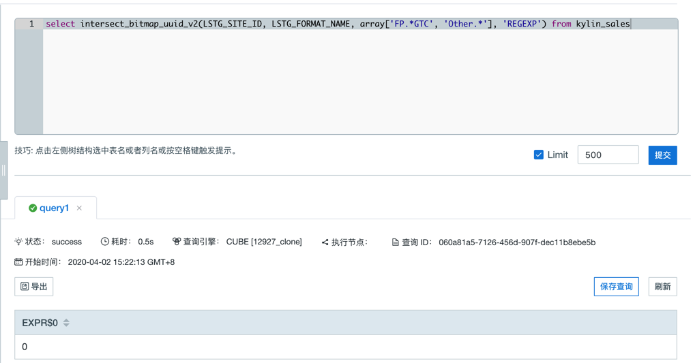
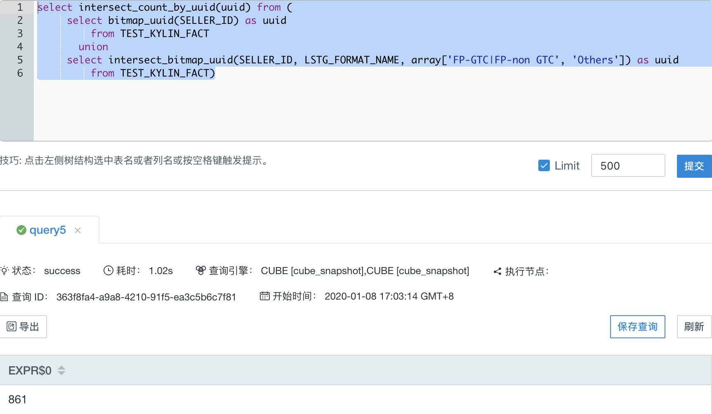
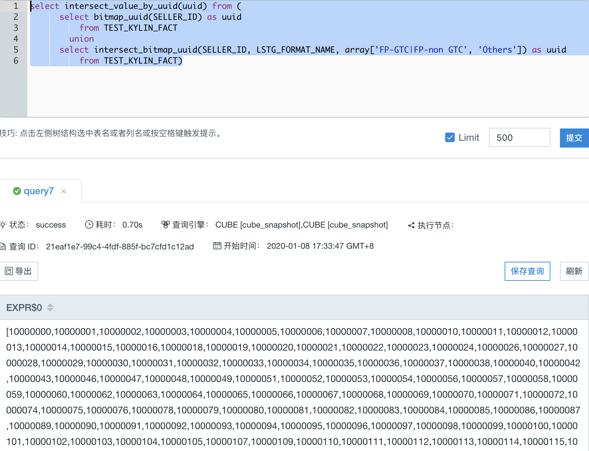
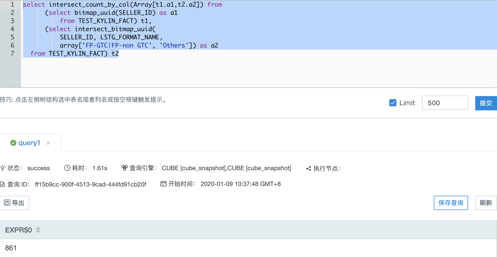
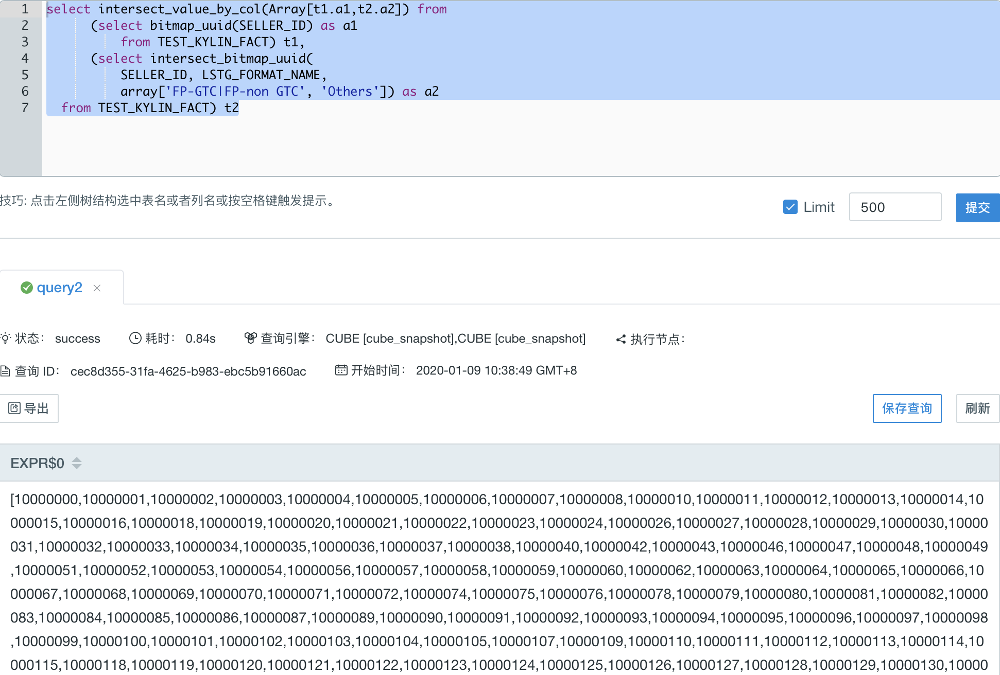

## Bitmap 函数

用户可以使用 Bitmap 函数，从多个模型中分别计算出去重后的 bitmap 结果，再对子查询的 bitmap 做交集操作。

Kyligence Enterprise 支持如下 Bitmap 函数。


### 前提条件

您的 Kyligence Enterprise 版本高于或等于 3.4.5.2080。


### BITMAP_VALUE

- 说明

  - 返回去重结果，以数组的形式展示在一行中。

- 语法

  - `bitmap_value(column_to_count)`
  
- 参数

  - `column_to_count` 指向用于统计去重数据的列，这个列必须已经被添加为**精确去重**的度量, **且只支持类型为 tinyint 、smallint 或 integer 的列**。

- 查询事例 1

  事实表 TEST_KYLIN_FACT 模拟了在线交易数据的记录表，其中 SELLER_ID 字段的类型为 integer，且已经被添加为**精确去重**的度量。
  
  ```select bitmap_value(SELLER_ID) from TEST_KYLIN_FACT where CAL_DT=date'2012-01-01'```
  
- 返回事例 1

  
  
  结果表示元旦在线交易的卖家 id 的集合，以数组的形式展示。	

### BITMAP_UUID

- 说明

  - 返回一个 uuid ，指向一个用户不可见的去重结果，类型为 bitmap ，供其他函数进行二次计算。

- 语法

  - `bitmap_uuid(column_to_count)`
  
- 参数

  - `column_to_count` 指向用于统计去重数据的列，这个列必须已经被添加为**精确去重**的度量。 
  
- 查询事例 1

  ```select bitmap_uuid(SELLER_ID) from TEST_KYLIN_FACT where CAL_DT=date'2012-01-01'```
  
- 返回事例 1

  

  结果返回一个 uuid: 0 ，指向一个用户不可见的 bitmap ，表示元旦在线交易的卖家 id 的集合，供其他函数进行二次计算。

### INTERSECT_BITMAP_UUID

- 说明

  - 返回一个 uuid ，指向一个用户不可见的多个结果集交集的去重结果，类型为 bitmap ，供其他函数进行二次计算。

- 语法

  - `intersect_bitmap_uuid(column_to_count,  column_to_filter, filter_value_list)`
  
- 参数

  - `column_to_count` 指向用于统计去重数据的列，这个列必须已经被添加为**精确去重**的度量。
  - `column_to_filter` 指向可变的维度	
  - `filter_value_list` 数组形式，指向可变维度中的值；当 `column_to_filter` 为 varchar 类型时，数组中单个元素可以映射多个值，默认使用'|'分割，可以使用 `kylin.query.intersect.separator` 配置分隔符，可以取值 `|` 或者 `,`，默认为 `|`，仅支持在 `kylin.properties` 文件中配置（目前该参数不支持使用子查询的结果作为参数使用）。
  
> **注意：** 当可变维度的数据类型不是 varchar 或 integer 时，`filter_value_list`中的值需要做显式的类型转换，例如：
> `select intersect_bitmap_uuid(column_to_count, column_to_filter, array[cast(3.53 as double), cast(5.79 as double)]) from TEST_TABLE`
> 或 `select intersect_bitmap_uuid(column_to_count, column_to_filter, array[TIMESTAMP'2012-01-02 11:23:45', TIMESTAMP'2012-01-01 11:23:45']) from TEST_TABLE;`

- 查询事例 1

  LSTG_FORMAT_NAME 字段类型为 VARCHAR(4096)，作为可变维度列。
  
  ```
  select intersect_bitmap_uuid(
          SELLER_ID, LSTG_FORMAT_NAME,
          array['FP-GTC|FP-non GTC', 'Others'])
      from TEST_KYLIN_FACT
  ```
  
- 返回事例 1

  
  
  结果返回一个 uuid: 0 ，指向一个用户不可见的 bitmap ，表示同时进行过类型为 'FP-GTC' 和 'Others'，或 'FP-non GTC' 和 'Others' 两种交易的用户的去重合集。uuid 指向的 bitmap 供其他函数进行二次计算。

### INTERSECT_BITMAP_UUID_V2

- 说明

  - 返回一个 uuid ，指向一个用户不可见的多个结果集交集的去重结果，类型为 bitmap ，供其他函数进行二次计算。

- 语法

  - `intersect_bitmap_uuid_v2(column_to_count,  column_to_filter, filter_value_list, filter_type)`
  
- 参数

  - `column_to_count` 指向用于统计去重数据的列，这个列必须已经被添加为**精确去重**的度量。
  - `column_to_filter` 指向可变的维度
  - `filter_value_list` 数组形式，指向可变维度中的值
  - `filter_type` 类型为 String，标识 filter 的方式，目前有两个可选值 “RAWSTRING” 和  "REGEXP"，当参数值为 "RAWSTRING" 时的过滤方式为精确过滤，当 `column_to_filter` 为 varchar 类型时，数组中单个元素可以映射多个值，默认使用'|'分割，可以使用 `kylin.query.intersect.separator` 配置分隔符，可以取值 `|` 或者 `,`，默认为 `|`，仅支持在 `kylin.properties` 文件中配置（目前该参数不支持使用子查询的结果作为参数使用）。当参数值为 "REGEXP" 时，过滤方式为正则匹配，只会过滤 column_to_filter 中能够匹配 filter_value_list中的正则表达式的值。
  
> **注意：** 当 filter_type 为 "RAWSTRING" ，并且可变维度的数据类型不是 varchar 或 integer 时，`filter_value_list`中的值需要做显式的类型转换，例如：
> `select intersect_bitmap_uuid_v2(column_to_count, column_to_filter, array[cast(3.53 as double), cast(5.79 as double)], 'RAWSTRING') from TEST_TABLE`
> 或 `select intersect_bitmap_uuid_v2(column_to_count, column_to_filter, array[TIMESTAMP'2012-01-02 11:23:45', TIMESTAMP'2012-01-01 11:23:45'], 'RAWSTRING') from TEST_TABLE;`

- 查询事例 1

  LSTG_FORMAT_NAME 字段类型为 VARCHAR(4096)，作为可变维度列。
  
  ```
  select intersect_bitmap_uuid_v2(
  				LSTG_SITE_ID, LSTG_FORMAT_NAME,
          array['FP.*GTC', 'Other.*'], 'REGEXP')
      from kylin_sales
  ```
  
- 返回事例 1

  
  
  结果返回一个 uuid: 0 ，指向一个用户不可见的 bitmap ，正则表达式能匹配到 'FP-GTC', 'FP-non GTC' 和 'Others'，表示进行过类型为 'FP-GTC' 和 'Others'，或 'FP-non GTC' 和 'Others' 两种交易的用户的去重合集。uuid 指向的 bitmap 供其他函数进行二次计算。

### INTERSECT_COUNT_BY_UUID

- 说明

  - 通过 uuid ，对其指向的 bitmap 进行交集操作，返回去重计数。

- 语法

  - `intersect_count_by_uuid(uuid)`
  
- 参数

  - `uuid` 子查询返回的 uuid 列，每一个 uuid 都指向一个对用户不可见的 bitmap 。能返回该类型的函数有，bitmap_uuid 和 intersect_bitmap_uuid 和 intersect_bitmap_uuid_v2。
  
- 查询事例 1

  ```
  select intersect_count_by_uuid(uuid) from (
      select bitmap_uuid(SELLER_ID) as uuid
          from TEST_KYLIN_FACT
        union
      select intersect_bitmap_uuid(
              SELLER_ID, LSTG_FORMAT_NAME,
              array['FP-GTC|FP-non GTC', 'Others']) as uuid
          from TEST_KYLIN_FACT)
  ```
  
- 返回事例 1

  
  
  子查询中的两个 uuid ，分别指向两个 bitmap ，由 bitmap_uuid 和 intersect_bitmap_uuid 提供。intersect_count_by_uuid 函数对这两个 bitmap 进行交集操作，并返回去重计数。

### INTERSECT_VALUE_BY_UUID

- 说明

  - 通过 uuid ，对其指向的 bitmap 进行交集操作，返回去重结果，以数组形式展示在一行中。

- 语法

  - `intersect_value_by_uuid(uuid)`
  
- 参数

  - `uuid` 子查询返回的 uuid 列，每一个 uuid 都指向一个对用户不可见的 bitmap 。能返回该类型的函数有，bitmap_uuid 和 intersect_bitmap_uuid 和 intersect_bitmap_uuid_v2。
  
> **注意：** 这个函数调用的 bitmap_uuid 或者 intersect_bitmap_uuid 或者 intersect_bitmap_uuid_v2 中用于统计去重数据的列只支持类型 tinyint 、smallint 或 integer。 

- 查询事例 1

  ```
    select intersect_value_by_uuid(uuid) from (
        select bitmap_uuid(SELLER_ID) as uuid
            from TEST_KYLIN_FACT
          union
        select intersect_bitmap_uuid(
                SELLER_ID, LSTG_FORMAT_NAME,
                array['FP-GTC|FP-non GTC', 'Others']) as uuid
            from TEST_KYLIN_FACT)
  ```
  
- 返回事例 1

  
  
  子查询中的两个 uuid ，分别指向两个 bitmap ，由 bitmap_uuid 和 intersect_bitmap_uuid 提供。intersect_value_by_uuid 函数对这两个 bitmap 进行交集操作，并返回去重结果。

### INTERSECT_COUNT_BY_COL

- 说明

  - 通过 uuid ，对其指向的 bitmap 进行交集操作，返回去重计数。

- 语法

  - `intersect_count_by_col(Array[t1.uuid,t2.uuid ...])`
  
- 参数

  - `t1.uuid, t2.uuid ...` 子查询的 uuid 列，每一个 uuid 都指向一个对用户不可见的 bitmap 。能返回该类型的函数有，bitmap_uuid 和 intersect_bitmap_uuid 和 intersect_bitmap_uuid_v2。
  
- 查询事例 1

  ```
  select intersect_count_by_col(Array[t1.a1,t2.a2]) from
      (select bitmap_uuid(SELLER_ID) as a1
          from TEST_KYLIN_FACT) t1,
      (select intersect_bitmap_uuid(
          SELLER_ID, LSTG_FORMAT_NAME,
          array['FP-GTC|FP-non GTC', 'Others']) as a2
  from TEST_KYLIN_FACT) t2
  ```
  
- 返回事例 1

  
  
  子查询中的两个 uuid ，分别指向两个 bitmap ，由 bitmap_uuid 和 intersect_bitmap_uuid 提供。intersect_count_by_col 函数对这两个 bitmap 进行交集操作，并返回去重计数。

### INTERSECT_VALUE_BY_COL

- 说明

  - 通过 uuid ，对其指向的 bitmap 进行交集操作，返回去重结果。

- 语法

  - `intersect_value_by_col(Array[t1.uuid,t2.uuid ...])`
  
- 参数

  - `t1.uuid, t2.uuid ...` 子查询的 uuid 列，每一个 uuid 都指向一个对用户不可见的 bitmap 。能返回该类型的函数有，bitmap_uuid 和 intersect_bitmap_uuid 和 intersect_bitmap_uuid_v2。

> **注意：** 这个函数调用的 bitmap_uuid 或者 intersect_bitmap_uuid 或者 intersect_bitmap_uuid_v2 中用于统计去重数据的列只支持类型 tinyint 、smallint 或 integer。

- 查询事例 1

  ```
  select intersect_value_by_col(Array[t1.a1,t2.a2]) from
      (select bitmap_uuid(SELLER_ID) as a1
          from TEST_KYLIN_FACT) t1,
      (select intersect_bitmap_uuid(
          SELLER_ID, LSTG_FORMAT_NAME,
          array['FP-GTC|FP-non GTC', 'Others']) as a2
  from TEST_KYLIN_FACT) t2
  ```
  
- 返回事例 1

  
  
  子查询中的两个 uuid ，分别指向两个 bitmap ，由 bitmap_uuid 和 intersect_bitmap_uuid 提供。intersect_value_by_col 函数对这两个 bitmap 进行交集操作，并返回去重结果。
