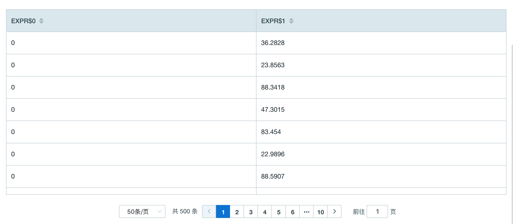

## 分组函数

用户可以使用分组函数在一条 SQL 查询中完成根据不同索引建的数据聚合。

Kyligence Enterprise 支持如下分组函数：


### GROUPING(expression)

- 函数说明
	- 如果表达式为 0，返回1；如果表达式不为 0，返回 0
- 查询示例

```SQL
SELECT GROUPING(TRANS_ID)
	,SUM(PRICE)
FROM KYLIN_SALES
GROUP BY TRANS_ID
```

- 返回示例

