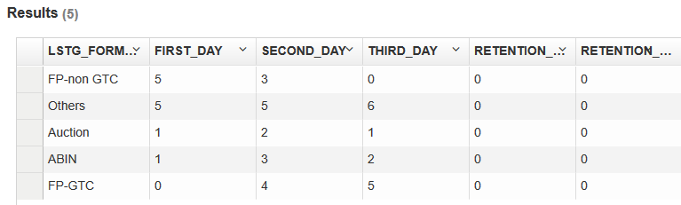
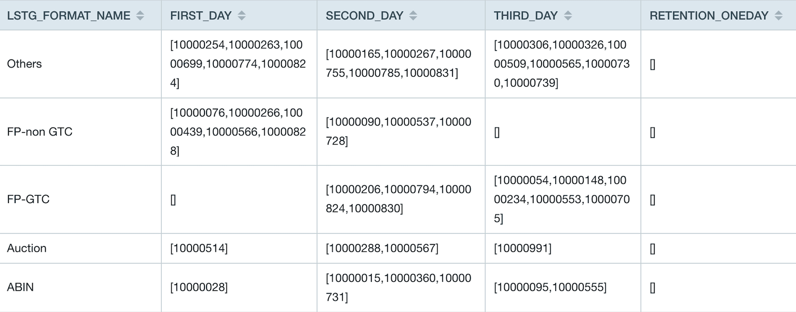

## 交集函数

用户可以使用交集函数计算两个数据集的交集的值。通常情况下，它们具有一些相同的维度（城市，类别等）和一个变化的维度（日期等），可以用来计算留存率和转化率。

Kyligence Enterprise 支持如下交集函数。


### INTERSECT_COUNT

- 说明

  - 返回不同条件下多个结果集交集的去重计数

- 语法

  - `intersect_count(column_to_count, column_to_filter, filter_value_list)`

- 参数

  - `column_to_count` 指向用于统计去重计数的列，这个列必须已经被添加为**精确去重**的度量
  - `column_to_filter` 指向可变的维度
  - `filter_value_list` 数组形式，指向可变维度中的值；当 `column_to_filter` 为 varchar 类型时，数组中单个元素可以映射多个值，默认使用'|'分割，可以使用 `kylin.query.intersect.separator` 配置分隔符，可以取值 `|` 或者 `,`，默认为 `|`，仅支持在 `kylin.properties` 文件中配置。

- 查询示例

  以 Kyligence Enterprise 的样例数据集为例，事实表 `KYLIN_SALES` 模拟了在线交易数据的记录表。
以下查询语句可以获得有多少比例的卖家能在新年假期阶段（2012.01.01-2012.01.03）进行持续的在线交易。

  ```sql
  select LSTG_FORMAT_NAME,
  intersect_count(SELLER_ID, PART_DT, array[date'2012-01-01']) as first_day,
  intersect_count(SELLER_ID, PART_DT, array[date'2012-01-02']) as second_day,
  intersect_count(SELLER_ID, PART_DT, array[date'2012-01-03']) as third_day,
  intersect_count(SELLER_ID, PART_DT, array[date'2012-01-01',date'2012-01-02']) as retention_oneday, 
  intersect_count(SELLER_ID, PART_DT, array[date'2012-01-01',date'2012-01-02',date'2012-01-03']) as retention_twoday 
  from KYLIN_SALES
  where PART_DT in (date'2012-01-01',date'2012-01-02',date'2012-01-03')
  group by LSTG_FORMAT_NAME
  ```

- 返回示例

  
  
  结果表示没有卖家在新年阶段进行持续的在线交易。
  
### INTERSECT_VALUE

- 说明

  - 返回不同条件下多个结果集交集的去重结果。若返回结果较大，可能会导致分析页面浏览器崩溃。

- 语法

  - `intersect_value(column_to_count, column_to_filter, filter_value_list)`

- 参数

  - `column_to_count` 指向用于统计去重计数的列，这个列必须已经被添加为**精确去重**的度量
  - `column_to_filter` 指向可变的维度
  - `filter_value_list` 数组形式，指向可变维度中的值；当 `column_to_filter` 为 varchar 类型时，数组中单个元素可以映射多个值，默认使用'|'分割，可以使用 `kylin.query.intersect.separator` 配置分隔符，可以取值 `|` 或者 `,`，默认为 `|`，仅支持在 `kylin.properties` 文件中配置。

- 查询示例

  以 Kyligence Enterprise 的样例数据集为例，事实表 `KYLIN_SALES`  模拟了在线交易数据的记录表。
以下查询语句可以获得有多少比例的卖家能在新年假期阶段（2012.01.01-2012.01.03）进行持续的在线交易。

  ```sql
  select LSTG_FORMAT_NAME,
  intersect_value(SELLER_ID, PART_DT, array[date'2012-01-01']) as first_day,
  intersect_value(SELLER_ID, PART_DT, array[date'2012-01-02']) as second_day,
  intersect_value(SELLER_ID, PART_DT, array[date'2012-01-03']) as third_day,
  intersect_value(SELLER_ID, PART_DT, array[date'2012-01-01',date'2012-01-02']) as retention_oneday, 
  intersect_value(SELLER_ID, PART_DT, array[date'2012-01-01',date'2012-01-02',date'2012-01-03']) as retention_twoday 
  from KYLIN_SALES
  where PART_DT in (date'2012-01-01',date'2012-01-02',date'2012-01-03')
  group by LSTG_FORMAT_NAME
  ```

- 返回示例

  
  
  结果表示在新年阶段进行持续的在线交易的卖家 id 的集合，以数组的形式展示。