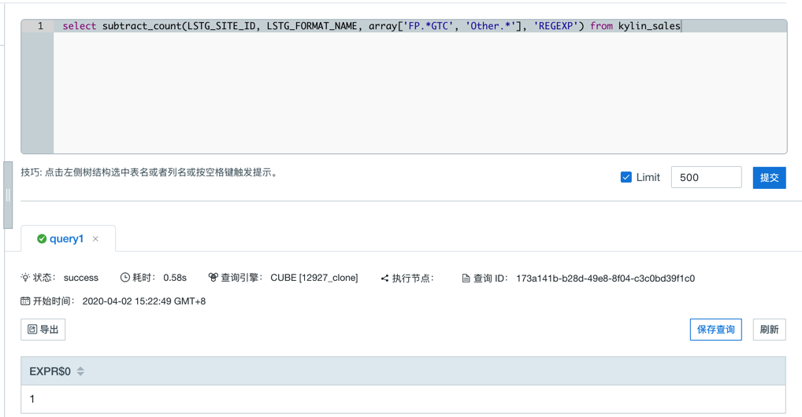
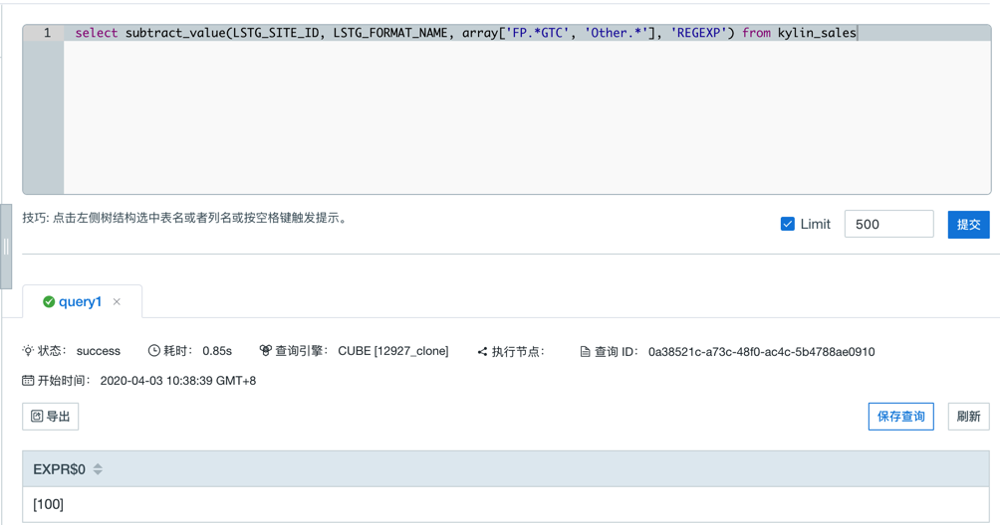
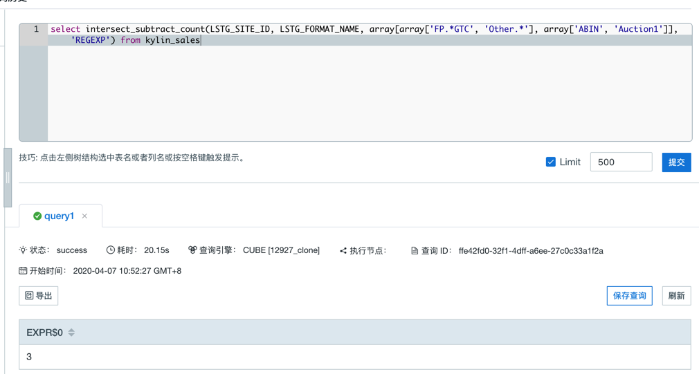
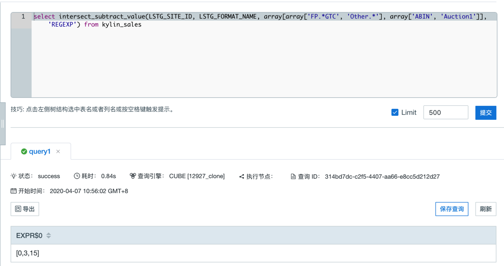

## 差集函数

用户可以使用交集函数计算两个数据集的差集的值。通常情况下，它们具有一些相同的维度（城市，类别等）和一个变化的维度（日期等），可以用来计算留存率和转化率。

Kyligence Enterprise 支持如下差集函数。


### SUBSTRACT_COUNT

- 说明

  - 返回不同条件下多个结果集差集的去重计数，第一个结果集依次减去后面的结果集。条件支持正则表达式匹配。

- 语法

  - `subtract_count(column_to_count, column_to_filter, filter_value_list, filter_type)`

- 参数

  - `column_to_count` 指向用于统计去重计数的列，这个列必须已经被添加为**精确去重**的度量
  - `column_to_filter` 指向可变的维度
  - `filter_value_list` 数组形式，指向可变维度中的值
  - `filter_type` 类型为 String，标识 filter 的方式，目前有两个可选值 “RAWSTRING” 和  "REGEXP"，当参数值为 "RAWSTRING" 时的过滤方式为精确过滤，当 `column_to_filter` 为 varchar 类型时，数组中单个元素可以映射多个值，默认使用'|'分割，可以使用 `kylin.query.intersect.separator` 配置分隔符，可以取值 `|` 或者 `,`，默认为 `|`，仅支持在 `kylin.properties` 文件中配置（目前该参数不支持使用子查询的结果作为参数使用）。当参数值为 "REGEXP" 时，过滤方式为正则匹配，只会过滤 column_to_filter 中能够匹配 filter_value_list中的正则表达式的值。

> **注意：** 当 filter_type 为 "RAWSTRING" ，并且可变维度的数据类型不是 varchar 或 integer 时，`filter_value_list`中的值需要做显式的类型转换，例如：
> `select subtract_count(column_to_count, column_to_filter, array[cast(3.53 as double), cast(5.79 as double)], 'RAWSTRING') from TEST_TABLE`
> 或 `select subtract_count(column_to_count, column_to_filter, array[TIMESTAMP'2012-01-02 11:23:45', TIMESTAMP'2012-01-01 11:23:45'], 'RAWSTRING') from TEST_TABLE;`

- 查询示例 1

  ```sql
  select subtract_count(
      LSTG_SITE_ID, LSTG_FORMAT_NAME,
        array['FP.*GTC', 'Other.*'], 'REGEXP')
      from kylin_sales
  ```
  
- 返回示例 1

  
  

### SUBTRACT_VALUE

  - 说明
  
    - 返回不同条件下多个结果集差集的去重结果，第一个结果集依次减去后面的结果集。若返回结果较大，可能会导致分析页面浏览器崩溃。条件支持正则表达式匹配。
  
  - 语法
  
    - `subtract_value(column_to_count, column_to_filter, filter_value_list, filter_type)`
  
  - 参数
  
    - `column_to_count` 指向用于统计去重计数的列，这个列必须已经被添加为**精确去重**的度量, **且只支持类型为tinyint、smallint或integer的列**。
    - `column_to_filter` 指向可变的维度
    - `filter_value_list` 数组形式，指向可变维度中的值
    - `filter_type` 类型为 String，标识 filter 的方式，目前有两个可选值 “RAWSTRING” 和  "REGEXP"，当参数值为 "RAWSTRING" 时的过滤方式为精确过滤，当 `column_to_filter` 为 varchar 类型时，数组中单个元素可以映射多个值，默认使用'|'分割，可以使用 `kylin.query.intersect.separator` 配置分隔符，可以取值 `|` 或者 `,`，默认为 `|`，仅支持在 `kylin.properties` 文件中配置（目前该参数不支持使用子查询的结果作为参数使用）。当参数值为 "REGEXP" 时，过滤方式为正则匹配，只会过滤 column_to_filter 中能够匹配 filter_value_list中的正则表达式的值。

  > **注意：**  当 filter_type 为 "RAWSTRING" ，并且可变维度的数据类型不是 varchar 或 integer 时，`filter_value_list`中的值需要做显式的类型转换，例如：
  > `select subtract_value(column_to_count, column_to_filter, array[cast(3.53 as double), cast(5.79 as double)], 'RAWSTRING') from TEST_TABLE`
  > 或 `select subtract_value(column_to_count, column_to_filter, array[TIMESTAMP'2012-01-02 11:23:45', TIMESTAMP'2012-01-01 11:23:45'], 'RAWSTRING') from TEST_TABLE;`

  - 查询示例 1
  
    ```sql
     select subtract_value(
       		LSTG_SITE_ID, LSTG_FORMAT_NAME,
       		array['FP.*GTC', 'Other.*'], 'REGEXP') 
       	from kylin_sales
    ```
    
  - 返回示例 1
  
    
    
    
### INTERSECT_SUBSTRACT_COUNT

- 说明

  - 返回不同条件下多个结果集计算交集的到子结果集，然后再计算子结果集之间的差集（差集由第一个子结果集依次减去后面的子结果集）。条件支持正则表达式匹配。

- 语法

  - `intersect_subtract_count(column_to_count, column_to_filter, filter_value_list, filter_type)`

- 参数

  - `column_to_count` 指向用于统计去重计数的列，这个列必须已经被添加为**精确去重**的度量
  - `column_to_filter` 指向可变的维度
  - `filter_value_list` 数组形式，数组中的元素也是数组类型，即两层数组类型：Array[Array[…], Array[…], …]。内层数组指向可变维度中的值
  - `filter_type` 类型为 String，标识 filter 的方式，目前有两个可选值 “RAWSTRING” 和  "REGEXP"，当参数值为 "RAWSTRING" 时的过滤方式为精确过滤，当 `column_to_filter` 为 varchar 类型时，内层数组中单个元素可以映射多个值，默认使用'|'分割，可以使用 `kylin.query.intersect.separator` 配置分隔符，可以取值 `|` 或者 `,`，默认为 `|`，仅支持在 `kylin.properties` 文件中配置（目前该参数不支持使用子查询的结果作为参数使用）。当参数值为 "REGEXP" 时，过滤方式为正则匹配，只会过滤 column_to_filter 中能够匹配 filter_value_list中的正则表达式的值。

> **注意：** 当 filter_type 为 "RAWSTRING" ，并且可变维度的数据类型不是 varchar 或 integer 时，`filter_value_list`中的值需要做显式的类型转换，例如：
> `select intersect_subtract_count(column_to_count, column_to_filter, array[array[cast(3.53 as double), cast(5.79 as double)], array[array[cast(3.53 as double), cast(5.79 as double)]], 'RAWSTRING') from TEST_TABLE`
> 或 `select intersect_subtract_count(column_to_count, column_to_filter, array[array[TIMESTAMP'2012-01-02 11:23:45', TIMESTAMP'2012-01-01 11:23:45'], array[TIMESTAMP'2012-01-02 11:23:45', TIMESTAMP'2012-01-01 11:23:45']], 'RAWSTRING') from TEST_TABLE;`

- 查询示例 1

  ```sql
  select intersect_subtract_count(
    		LSTG_SITE_ID, LSTG_FORMAT_NAME,
    		array[array['FP.*GTC', 'Other.*'], array['ABIN', 'Auction1']], 'REGEXP') 
    	from kylin_sales
  ```
  
- 返回示例 1

  
  

### INTERSECT_SUBTRACT_VALUE

  - 说明
  
    - 返回不同条件下多个结果集计算交集的到子结果集，然后再计算子结果集之间的差集（差集由第一个子结果集依次减去后面的子结果集）。条件支持正则表达式匹配。
  
  - 语法
  
    - `intersect_subtract_value(column_to_count, column_to_filter, filter_value_list, filter_type)`
  
  - 参数
  
    - `column_to_count` 指向用于统计去重计数的列，这个列必须已经被添加为**精确去重**的度量, **且只支持类型为tinyint、smallint或integer的列**。
    - `column_to_filter` 指向可变的维度
    - `filter_value_list` 数组形式，数组中的元素也是数组类型，即两层数组类型：Array[Array[…], Array[…], …]。内层数组指向可变维度中的值
    - `filter_type` 类型为 String，标识 filter 的方式，目前有两个可选值 “RAWSTRING” 和  "REGEXP"，当参数值为 "RAWSTRING" 时的过滤方式为精确过滤，当 `column_to_filter` 为 varchar 类型时，内层数组中单个元素可以映射多个值，默认使用'|'分割，可以使用 `kylin.query.intersect.separator` 配置分隔符，可以取值 `|` 或者 `,`，默认为 `|`，仅支持在 `kylin.properties` 文件中配置（目前该参数不支持使用子查询的结果作为参数使用）。当参数值为 "REGEXP" 时，过滤方式为正则匹配，只会过滤 column_to_filter 中能够匹配 filter_value_list中的正则表达式的值。

  > **注意：**  当 filter_type 为 "RAWSTRING" ，并且可变维度的数据类型不是 varchar 或 integer 时，`filter_value_list`中的值需要做显式的类型转换，例如：
  > `select intersect_subtract_value(column_to_count, column_to_filter, array[array[cast(3.53 as double), cast(5.79 as double)], array[array[cast(3.53 as double), cast(5.79 as double)]], 'RAWSTRING') from TEST_TABLE`
  > 或 `select intersect_subtract_value(column_to_count, column_to_filter, array[array[TIMESTAMP'2012-01-02 11:23:45', TIMESTAMP'2012-01-01 11:23:45'], array[TIMESTAMP'2012-01-02 11:23:45', TIMESTAMP'2012-01-01 11:23:45']], 'RAWSTRING') from TEST_TABLE;`

  - 查询示例 1
  
    ```sql
     select intersect_subtract_value(
       		LSTG_SITE_ID, LSTG_FORMAT_NAME,
       		array[array['FP.*GTC', 'Other.*'], array['ABIN', 'Auction1']], 'REGEXP') 
       	from kylin_sales
    ```
    
  - 返回示例 1
  
    