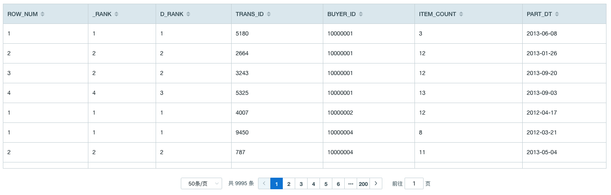
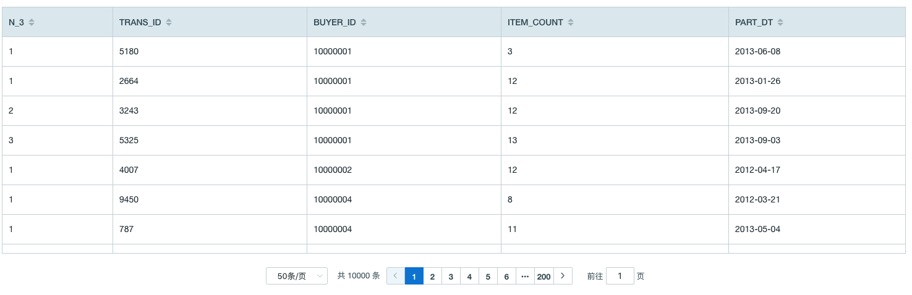
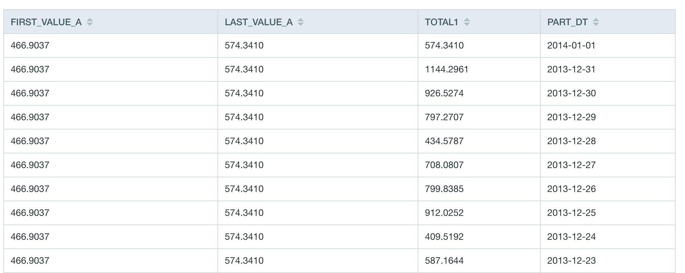
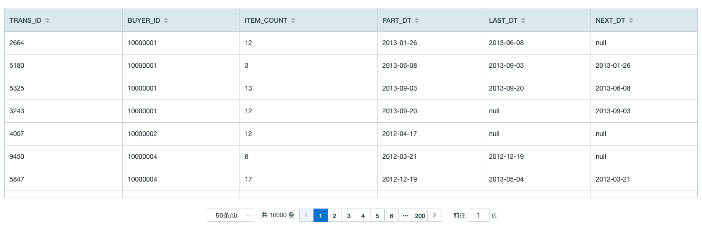

## 窗口函数

用户可以使用窗口函数来完成更多复杂的查询、简化查询过程并且获得更好的统计结果。

### 函数的语法结构

- function(value) OVER window
- window 的组成
  - partition by：分组子句，表示分析函数的计算范围。
  - order by: 排序子句，表示分组后，组内的排序方式。
  - rows/range：窗口子句，是在分组（partition by）后，组内的窗口。
    - 如果指定了 order by 子句，没有指定窗口子句，则默认为 range between unbounded preceding and current row。
  - rows 是物理窗口，即根据 order by 子句排序后，与当前行的值无关，只与排序后的行号有关。
  - range 是逻辑窗口，即指定当前行对应值的范围取值，与排序后的行号无关，与行的值有关。

### 窗口函数示例

接下来我们以[样例数据集](../../../appendix/sample_dataset.cn.md)中的表 `KYLIN_SALES` 为例，介绍每个函数的使用方法。表中字段及其意义如下：`PART_DT`：订单日期；`TRANS_ID`：订单号；`BUYER_ID`：买家 ID； `ITEM_COUNT`：购买商品个数；

- **ROW_NUMBER**

  - ROW_NUMBER() OVER window
  - 返回当前行在其分区中的位置，数字不重复

- **RANK** 

  - RANK() OVER window
  - 返回当前行的位置（可能会有序号间隙）

- **DENSE_RANK**

  - DENSE_RANK() OVER window
  - 返回当前行的位置（无间隙）

- 查询示例
  使用 RANK() 和 DENSE_RANK() 与 ROW_NUMBER() 在同一条查询语句中，查询每个买家购买商品数最少的前五个订单，进行对比，查询 SQL 如下：

  ```SQL
    SELECT *
    FROM (
    SELECT ROW_NUMBER() OVER w AS ROW_NUM
          ,RANK() OVER w AS _RANK
          ,DENSE_RANK() OVER w AS D_RANK
          ,TRANS_ID
          ,BUYER_ID
          ,ITEM_COUNT
          ,PART_DT
      FROM KYLIN_SALES 
      WINDOW w AS (PARTITION BY BUYER_ID ORDER BY ITEM_COUNT)
      ) T
    WHERE ROW_NUM <= 5
  ```

- 返回示例
  

- 返回结果说明
  ​    对于买家 '10000001' ，购买商品个数为 12 的订单有两条，使用三种排名函数对比如下：
  ​    1. 使用 row_number 函数，序号随机为2和3；购买商品个数为13的订单序号为4。
  ​    2. 使用 rank 函数，序号为2和2；购买商品个数为 13 的订单序号为 4（此处存在序号空隙）
  ​    3. 使用 dense_rank 函数，序号为 2 和 2；购买商品个数为 13 的订单序号为 3（此处不存在序号空隙）


- **NTILE**

  - NTILE(value) OVER window
  - 将分区内的有序数据尽量按 value 等分，返回组号

- 查询示例

  将每个买家的订单按照购买商品个数等分为3组

  ```SQL
    SELECT NTILE(3) OVER w AS N_3
    ,TRANS_ID
    ,BUYER_ID
    ,ITEM_COUNT
    ,PART_DT
    FROM KYLIN_SALES
    WINDOW w AS (PARTITION BY BUYER_ID ORDER BY ITEM_COUNT)
  ```

- 返回示例
  

- **FIRST_VALUE**

  - FIRST_VALUE(value) OVER window
  - 返回窗口框架中计算行中第一行的值

- **LAST_VALUE**
  - LAST_VALUE(value) OVER window
  - 返回窗口框架中计算行中最后一行的值 

- 查询示例

  查询按照日期排序的总价格最高的第一个订单和最后一个订单

  ```SQL
  SELECT FIRST_VALUE(TOTAL1) OVER W AS FIRST_VALUE_A
  	,LAST_VALUE(TOTAL1) OVER W AS LAST_VALUE_A
  	,TOTAL1
  	,PART_DT
  FROM (
  	SELECT SUM(PRICE) AS TOTAL1
  		,PART_DT
  	FROM KYLIN_SALES
  	GROUP BY PART_DT
  	) T WINDOW W AS (
  		ORDER BY PART_DT ROWS BETWEEN UNBOUNDED PRECEDING
  				AND UNBOUNDED FOLLOWING
  		)
  ORDER BY PART_DT DESC
  ```

- 返回示例
  

- **LEAD()**
  - LEAD(value, offset, default) OVER window
  - 返回分区内当前行的偏移行中向前的偏移值
- **LAG()**
  - LAG(value, offset, default) OVER window
  - 返回分区内当前行的偏移行中向后的偏移值

- 查询示例
  查询当前订单和上一个订单、下一个订单的时间

  ```SQL
  SELECT TRANS_ID
    ,BUYER_ID
    ,ITEM_COUNT
    ,PART_DT
    ,LEAD(PART_DT, 1) OVER w LAST_DT
    ,LAG(PART_DT, 1) OVER w NEXT_DT
  FROM KYLIN_SALES 
  WINDOW w AS (PARTITION BY BUYER_ID ORDER BY PART_DT)
  ```

- 返回示例
  

