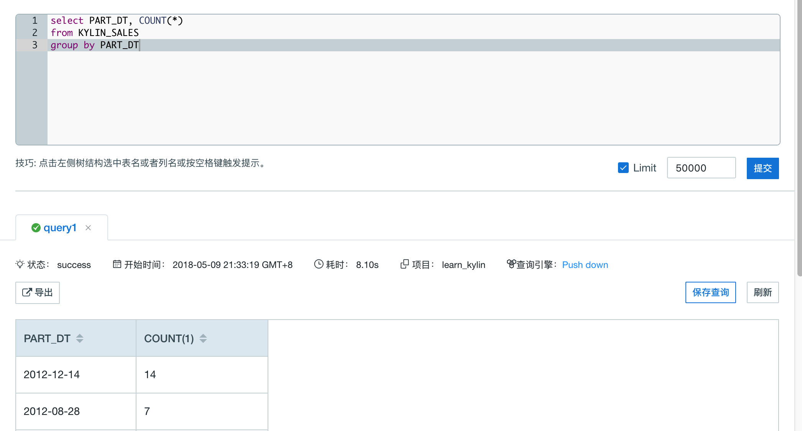

## 查询下压
Kyligence Enterprise 支持查询下压功能。当 Cube 无法满足当前查询时，可以使用查询下压，将该查询重定向至 Spark SQL、Hive 或 Impala，从而在查询的执行时间与灵活程度之间做一个权衡折中，获取更理想的使用体验。

### 启用查询下压
查询下压可用的前提条件是有已加载完成的表。

默认情况下，查询下压功能未开启。如果要开启查询下压，请参考[查询下压配置](../installation/pushdown/README.md)章节。

开启查询下压后，所有同步的数据表将对用户可见，而无需构建相应的 Cube。用户在提交查询时，若查询下压功能正常启用，则状态下方的查询引擎条目里，会显示 Pushdown。

