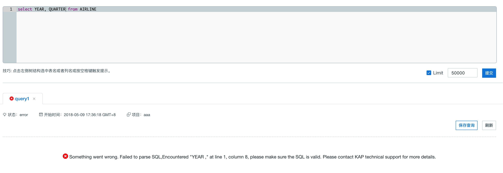
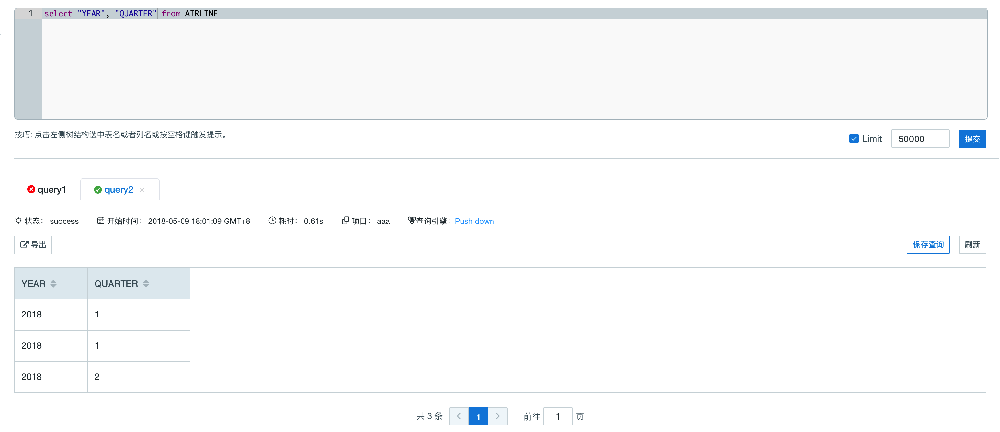
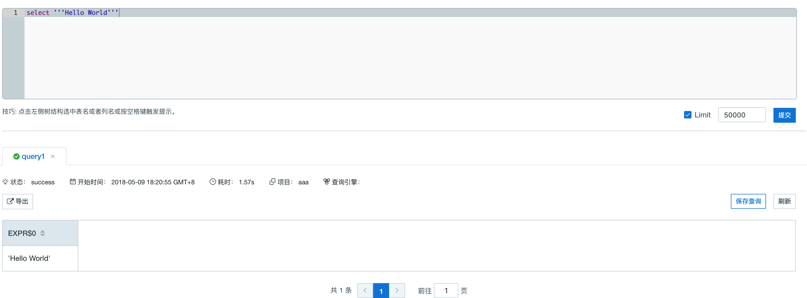
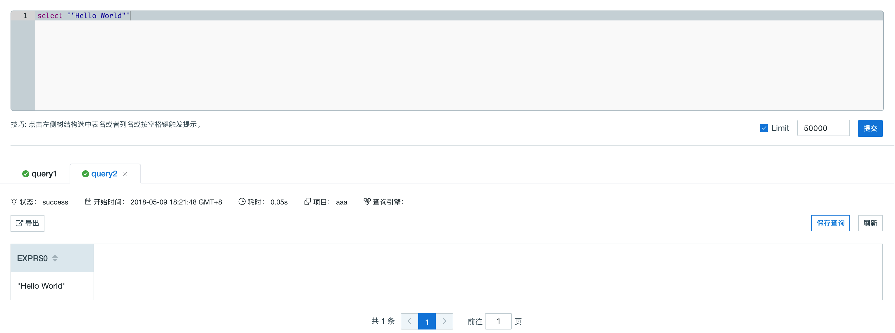

## SQL 规范参考
Kyligence Enterprise 支持 ANSI SQL 2003，以下列举了支持的基本 SQL 语句。


### 支持语法

```sql
statement:
|  query

query:
      values
  |  WITH withItem [ , withItem ]* query
  |   {
          select
      |  selectWithoutFrom
      |  query UNION [ ALL | DISTINCT ] query
      |  query INTERSECT [ ALL | DISTINCT ] query
      }
      [ ORDER BY orderItem [, orderItem ]* ]
      [ LIMIT { count | ALL } ]
      [ OFFSET start { ROW | ROWS } ]
      [ FETCH { FIRST | NEXT } [ count ] { ROW| ROWS } ]

withItem:
      name
      ['(' column [, column ]* ')' ]
      AS '(' query ')'

orderItem:
      expression [ ASC | DESC ]［ NULLS FIRST |NULLS LAST ］

select:
      SELECT [ ALL | DISTINCT]
          { * | projectItem [, projectItem ]* }
      FROM tableExpression
      [ WHERE booleanExpression ]
      [ GROUP BY { groupItem [, groupItem ]* }]
      [ HAVING booleanExpression ]
      [ WINDOW windowName AS windowSpec [,windowName AS windowSpec ]* ]

selectWithoutFrom:
      SELECT [ ALL | DISTINCT ]
          { * | projectItem [, projectItem ]* }

projectItem:
      expression [ [ AS ] columnAlias ]
  |  tableAlias . *

tableExpression:
      tableReference [, tableReference ]*
  |  tableExpression [ NATURAL ]［( LEFT | RIGHT | FULL ) [ OUTER ] ］ JOINtableExpression [ joinCondition ]

joinCondition:
      ON booleanExpression
  |  USING '(' column [, column ]* ')'

tableReference:
      tablePrimary
      [ matchRecognize ]
      [ [ AS ] alias [ '(' columnAlias [,columnAlias ]* ')' ] ]

tablePrimary:
      [ [ catalogName . ] schemaName . ]tableName
      '(' TABLE [ [ catalogName . ] schemaName. ] tableName ')'
  |   [LATERAL ] '(' query ')'
  |  UNNEST '(' expression ')' [ WITH ORDINALITY ]
  |   [LATERAL ] TABLE '(' [ SPECIFIC ] functionName '(' expression [, expression ]*')' ')'

values:
      VALUES expression [, expression ]*

groupItem:
      expression
  |   '('')'
  |   '('expression [, expression ]* ')'
  |  GROUPING SETS '(' groupItem [, groupItem ]* ')'

windowRef:
      windowName
  |  windowSpec

windowSpec:
      [windowName ]
      '('
      [ ORDER BYorderItem [, orderItem ]* ]
      [ PARTITION BY expression [, expression]* ]
      [
          RANGE numericOrIntervalExpression {PRECEDING | FOLLOWING }
      |  ROWS numericExpression { PRECEDING | FOLLOWING }
      ]
    ')'
```

> **注意：**不同版本实现反馈可能会有不同，如有问题请咨询技术服务团队。


### 查询关键字

以下为 Kyligence Enterprise 查询的保留关键字（如下保留关键字需要使用双引号对列名进行转义）


ABS,ALL,ALLOCATE,ALLOW,ALTER,AND,ANY,ARE,ARRAY,ARRAY_MAX_CARDINALITY,AS,ASENSITIVE,ASYMMETRIC,AT,ATOMIC,AUTHORIZATION,AVG,BEGIN,BEGIN_FRAME,BEGIN_PARTITION,BETWEEN,BIGINT,BINARY,BIT,BLOB,BOOLEAN,BOTH,BY,CALL,CALLED,CARDINALITY,CASCADED,CASE,CAST,CEIL,CEILING,CHAR,CHARACTER,CHARACTER_LENGTH,CHAR_LENGTH,CHECK,CLASSIFIER,CLOB,CLOSE,COALESCE,COLLATE,COLLECT,COLUMN,COMMIT,CONDITION,CONNECT,CONSTRAINT,CONTAINS,CONVERT,CORR,CORRESPONDING,COUNT,COVAR_POP,COVAR_SAMP,CREATE,CROSS,CUBE,CUME_DIST,CURRENT,CURRENT_CATALOG,CURRENT_DATE,CURRENT_DEFAULT_TRANSFORM_GROUP,CURRENT_PATH,CURRENT_ROLE,CURRENT_ROW,CURRENT_SCHEMA,CURRENT_TIME,CURRENT_TIMESTAMP,CURRENT_TRANSFORM_GROUP_FOR_TYPE,CURRENT_USER,CURSOR,CYCLE,DATE,DAY,DEALLOCATE,DEC,DECIMAL,DECLARE,DEFAULT,DEFINE,DELETE,DENSE_RANK,DEREF,DESCRIBE,DETERMINISTIC,DISALLOW,DISCONNECT,DISTINCT,DOUBLE,DROP,DYNAMIC,EACH,ELEMENT,ELSE,EMPTY,END,END-EXEC,END_FRAME,END_PARTITION,EQUALS,ESCAPE,EVERY,EXCEPT,EXEC,EXECUTE,EXISTS,EXP,EXPLAIN,EXTEND,EXTERNAL,EXTRACT,FALSE,FETCH,FILTER,FIRST_VALUE,FLOAT,FLOOR,FOR,FOREIGN,FRAME_ROW,FREE,FROM,FULL,FUNCTION,FUSION,GET,GLOBAL,GRANT,GROUP,GROUPING,GROUPS,HAVING,HOLD,HOUR,IDENTITY,IMPORT,IN,INDICATOR,INITIAL,INNER,INOUT,INSENSITIVE,INSERT, INT, INTEGER,INTERSECT,INTERSECTION,INTERVAL,INTO,IS,JOIN,JSON_ARRAY,JSON_ARRAYAGG,JSON_EXISTS,JSON_OBJECT,JSON_OBJECTAGG,JSON_QUERY,JSON_VALUE,LAG,LANGUAGE,LARGE,LAST_VALUE,LATERAL,LEAD,LEADING,LEFT,LIKE,LIKE_REGEX,LIMIT,LN,LOCAL,LOCALTIME,LOCALTIMESTAMP,LOWER,MATCH,MATCHES,MATCH_NUMBER,MATCH_RECOGNIZE,MAX,MEASURES,MEMBER,MERGE,METHOD,MIN,MINUS,MINUTE,MOD,MODIFIES,MODULE,MONTH,MULTISET,NATIONAL,NATURAL,NCHAR,NCLOB,NEW,NEXT,NO,NONE,NORMALIZE,NOT,NTH_VALUE,NTILE,NULL,NULLIF,NUMERIC,OCCURRENCES_REGEX,OCTET_LENGTH,OF,OFFSET,OLD,OMIT,ON,ONE,ONLY,OPEN,OR,ORDER,OUT,OUTER,OVER,OVERLAPS,OVERLAY,PARAMETER,PARTITION,PATTERN,PER,PERCENT,PERCENTILE_CONT,PERCENTILE_DISC,PERCENT_RANK,PERIOD,PERMUTE,PORTION,POSITION,POSITION_REGEX,POWER,PRECEDES,PRECISION,PREPARE,PREV,PRIMARY,PROCEDURE,RANGE,RANK,READS,REAL,RECURSIVE,REF,REFERENCES,REFERENCING,REGR_AVGX,REGR_AVGY,REGR_COUNT,REGR_INTERCEPT,REGR_R2,REGR_SLOPE,REGR_SXX,REGR_SXY,REGR_SYY,RELEASE,RESET,RESULT,RETURN,RETURNS,REVOKE,RIGHT,ROLLBACK,ROLLUP,ROW,ROWS,ROW_NUMBER,RUNNING,SAVEPOINT,SCOPE,SCROLL,SEARCH,SECOND,SEEK,SELECT,SENSITIVE,SESSION_USER,SET,SHOW,SIMILAR,SKIP,SMALLINT,SOME,SPECIFIC,SPECIFICTYPE,SQL,SQLEXCEPTION,SQLSTATE,SQLWARNING,SQRT,START,STATIC,STDDEV_POP,STDDEV_SAMP,STREAM,SUBMULTISET,SUBSET,SUBSTRING,SUBSTRING_REGEX,SUCCEEDS,SUM,SYMMETRIC,SYSTEM,SYSTEM_TIME,SYSTEM_USER,TABLE,TABLESAMPLE,THEN,TIME,TIMESTAMP,TIMEZONE_HOUR,TIMEZONE_MINUTE,TINYINT,TO,TRAILING,TRANSLATE,TRANSLATE_REGEX,TRANSLATION,TREAT,TRIGGER,TRIM,TRIM_ARRAY,TRUE,TRUNCATE,UESCAPE,UNION,UNIQUE,UNKNOWN,UNNEST,UPDATE,UPPER,UPSERT,USER,USING,VALUE,VALUES,VALUE_OF,VARBINARY,VARCHAR,VARYING,VAR_POP,VAR_SAMP,VERSIONING,WHEN,WHENEVER,WHERE,WIDTH_BUCKET,WINDOW,WITH,WITHIN,WITHOUT,YEAR


### 标识符

标识符为 SQL 查询中使用的表名、列名以及其他元数据。没有使用引号的标识符，如 `emp ` 需要以字母开头并且只能包含字母、数字及下划线。没有使用引号的标识符在查询时会隐式地被转换成**全大写**。

带引号的标识符，如 `"Employee Name"`，以双引号开头及结尾。这种标识符基本可以包含任何字符，包括空格或其他标点符号。如果您希望在标识符中包含双引号，使用另一个双引号来将其转义，例如：

```"An employee called ""Fred""."```

标识符和引用的对象进行匹配是大小写敏感的。没有使用引号的标识符会隐式地被转换成全大写，如果查询对象在创建时也没有使用引号，它的名字也会被转换成全大写，因此标识符和查询对象可以进行匹配。


### 转义关键字

如果您的列名或表名是关键字，您需要使用双引号对其进行转义。

例如表 `AIRLINE` 包含列 `YEAR` 及 `QUARTER`。这两列的列名和 Kyligence Enterprise 的关键字 **YEAR** 和 **QUARTER** 重复。如下图所示，如果用户直接对 `YEAR` 及 `QUARTER` 两列进行查询，查询会返回报错，因为 Kyligence Enterprise 查询引擎无法分辨两列是否为关键字。



如上文所述，当您使用双引号对列名进行转义时，匹配标识符和引用的对象是大小写敏感的，Kyligence Enterprise 查询引擎无法查询到使用双引号包裹的小写的列名，因为这些列是用大写存储的。


这时候我们只要将双引号包裹的列名改为全大写的就可以正常查询了。




### 转义引号

如果您查询的值中包含单引号，您可以用另一个单引号对查询进行转义。



如果查询的值中有双引号是不需要转义的。




### 日期查询

下面是日期查询语法范例：

```sql
select TRANS_ID,PART_DT,PRICE from KYLIN_SALES where PART_DT =date '2012-01-01'
```

或者

```sql
select TRANS_ID,PART_DT,PRICE from KYLIN_SALES where PART_DT =cast ('2012-01-01' as date)
```