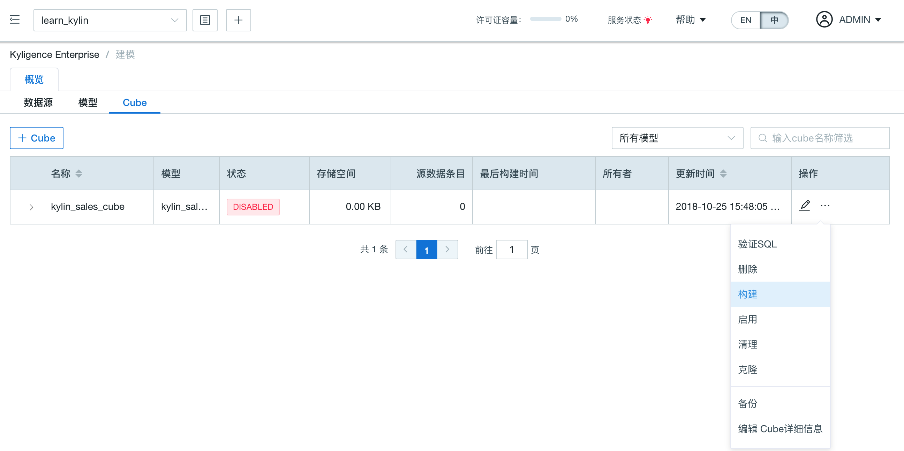

## 快速开始

在本节中，我们将引导您在单节点上快速安装 Kyligence Enterprise。

在安装前，请确认您已阅读[**安装前置条件**](../installation_conditions.cn.md)。

### 下载安装 Kyligence Enterprise

1. 获取 Kyligence Enterprise 软件包。您可以访问 [发行说明](../release/README.md)，选择适合您的版本。

2. 决定安装路径和将要运行 Kyligence Enterprise 的 Linux 账户。下文所有示例都做如下假设：

   - 假设安装路径为 `/usr/local/`。
   - 假设运行 Kyligence Enterprise 的 Linux 账户为 `root`，下文简称 “Linux 账户”。

   > **提示**：在执行时，请留意将上述假设替换为真实的安装路径和 Linux 账户。比如，CDH 平台的默认用户是 `cloudera`。

3. 将 Kyligence Enterprise 软件包拷贝至您需要安装的服务器或虚拟机，并解压至安装路径下。

   ```shell
   cd /usr/local
   tar -zxvf Kyligence-Enterprise-{version}.tar.gz
   ```

4. 将环境变量`KYLIN_HOME`的值设为 Kyligence Enterprise 解压后的路径：

   ```shell
   export KYLIN_HOME=/usr/local/Kyligence-Enterprise-{version}
   ```

5. 在 HDFS 上创建 Kyligence Enterprise 的工作目录，并授予 Linux 账户读写该工作目录的权限。默认的工作目录为`/kylin`。同时确保 Linux 账户在 HDFS 上的用户目录也有正常的读写权限。运行下述命令：

   ```shell
   hdfs dfs -mkdir /kylin
   hdfs dfs -chown root /kylin
   hdfs dfs -mkdir /user/root
   hdfs dfs -chown root /user/root
   ```

   如果需要，您可以在 `$KYLIN_HOME/conf/kylin.properties` 配置文件中修改 Kyligence Enterprise 工作目录的位置。

   > **提示**：如果您没有权限执行上述命令，可以先转至 `hdfs` 账户，然后再次尝试。
   >
   > ```shell
   > su hdfs
   > # 然后重复上述的 hdfs dfs 命令
   > ```

### 快速配置 Kyligence Enterprise

在 `$KYLIN_HOME/conf/` 路径下，我们准备了两套可用的出场配置方案：`profile_prod` 和 `profile_min`。前者是默认方案，适用于实际生产环境；后者使用较少的资源，适用于沙箱等资源有限的环境。如果您的单点环境资源有限，可以切换到 `profile_min` 配置。

```shell
rm -f KYLIN_HOME/conf/profile
ln -sfn KYLIN_HOME/conf/profile_min $KYLIN_HOME/conf/profile
```

### 启动 Kyligence Enterprise

运行下述命令以启动 Kyligence Enterprise：

```shell
$KYLIN_HOME/bin/kylin.sh start
```

> **提示**：如果想观察启动的详细进度：
>
> ```shell
> tail -f $KYLIN_HOME/logs/kylin.log
> ```

启动成功后，您将在控制台中看到提示信息。此时可以运行下述命令检查 Kyligence Enterprise 进程：

```shell
ps -ef | grep kylin
```

### 使用 Kyligence Enterprise

当 Kyligence Enterprise 顺利启动后，您可以打开 Web 浏览器，访问 `http://{host}:7070/kylin/`。请将其中的 `host` 替换为具体的机器名、IP 地址或域名，默认端口为 `7070`。默认用户名和密码为 `ADMIN` 和 `KYLIN`。初次登陆后，请遵照密码规则重置管理员密码。

- 密码长度至少 8 位
- 密码需要包含至少一个数字、字母、及特殊字符（~!@#$%^&*(){}|:"<>?[];',./`）

当您成功登录后，可以通过构建 Sample Cube 来验证 Kyligence Enterprise 的功能。具体请参阅[安装验证](../installation/install_uninstall/install_validation.cn.md)。

### 停止 Kyligence Enterprise

运行下述命令以停止运行 Kyligence Enterprise：

```shell
$KYLIN_HOME/bin/kylin.sh stop
```

您可以运行下述命令查看 Kyligence Enterprise 进程是否已停止：

```shell
ps -ef | grep kylin
```

### 导入样例数据

目前，Kyligence Enterprise 支持 Hive 作为默认的输入数据源。为了使用本产品中自带的样例数据，需要把数据表导入 Hive 中。在安装目录的 `$KYLIN_HOME/bin` 文件夹中，有一个样例数据脚本，可以把样例数据导入Hive。

关于样例数据集更多介绍请参考 [样例数据集](../appendix/sample_dataset.cn.md)。

```sh
$KYLIN_HOME/bin/sample.sh
```

> 提示：运行该脚本后，请在**系统**页面下点击**重载元数据**。

### 构建 Cube

在导入样例数据后，进入 `learn_kylin` 项目，选择构建 `kylin_sales_cube`。



### 查询验证

Cube构建成功后，可以在分析页面进行查询。

> **查询限制**
>
> 1. 仅支持 SELECT 查询
> 2. 若未开启查询下压，无法根据 Cube 中的数据满足的查询，将不会进行重定向

查询结果成功返回后，会在状态下方的查询引擎条目里，显示该查询所命中的Cube。

```sql
select PART_DT,COUNT(*)
from KYLIN_SALES
group by PART_DT
```

### FAQ

**Q：如何修改默认端口？**

您可以运行以下命令进行更改。运行后端口将被设置为7070加上您设置的偏移量。

```shell
$KYLIN_HOME/bin/kylin-port-replace-util.sh set PORT_OFFSET
```

**Q：如何使用 Beeline 连接 Hive？**

请您参考 [Beeline 连接 Hive 章节](../installation/config/beeline.cn.md)。

**Q：如果我的 Hadoop 集群为 JDK 7，要怎么使用 Kyligence Enterprise？**

请您执行 [如何在低版本 JDK 上运行 Kyligence Enterprise](../appendix/run_on_jdk7.cn.md) 中的配置步骤。

**Q：Kyligence Enterprise 支持配置 Kerberos 吗？**

支持。如果您的集群启用 Kerberos 安全机制，Kyligence Enterprise 自带的 Spark 需要正确的配置才能安全地访问您的集群资源。具体配置方法请参看[集成Kerberos](../security/kerberos.cn.md)章节。