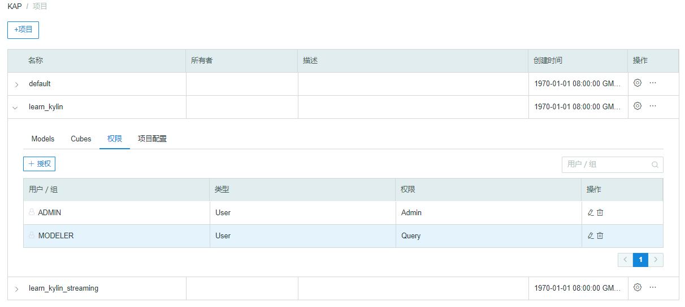

## 管理访问权限

用户／组在Kyligence Enterprise中能否访问一个项目并使用项目中的一些功能是由项目级别访问权限决定的。Kyligence Enterprise内置四种项目访问权限角色，他们是 Admin、Management、Operation 和 Query。每个角色定义了一系列在 Kyligence Enterprise 中有权限访问的功能。

Kyligence Enterprise 为不同角色提供什么样的权限？

- *Query*：定位为一般分析师，只需要项目中的表或者 Cube 的查询权限。
- *Operation*：定位为公司、组织内的 IT 运维人员，负责运维 Cube。Operation 权限包含 Query 权限。
- *Management*：定位为业务部门的建模人员，对数据的业务情况很清楚，负责对数据进行导入、设计模型，Cube 等。Management 权限包含了 Operation 权限和 Query 权限。
- *Admin*：定义为项目的管理员，拥有项目内的所有权限。Admin 权限包含了 Management 权限，Operation 权限和 Query 权限。

### 如何判断用户／组的访问权限

管理员在项目上为用户／组分配了管理权限后，用户／组会相应地继承数据源、模型及 Cube 上的访问权限。每个访问权限角色可以访问的功能详情，请见下表：

| Functionality        | SYSTEM ADMIN | PROJECT Admin | Management | Operation | Query |
| -------------------- | ------------ | ------------- | ---------- | --------- | ----- |
| 增加／删除项目              | Yes          | No            | No         | No        | No    |
| 编辑／备份项目              | Yes          | Yes           | No         | No        | No    |
| 查看项目详情               | Yes          | Yes           | Yes        | Yes       | Yes   |
| 增加／编辑／删除项目访问权限       | Yes          | Yes           | No         | No        | No    |
| 查看系统仪表盘              | Yes          | Yes           | Yes        | Yes       | Yes   |
| 查看建模页面               | Yes          | Yes           | Yes        | Yes       | Yes   |
| 查看建模->数据源页面          | Yes          | Yes           | Yes        | No        | No    |
| 载入／卸载／重载数据源          | Yes          | Yes           | No         | No        | No    |
| 配置 Kafka 数据源           | Yes          | Yes           | No         | No        | No    |
| 查看表级、行级、列级访问权限       | Yes          | Yes           | Yes        | No        | No    |
| 添加、修改、删除表级、行级、列级访问权限 | Yes          | Yes           | No         | No        | No    |
| 查看建模->模型页面           | Yes          | Yes           | Yes        | Yes       | Yes   |
| 查看模型                 | Yes          | Yes           | Yes        | Yes       | Yes   |
| 添加、编辑、克隆、删除模型。模型健康检查 | Yes          | Yes           | Yes        | No        | No    |
| 查看 Cube 页面             | Yes          | Yes           | Yes        | Yes       | Yes   |
| 查看 Cube 详情             | Yes          | Yes           | Yes        | Yes       | Yes   |
| 编辑 Cube 详情             | Yes          | Yes           | Yes        | No        | No    |
| 添加、禁用／启用，清理 Cube      | Yes          | Yes           | Yes        | No        | No    |
| 构建、管理 Cube            | Yes          | Yes           | Yes        | Yes       | No    |
| 添加、编辑、删除 Cube         | Yes          | Yes           | Yes        | No        | No    |
| 查看、编辑及删除 Cube 草稿       | Yes          | Yes           | Yes        | No        | No    |
| 查看分析页面               | Yes          | Yes           | Yes        | Yes       | Yes   |
| 在分析页面查询              | Yes          | Yes           | Yes        | Yes       | Yes   |
| 查看监控页面               | Yes          | Yes           | Yes        | Yes       | No    |
| 查看系统页面               | Yes          | No            | No         | No        | No    |
| 管理系统                 | Yes          | No            | No         | No        | No    |
| 管理用户／组               | Yes          | No            | No         | No        | No    |

另外，在查询下压开启的情况下，项目上的 Query 权限允许用户／组在项目中没有 Ready 状态 Cube 的情况下，使用查询下压查询已同步到项目的表。但是如果用户／组没有 Query 访问权限则不可以这样做。

### 在项目级别管理权限

#### 授权权限

按照以下步骤，为用户／组赋予项目权限：

1. 点击项目列表右侧的项目图标。
2. 在项目列表中展开某个项目。
3. 点击`权限`然后点击`+授权`来为用户／组授予权限。
4. 填写用户名或组名，选择要赋予的权限，点击`提交`。

#### 修改权限

按照以下步骤修改用户／组的项目权限

1. 点击项目列表右侧的项目图标。
2. 在项目列表中展开某个项目。
3. 点击`权限`，选择一个用户／组点击`编辑`。
4. 修改用户／组的访问权限后`提交`。

#### 删除权限

按照以下步骤删除用户／组的项目权限

1. 点击项目列表右侧的项目图标。
2. 在项目列表中展开某个项目。
3. 点击`权限`，选择一个用户／组点击`删除`。

当用户／组的项目级权限被删除时，用户／组在项目上的所有权限也会被删除，这包括用户／组在项目上的表级、行级及列级权限。