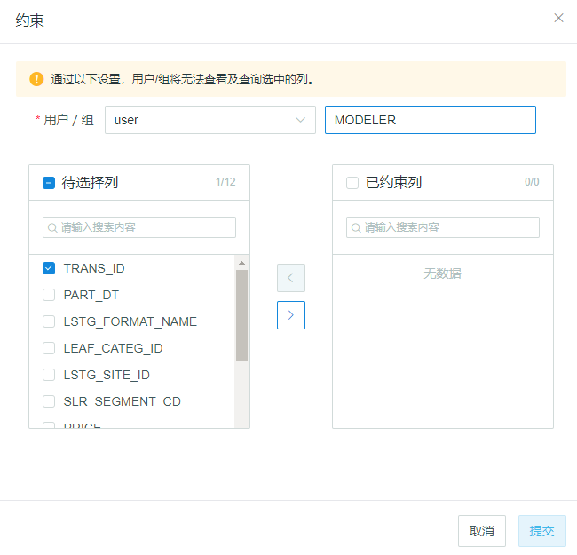
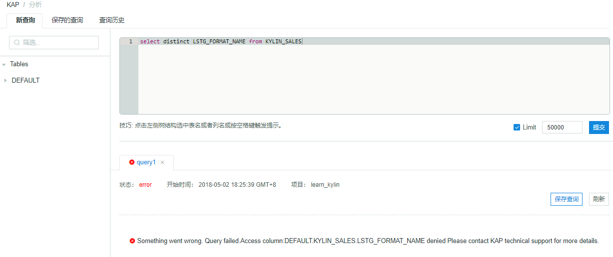

## 列级访问权限

**列级访问权限**限制了用户／组在表上**不能**访问的列。如果用户／组在某列的访问权限被限制了，用户／组不可以查询这个列，不管是通过 Cube，明细表索引还是查询下压。用户／组的查询还可以使用引用了限制列的 Cube，前提条件是用户／组的查询没有使用限制的列。

当用户／组发送 `select * from table` 的查询到表上时，如表上有用户／组受到限制的列，那么查询将仅返回那些用户／组可以访问的列，限制的列不返回。

当表初次被导入Kyligence Enterprise中或者项目从低版本升级到有列级权限功能的版本时，默认情况下所有用户／组都没有设置列级访问权限。

列级权限需要以项目为单位进行设置。也就是说如果同一个表在不同的项目中都导入了，两个项目下的列级权限需要分别设置。

在对某个用户赋予列级访问权限前，应先确保该用户已获得当前项目的访问权限。

> 注意：权限配置会受到 BI 前端缓存的影响。如果一个没有访问权限限制的用户在 BI 工具查看了某报表，BI 工具可能生成报表缓存，当另一个用户登陆查看同一张报表时，BI 工具可能会使用之前生成的缓存，而不再发送查询，导致用户因此绕开了其被限制的访问权限。

### 管理列级权限

#### 添加约束

按照以下步骤，对列级访问权限添加约束：

1. 点击左侧导航栏中的`建模`。
2. 点击`数据源`，选择一个已导入的表。
3. 在这个表上，点击`权限`，然后选择`列`。
4. 点击`+约束`以约束列级权限。
5. 在弹出窗口中，选择用户／组。
6. 选择一个或多个列，并点击向右箭头将列移到右侧已约束列中。
7. 点击`保存`。

#### 修改约束

按照以下步骤对列级访问权限约束进行修改：

1. 点击左侧导航栏中的`建模`。
2. 点击`数据源`，选择一个已导入的表。
3. 在这个表上，点击`权限`，然后选择`列`。
4. 在`操作`中，点击`修改`按钮。
5. 在弹窗中，对已约束列进行修改。
6. 点击`保存`。

####删除约束

按照以下步骤对列级访问权限约束进行修改：

1. 点击左侧导航栏中的`建模`。
2. 点击`数据源`，选择一个已导入的表。
3. 在这个表上，点击`权限`，然后选择`列`。
4. 在`操作`中，点击`删除`按钮。

### 验证列级访问权限

在本例中，以用户为例来验证列级访问权限，组访问权限的验证方法与此类似。用户 `joanna` 是一个有项目 `learn_kylin` 访问权限的用户，并且被限制了对列 `LSTG_FORMAT_NAME` 的访问。

登录用户 `joanna` 来到查询页面使用列 `LSTG_FORMAT_NAME` 进行查询以验证列级访问权限约束是否生效了。

如截图所示用户 `joanna` 试图查询列 `LSTG_FORMAT_NAME` 访问请求被被拒绝了。

