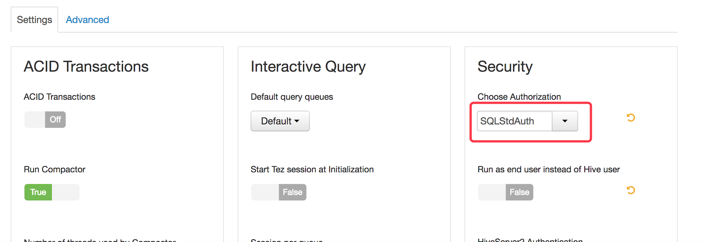

## 加载表时的 Hive 权限映射

Kyligence Enterprise 在 Hortonworks HDP 和华为 FusionInsight 平台上支持 Hive 数据源的权限映射，当用户如项目管理员、建模人员加载 Hive 数据源中的表时，其仅能看到其在 Hive 中拥有权限的表。

**注意：** 

1. Kyligence Enterprise 的系统管理员不受该权限限制，即管理员能看到 Hive 中所有的表。
2. 一旦将 Hive 数据源中的表成功加载进入 Kyligence Enterprise 后，其权限就不再与 Hive 数据源关联。比如，若用户在 Hive 中失去权限，但已经加载到系统中的表不会自动失去权限。


### 如何配置

* **Hortonworks HDP 平台**

  1. 确认您的 Hive 配置中 Authorization 模式选择的是 `SQLStdAuth`

     

  2. 确认 Hive 高级设置中 `hive.security.authorization.enabled` 为 `true`

  3. 保证  Hive 高级设置 `hive.security.metastore.authorization.manager` 中去除
     `org.apache.hadoop.hive.ql.security.authorization.MetaStoreAuthzAPIAuthorizerEmbedOnly`

  4. 完成以上步骤后，在 Kyligence Enterprise 的配置文件 `kylin.properties` 中添加以下参数：

     ```java
     kylin.source.hive.sync-table-using-hive-acl=true 
     //[必选]是否开启hive权限映射。该参数指定是否将 Hive 数据源中的权限映射到系统中，默认值为 “false”。开启后，登陆系统的用户只能加载在 Hive 中被授予权限的表。
         
     kylin.source.hive.sync-table-using-hive-acl-exceptions=hive 
     //[可选]配置 Hive 中超级用户，被配置到该项的用户将会跳过 Hive 权限过滤。
     ```


* **华为 FusionInsight 平台**

  如果您使用的是华为 FusionInsight 平台，无需额外配置。因为 FusionInsight 环境默认是安全模式，您需要在 Kyligence Enterprise 的配置文件 `kylin.properties` 中添加以下参数：

  ```java
  kylin.source.hive.sync-table-using-hive-acl=true 
  //[必选]是否开启hive权限映射。该参数指定是否将 Hive数据源中的权限映射到系统中，默认值为 xxx。开启后，登陆系统的用户只能加载在 Hive 中被授予权限的表。
      
  kylin.source.hive.sync-table-using-hive-acl-exceptions=hive 
  //[可选]配置hive中超级用户，被配置到该项的用户将会跳过hive权限过滤。
  ```


同时我们提供了命令行工具来检查用户在特定表上的权限，使用方式如下：

```sh
kylin.sh io.kyligence.kap.tool.storage.KapHiveRemoteClientCheckCLI check -database [yourdatabase] -table [yourtable] -user [username]
```

 配置完毕后，重启 Kyligence Enterprise 来生效。


### Hive 用户映射

启用 Hive 权限映射后，系统默认 Kyligence Enterprise 用户名与 Hive 用户名相同。比如，对于 Kyligence Enterprise 用户 test_user，系统假设 Hive 中也有 test_user 用户，加载表时将只显示 test_user 在 Hive 中有权限访问的表。

如果 Kyligence Enterprise 用户名与 Hive 用户名并非一一对应，还可以实现 UserMappingProvider 将 Kyligence Enterprise 用户名映射到 Hive 用户名。

为了满足映射的灵活性，这里需要编写简单的代码，具体步骤如下：

- 搭建开发环境

  拷贝 `$KYLIN_HOME/samples/static-user-mapping.tar.gz`，解压后目录为一个完整的样例程序，将其拷贝到工作目录后，在项目的 lib 目录中加入 `$KYLIN_HOME/tool/kylin-tool-kap-[version].jar`，并将其添加到 classpath 中。您可以在 IDE 中打开并编译这个样例程序。

  

- 实现 UserMappingProvider  接口

  代码相当简单，主要就是实现 `getRealUsers(String user)` 方法，根据每一个输入的 Kyligence Enterprise 用户返回对应的 Hive 用户。
  
  下例中，将名为 kylin 的用户映射为 Hive 中的 kylin_in_hive 用户。
  
  ```java
  public class StaticUserMapping implements UserMappingProvider {
  
      Map<String, Set<String>> mapping = new ConcurrentHashMap<>();
  
      public StaticUserMapping() {
          Set<String> users = new HashSet<>();
          users.add("kylin_in_hive");
          mapping.put("kylin", users);
      }
  
      public Set<String> getRealUsers(String user) {
          if (mapping == null) {
              return new HashSet<>();
          }
          Set<String> realUsers = mapping.get(user);
          if (realUsers == null) {
              return new HashSet<>();
          }
          return realUsers;
      }
  }
  ```
  
  注意 `getRealUsers(String user)` 可以返回一个集合，允许将一个 Kyligence Enterprise 用户映射为多个 Hive 用户。这时，该用户可以加载任意一名 Hive 用户可访问的表。
  
  


- 打包、部署与调试
  1. Maven 生成 JAR 包

     ```shell
     mvn package -DskipTests
     ```
  
     在 target 目录下找到包含了扩展点实现的 JAR 包。

  2. 部署 JAR 包

     将该 JAR 包放入路径`$KYLIN_HOME/ext`。

  3. 配置

     在 `conf/kylin.properties` 中增加如下配置，并重启 Kyligence Enterprise 生效。

     ```properties
     # 用户名映射 Provider 类的完整类名
     kylin.security.user-mapping-provider-clz=StaticUserMapping
     ```

  4. 登录 Kyligence Enterprise 并验证

     重新启动 Kyligence Enterprise 后，当加载 Hive 表时，用户名映射将会生效。


### 已知限制

目前 Kyligence Enterprise 对加载表时的 Hive 权限映射还存在以下限制：

- 目前该功能只支持将 Hive 中 `Authorization` 设置为 `SQLStdAuth`

- 不支持按用户组级别的权限映射

- 不支持 Cloudera CDH 和 MapR 环境的 Hive 权限同步

