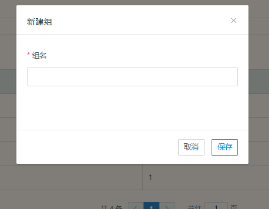
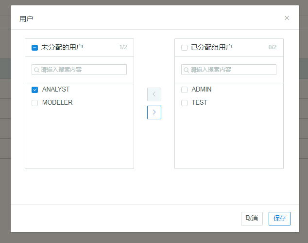

## 管理用户组

本章将介绍什么是用户组以及如何管理用户组。

### 关于用户组

用户组是一组用户的集合，用户组中的用户通过用户组共享相同的访问权限。在大型组织机构／企业中，用户的权限常常以用户组为单位进行授予，方便在用户人数众多的场景下，快速对拥有相同权限的用户进行批量权限配置。Kyligence Enterprise 默认会初始化四个用户组，对应名称为 ALL_USERS、ROLE_ADMIN、ROLE_ANALYST 和 ROLE_MODELER，其中 ALL_USERS 组是一个默认的用户组，用户被创建后，即进入该组，也就是说，所有用户都包含在 ALL_USERS 用户组中。ALL_USERS 用户组不能被修改或删除。系统管理员可以对除 ALL_USERS 以外的其他组进行批量添加或删除用户，也可以将某个用户添加到除 ALL_USERS 以外的多个组中。用户组在整个 Kyligence Enterprise 实例中不能重名。

### 关于用户组权限

系统管理员可以对用户组赋予项目级／行级／表级／列级权限。在对用户组赋予某种项目级／行级／表级／列级权限时，用户组中的用户会继承所属组的相应权限。

当用户组与用户组中的用户被同时赋予某一项目级／行级／表级／列级权限时，用户的权限取两者最大权限。例如，如果用户 A 在某项目上被授予 Query 权限，用户组被授予该项目的 Management 权限，而用户 A 包含在该用户组中，则该用户具有该项目上的 Management 权限。

用户组被剥夺了某表级／行级／列级权限时，则用户组内的所有用户都将失去表／行／列的访问权限。用户组上禁止访问某表／行／列，而用户组内某用户被允许访问某表／行／列，按照限制取最大的原则，则用户禁止访问某表／行／列，反之亦然。

配置在用户及用户组上的权限会同时作用在用户的访问权限上，如用户组上禁止访问某表 A，用户组内用户禁止访问某表 B，则该用户不能访问表 A 和 B。

当某用户属于多个用户组时，该用户同时具有从不同用户组赋予的项目级权限；对于行列级权限，用户从多个用户组继承的权限之间是与（AND）的关系。

例如，如果用户 A 同时属于两个用户组 North_Region 和 East_Region，且这两个用户组分别被限定了行级权限，那么用户 A 会同时继承这两个行级权限，并且两者之间的关系为与（AND）。

如果用户 A 同时属于两个用户组 North_Region 和 East_Region，且这两个用户组分别被限定了列级权限，例如 North_Region 组不能访问 East_sales 列而 East_Region 组不能访问 North_sales 列，那么用户 A 将不能访问这两列。

### 管理用户组

系统管理员登录 Kyligence Enterprise 后，点击导航栏的 **系统**  --> **组 ** 进入用户组管理页面。

### 创建用户组

在用户组管理页面，系统管理员可以点击 **+组** 按钮来添加新组。

在弹出窗口中，系统管理员可以输入组名，点击 **保存**。

### 删除用户组

在用户组管理页面，点击 **操作 ** --> **删除**。

系统管理员可以弹出窗口中确认删除用户组，用户组被删除后将不能恢复，删除用户组后，用户组内的所有用户不会被删除，但所有赋予该用户组的权限将被删除。

### 为组分配用户

1. 在用户组管理页面，选择要分配用户的组。
2. 点击右侧 **操作**--> **分配用户**。
3. 在弹出窗口的 **未分配的用户** 中，勾选需要分配到该组的用户，点击**向右箭头（ > )**，该用户将进入 **已分配组用户**。
4. 点击 **保存**，用户将分配到该组。

### 修改用户所在组

参见本章[管理用户](user_management.cn.md)。

### 赋予用户组权限

参见本章[管理访问权限](acl.cn.md)。

### 启用 LDAP 后的用户组管理

在启用 LDAP 后，用户组为**只读**，不可添加、编辑、删除、修改用户组或为用户组分配用户。

有关 LDAP 的更多信息，参见本章 [LDAP 验证](ldap.cn.md)。