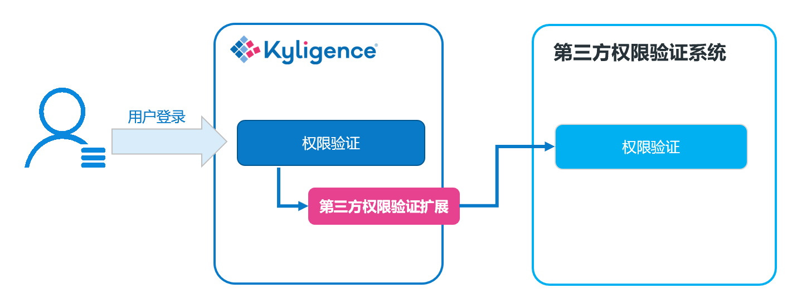

## 与第三方权限系统集成

Kyligence Enterprise 除了自身拥有的权限系统外，还支持与第三方的权限系统进行集成，可以将表级和列级的权限验证工作委托于第三方系统。

默认情况下，Kyligence Enterprise 会使用自身的权限系统，对用户的查询行为进行权限验证。当开启第三方权限系统时，Kyligence Enterprise 会通过用户实现的权限扩展类，对用户的查询行为进行表级和列级校验。

> **注意**：当前的权限验证扩展点暂时不支持行级权限与第三方系统集成。行级权限控制只能通过系统自身的权限系统实现。

本文将介绍 Kyligence Enterprise 实现与第三方用户权限系统集成的原理与实现方法，并举例说明如何进行开发实现。

### 实现原理

扩展原理如下图所示：



与第三方权限系统集成的关键在于实现自定义的第三方权限验证扩展类，在其中完成与第三方权限验证系统的对接，调用第三方系统的接口完成对表级和列级权限的验证。


### 实现方法

Kyligence Enterprise 自带一个样例，向您展示如何从源代码编译到打包部署一个自定义的第三方权限验证扩展。下面向您介绍这个样例工程。

#### 一、搭建开发环境

拷贝 `$KYLIN_HOME/samples/hive-acl-reader.tar.gz`，解压后目录为一个完整的样例程序，将其拷贝到工作目录后，在项目的 lib 目录中加入 `$KYLIN_HOME/tool/kylin-tool-kap-[version].jar`，并将其添加到 classpath 中。您可以在 IDE 中打开并编译这个样例程序。

样例中对接了 Hive 的表级权限。您可以看到如何调用 Hive API 来实现 Kyligence Enterprise 的权限验证。

> **提示**：
> 
> 为了能够远程访问 Hive 中的权限信息，样例程序假设在 Hive 中有如下配置：
> 
> * 设置 `hive.security.authorization.enabled` 为 `true`
> * 设置 Hive Authorization 模式为 `SQLStdAuth`
> * 设置 `hive.security.metastore.authorization.manager` 为**不包含** `org.apache.hadoop.hive.ql.security.authorization.MetaStoreAuthzAPIAuthorizerEmbedOnly`

#### 二、实现对接第三方权限验证系统的 Java 类

权限验证的扩展点主要包含下面几个接口类：

- **KapOpenTableACLProvider** (必要): 用于自定义表级权限验证的逻辑，该类必须实现。

- **KapOpenColumnACLProvider** (可选): 用于自定义列级权限验证的逻辑。该类可以不被实现，这时默认用户可以访问所有的列，只要用户在表上拥有授权。

下面通过样例来看看具体的实现。

HiveAclProvider 类实现了 KapOpenTableACLProvider，通过调用 Hive API 实现了表级权限验证，其中重要方法有：

* *HiveAclProvider()* 为该类的构造器，本例在构造器中初始化了`HiveMetaStoreClient`和ACL缓存。

  > **注意**：为了防止 Kyligence Enterprise 中众多类加载器冲突，在使用 Hive 的 conf 作为参数初始化 `HiveMetaStoreClient` 时，需要先 unset 参数 `HiveConf.ConfVars.METASTORE_FILTER_HOOK.varname`。

* *getCanAccessUserList(String project, String table)* 方法返回在项目下能够访问某张表的用户列表。如果你不需要展示在前端，返回空列表即可。本例中不做前端展示，故返回空列表。
* *getCanAccessGroupList(String project, String table)* 方法返回在项目下某张表能够访问的组列表，如果你不需要展示在前端或没有组的概念，返回空列表即可。本例中不做前端展示，故返回空列表。
* *getAccessTableList(String project, String username)* 方法返回用户在项目中能够访问的表的列表，格式为`DATABASE.TABLE`，数据库和表名均为大写。本例中我们通过 `HiveMetaStoreClient` 读取了hive 中的表权限并作返回。

HiveAclProvider 源代码如下：

```java
public class HiveAclProvider extends KapOpenTableACLProvider {
    private static final Logger logger = LoggerFactory.getLogger(HiveAclProvider.class);
    private static final String TYPE_USER = "user";
    private static final String TYPE_ROLE = "role";

    private HiveMetaStoreClient metaStoreClient;
    private HiveConf hiveConf;
    private HiveObjectRef hiveObj;
    private Cache<String, Map<String, Map<String, Set<String>>>> aclCache = CacheBuilder.newBuilder().build();

    public HiveAclProvider() throws MetaException {
        hiveConf = new HiveConf();
        hiveConf.unset(HiveConf.ConfVars.METASTORE_FILTER_HOOK.varname);
        metaStoreClient = new HiveMetaStoreClient(hiveConf);
        ScheduledExecutorService scheduledExecutor = Executors.newSingleThreadScheduledExecutor();
        scheduledExecutor.scheduleAtFixedRate(new Runnable() {
            @Override
            public void run() {
                aclCache.cleanUp();
                try {
                    List<String> databases = metaStoreClient.getAllDatabases();
                    List<String> tables;
                    Map<String, Map<String, Set<String>>> databaseAcls;

                    Map<String, Set<String>> tableAcls;
                    Set<String> roles;
                    Set<String> users;
                    List<HiveObjectPrivilege> hiveObjectPrivileges;
                    PrivilegeGrantInfo grantInfo;

                    for (String database : databases) {
                        tables = metaStoreClient.getAllTables(database);
                        databaseAcls = Maps.newHashMap();
                        for (String table : tables) {
                            users = Sets.newHashSet();
                            roles = Sets.newHashSet();
                            hiveObj = new HiveObjectRef(TABLE, database, table, null, null);
                            hiveObjectPrivileges = metaStoreClient.list_privileges(null, null, hiveObj);
                            for (HiveObjectPrivilege privilege : hiveObjectPrivileges) {
                                grantInfo = privilege.getGrantInfo();
                                if (!"SELECT".equals(grantInfo.getPrivilege())) {
                                    continue;
                                }
                                if (PrincipalType.USER.equals(privilege.getPrincipalType())) {
                                    users.add(privilege.getPrincipalName());
                                } else if (PrincipalType.ROLE.equals(privilege.getPrincipalType())) {
                                    roles.add(privilege.getPrincipalName());
                                } else {
                                    logger.info("Unsupported principal type '{}' and name '{}'", privilege.getPrincipalType(), privilege.getPrincipalName());
                                }

                            }
                            tableAcls = Maps.newHashMap();
                            tableAcls.put(TYPE_USER, users);
                            tableAcls.put(TYPE_ROLE, roles);
                            databaseAcls.put(table.toUpperCase(), tableAcls);
                        }
                        aclCache.put(database.toUpperCase(), databaseAcls);
                    }
                } catch (Exception e) {
                    throw new RuntimeException("Init ACL failed", e);
                }
            }
        }, 0, 1, TimeUnit.MINUTES);
        logger.info("Hive ACL reader init succeeded");
    }

    public List<String> getCanAccessUserList(String project, String table) {
        Map<String, Set<String>> aclInfos = getAclInfos(table);
        return aclInfos.get(TYPE_USER) == null ? Lists.newArrayList() : Lists.newArrayList(aclInfos.get(TYPE_USER));
    }

    public List<String> getCanAccessGroupList(String project, String table) {
        return Lists.newArrayList();
    }

    private Map<String, Set<String>> getAclInfos(String table) {
        String databaseName = table.split("\\.")[0];
        String tableName = table.split("\\.")[1];
        Map<String, Map<String, Set<String>>> databaseAcls = aclCache.getIfPresent(databaseName.toUpperCase());
        return databaseAcls == null ? Maps.newHashMap() : databaseAcls.get(tableName.toUpperCase());
    }

    public List<String> getAccessTableList(String project, String username) {
        List<String> ret = Lists.newArrayList();
        try {
            List<Role> roles = new HiveMetaStoreClient(hiveConf).list_roles(username, PrincipalType.USER);
            List<String> roleNames = Lists.newArrayList();
            for (Role role : roles) {
                roleNames.add(role.getRoleName());
            }
            ConcurrentMap<String, Map<String, Map<String, Set<String>>>> aclMaps = aclCache.asMap();
            Map<String, Map<String, Set<String>>> databaseAcls;
            Map<String, Set<String>> tableAcls;
            for (String database : aclMaps.keySet()) {
                databaseAcls = aclMaps.get(database);
                for (String table : databaseAcls.keySet()) {
                    tableAcls = databaseAcls.get(table);
                    if (tableAcls.get(TYPE_USER).contains(username)) {
                        ret.add(String.format("%s.%s", database, table));
                        break;
                    } else {
                        Set<String> rolesInTable = tableAcls.get(TYPE_ROLE);
                        for (String role : roleNames) {
                            if (rolesInTable.contains(role)) {
                                ret.add(String.format("%s.%s", database, table));
                                break;
                            }
                        }
                    }
                }
            }
        } catch (TException e) {
            logger.error("Failed to get ACL info from Hive, please check if Hive is working properly", e);
        }
        return ret;
    }

}
```

KapOpenColumnACLProvider 的实现方法比较类似，这里就不重复了。


#### 三、打包、部署与调试

1. Maven 生成 JAR 包

   ```shell
   mvn package -DskipTests
   ```
   
   在 target 目录下找到包含了扩展点实现的 JAR 包。

2. 部署 JAR 包

   将该 JAR 包放入路径`$KYLIN_HOME/ext`。

3. 配置

   在 `conf/kylin.properties` 中增加如下配置，并重启 Kyligence Enterprise 生效。

   ```properties
   # 启用第三方权限验证扩展，启用相关的服务和拦截器
   kylin.security.table-acl-service-clz=io.kyligence.kap.rest.service.KapOpenTableACLService
   kylin.security.column-acl-service-clz=io.kyligence.kap.rest.service.KapOpenColumnACLService
   kylin.query.interceptors=io.kyligence.kap.rest.security.KapOpenTableInterceptor
   
   # 配置自定义的表级权限 Provider 类，必要
   kylin.security.table-acl-provider-clz=HiveAclProvider
   
   # 配置自定义的列级权限 Provider 类，可选
   #kylin.security.column-acl-provider-clz=SomeColumnAclProvider
   ```

4. 登录 Kyligence Enterprise 并验证

   重新启动 Kyligence Enterprise 后，系统的权限验证便已经与第三方系统集成了。执行查询时，则会根据 Hive 中的权限设置进行表权限验证。

