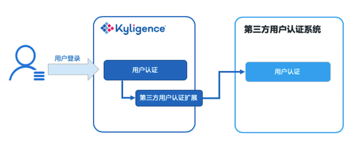

# 与第三方用户认证系统集成

Kyligence Enterprise 除了支持与 LDAP 集成实现用户认证外，还支持与第三方用户认证系统集成，完成登录 Kyligence Enterprise 的用户认证。
默认情形下，Kyligence Enterprise 有自己的用户管理系统，实现登录用户的认证与授权。当用户登录 Kyligence  Enterprise 时，系统会校验当前用户的用户名与密码，认证通过后完成登录。同时 Kyligence Enterprise开放了用户认证的扩展接口，用户可以在这个接口中实现与第三方用户认证系统的对接，从而取代系统默认的用户认证，完成用户校验与登录。

本文将介绍 Kyligence Enterprise 实现与第三方用户认证系统集成的原理与实现方法，并举例说明如何进行开发实现。


### 实现原理

原理如下图所示：



因此，与第三方用户认证系统的集成关键在于实现自定义的第三方用户认证扩展，在其中完成与第三方用户认证系统的对接，调用第三方用户认证系统的接口完成对用户名密码的校验，实现用户的登录认证。


### 实现方法

#### 一、搭建开发环境

拷贝 `$KYLIN_HOME/samples/static-user-manager.tar.gz`，解压后目录为一个完整的样例程序，将其拷贝到工作目录后，在项目的lib目录中加入 `$KYLIN_HOME/tool/kylin-tool-kap-[version].jar`，并将其添加到 classpath 中。

样例会创建一个基于内存的用户系统，该系统中包含两个用户 admin 和 test，admin 拥有管理员权限，test 拥有浏览权限。

#### 二、实现对接第三方用户认证系统的 Java 类

实现第三方用户认证扩展时，需要实现 Kyligence Enterprise 中的三个类：*KapOpenUserService(可选)*、*KapOpenUserGroupService(可选)*、*KapOpenAuthenticationProvider(必须)*，这三个类的功能介绍如下：

- KapOpenUserService: 用于返回用户列表，检查用户是否存在，返回管理员列表等，若您使用 Kyligence Enterprise 的用户系统管理用户，则不需要实现该方法
- KapOpenUserGroupService: 用于返回用户组列表，返回用户组成员等，若您使用 Kyligence Enterprise 的用户系统管理组，则不需要实现该方法
- KapOpenAuthenticationProvider: 用于校验登录用户是否合法等，该方法是必须实现的

下面会通过样例模版分别介绍如何实现这三个类。

1. *KapOpenUserService* 类的自定义实现模版：

   ```java
   public class StaticUserService extends KapOpenUserService {
   		private static final Logger logger = LoggerFactory.getLogger(StaticUserService.class);
   		private List<ManagedUser> users = Lists.newArrayList();
     
      	@PostConstruct
      	public void init() throws IOException {
           ManagedUser admin = new ManagedUser();
           admin.addAuthorities(Constant.ROLE_ADMIN);
           admin.setPassword("123456");
           admin.setUsername("admin");
           admin.setDisabled(false);
           admin.setLocked(false);
           users.add(admin);
           ManagedUser test = new ManagedUser();
           test.addAuthorities(Constant.ROLE_ANALYST);
           test.setPassword("123456");
           test.setUsername("test");
           test.setDisabled(false);
           test.setLocked(false);
           users.add(test);
      	}
   
   		@Override
      	public List<ManagedUser> listUsers() {
      			return users;
      	}
      
      	@Override
      	public List<String> listAdminUsers() {
           List<String> admins = Lists.newArrayList();
           for (ManagedUser user : users) {
             if (user.getAuthorities().contains(new SimpleGrantedAuthority(Constant.ROLE_ADMIN))) {
               admins.add(user.getUsername());
             }
           }
           return admins;
      	}
      
      	@Override
      	public boolean userExists(String s) {
           for (ManagedUser user : users) {
             if (s.equals(user.getUsername())) {
               return true;
             }
           }
           return false;
      	}		
   
   		@Override
      	public UserDetails loadUserByUsername(String s) throws UsernameNotFoundException {
           for (ManagedUser user : users) {
             if (s.equals(user.getUsername())) {
               return user;
             }
           }
           throw new UsernameNotFoundException(s);
      	}
   
      	@Override
      	public void completeUserInfo(ManagedUser user) {
      
      	}
   }
   ```

   - *init()* 方法用来做一些初始化的操作，该方法必须用*@PostConstruct*注解标注。在本例中我们做了创建两个用户的操作。

   - *listUsers()* 方法用来返回所有用户，该方法的返回值是一个 *ManagedUser* 的集合。*ManagedUser* 包含几个关键属性：
     - username：用户名
     - password：用户密码
     - disabled：是否启用
     - locked：是否锁定
     - authorities：用户角色

   ​       在本例我们直接返回初始化之后的用户列表 *users*

   - *listAdminUses()* 方法用来返回所有的角色为管理员的用户，该方法返回值是一个由用户名组成的List。在本例中我们直接过滤出 *users* 中角色为 admin 的用户返回

   - *userExists(String s)* 方法用来根据用户名返回用户是否存在。在本例中我们直接遍历 *users* 进行判断

   - *loadUserByUsername(String s)* 方法用来返回一个用户。在本例中我们直接在 *users* 中进行查找。

   - *completeUserInfo(ManagedUser user)* 方法用来做一些用户信息补充的操作。

     > **注意：** 在 Kyligence Enterprise 中 *completeUserInfo* 是返回用户后必须的一个环节，所以即使您不需要在 *completeUserInfo* 中做什么事情，也要有一个空的实现。

   - 其他方法请根据您的实际需求进行覆盖实现

2. *KapOpenUserGroupService* 类的自定义实现模板：

   ```java
   public class StaticUserGroupService extends KapOpenUserGroupService {
      	private static final Logger logger = LoggerFactory.getLogger(StaticUserGroupService.class);
      	
      	@Autowired
      	@Qualifier("userService")
      	UserService userService;
      	
      	@Override
      	public List<ManagedUser> getGroupMembersByName(String s) {
           try {
               List<ManagedUser> ret = Lists.newArrayList();
               List<ManagedUser> managedUsers = userService.listUsers();
               for (ManagedUser user : managedUsers) {
                 if (user.getAuthorities().contains(new SimpleGrantedAuthority(s))) {
                   ret.add(user);
                 }
               }
             	return ret;
           } catch (Exception e) {
             	throw new RuntimeException("");
           }
      	}
      	
      	@Override
      	protected List<String> getAllUserGroups() {
           List<String> groups = Lists.newArrayList();
           groups.add(Constant.ROLE_ADMIN);
           groups.add(Constant.ROLE_ANALYST);
           return groups;
       }
   }
   ```

   - *getGroupMembersByName(String s)* 返回用户组内的所有用户。在本例中，直接根据上述 UserService 中的用户返回。

   - *getAllUserGroups()* 返回所有的用户组。在本例中，直接返回了一个静态的用户组集合。

   - 其他方法请根据您的实际需求进行覆盖实现

     > **注意：** 如果您的用户管理系统没有用户组的概念，那您仅需在上述两个方法中保持空的实现即可。

3. *KapOpenAuthenticationProvider* 类的自定义实现模板

   ```java
   public class StaticAuthenticationProvider extends KapOpenAuthenticationProvider {
       private static final Logger logger = LoggerFactory.getLogger(StaticAuthenticationProvider.class);
     
       @Override
       public boolean authenticateImpl(Authentication authentication) {
           String name = authentication.getName();
           Object credentials = authentication.getCredentials();
           ManagedUser user = (ManagedUser) getUserService().loadUserByUsername(name);
           if (!credentials.equals(user.getPassword())) {
               return false;
           }
           return true;
       }
   }
   ```

   - *authenticateImpl(Authentication authentication)* 该方法用来校验用户名密码是否合法，即是否允许用户登录。该方法的参数为一个 *Authentication* 的对象，该对象有三个关键属性：
     - *principal* 页面上传递过来的用户名
     - *credentials* 页面上传递过来的密码
   - 其他方法请根据您的实际需求进行覆盖实现

#### 三、打包、部署与调试

1. Maven 生成 JAR 包

   ```shell
   mvn package -DskipTests
   ```

2. 部署 JAR 包

   当 Java 类已经准备好并打包完毕后，将该 Java 类放入路径`$KYLIN_HOME/ext`。

3. 配置

   在 kylin.properties 中增加如下配置，并重启 Kyligence Enterprise。

   ```shell
   kylin.security.profile=custom //配置 profile 为 custom 模式
   kylin.security.custom.user-service-clz=StaticUserService //配置KapOpenUserService自定义实现类的全类名，可选
   kylin.security.custom.user-group-service-clz=StaticUserGroupService //配置KapOpenUserGroupService自定义实现类的全类名，可选
   kylin.security.custom.authenticaton-provider-clz=StaticAuthenticationProvider //配置KapOpenAUthenticationProvider 自定义实现类的全类名，必须
   ```

4. 登录 Kyligence Enterprise 并验证

   重新启动 Kyligence Enterprise 后，系统的用户认证便已经与第三方应用集成了。登录系统时，输入的用户名和密码将会由集成的第三方应用进行登录验证。