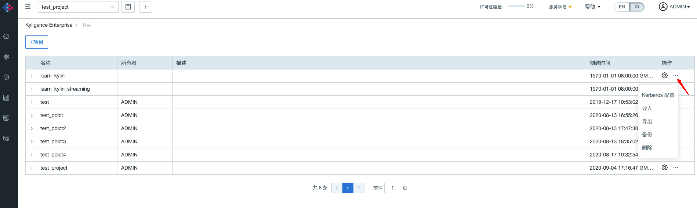
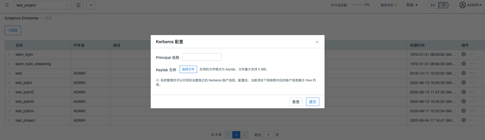

## 项目级别配置 Kerberos
在开启了 Kerberos 集成后，从 3.4.5.2112 版本开始 Kyligence 还支持项目级别配置不同的 Kerberos 用户。从而实现了不同项目拥有不同的源数据加载权限，为企业级用户的安全管控提供了更加精细化的管理能力。

### 环境准备

开启项目级 Kerberos 集成，需要满足以下条件：
1. 环境中已开启 Kerberos 且在 Kyligence 中完成相关配置，具体请参考 [与 Kerberos 集成 ](kerberos.cn.md)
2. 启动 Kyligence 的 Kerberos 用户需要拥有所有项目集成的 Kerberos 用户的 Hive 访问权限的合集
3. 配置在项目上的 Kerberos 用户需要配置属于 Hive 用户组
4. 更换项目配置的 Kerberos 用户时，绑定用户的 Hive 权限需要大于该项目已加载的数据源

### 如何开启
1. 在 `kylin.properties` 文件中添加配置：`kylin.kerberos.project-level-enabled=true`
2. 添加配置后启动 Kyligence，此时在项目的设置界面可以看到如下设置项，开启并填写内容即可完成对应配置。

### 已知限制

1. 更换项目 Kerberos 账号信息时，需要进行权限校验，该过程在源表数量较多的情况下可能会持续数分钟。
2. 当前仅支持数据源加载功能使用不同的 Kerberos 账号权限读取，构建任务等相关功能仍以启动 Kyligence 的 Kerberos 用户提交。
